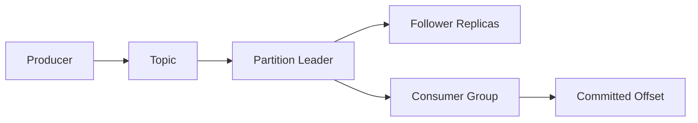

# Kafka 核心术语速查

## 一条消息从哪里到哪里

- **Event / Record**：一条业务事件，通常包含 key、value、timestamp 和 headers。
- **Topic**：事件的逻辑分类。Topic 本身不是顺序队列，真正的顺序存在于每个 Partition 内。
- **Partition**：Topic 的物理分片，也是 Kafka 并行度和局部顺序的边界。
- **Offset**：Record 在某个 Partition 内的位置。不同 Partition 的 Offset 不能直接比较。
- **Producer**：发送事件；可以显式指定 Partition，也可以按 key 或默认策略选择。
- **Consumer**：拉取事件并处理。它读取的是被分配 Partition 上的一段 Offset 区间。
- **Consumer Group**：同组消费者协作分摊 Partition；不同组彼此独立，可以各消费一遍。
- **Broker**：Kafka 服务节点。一个集群通常由多个 Broker 构成。
- **Replica**：Partition 的副本。Leader 处理读写，Follower 同步日志。
- **Controller**：负责集群元数据和控制决策；旧架构依赖 ZooKeeper，新架构使用 KRaft 仲裁。

## 最容易混淆的四组概念

### Topic 与 Partition

Topic 是业务分类，Partition 是该分类在存储和并行处理上的分片。增加 Partition 可以提高并行度，
但不能保证跨 Partition 的全局顺序，并且后续缩减分区并不是常规操作。

### Producer 分区策略与 Consumer 分区分配策略

Producer 分区策略回答“这条消息写到哪个 Partition”；Consumer Assignor 回答“这些 Partition
分别交给组内哪个 Consumer”。一个发生在写入时，一个发生在消费者组协调/重平衡时。

### 消费位置与已提交 Offset

Consumer 当前内存中的 position 表示下一次准备读取的位置；committed Offset 是持久化的组进度，
用于重启或重平衡后恢复。手动确认本质上是在控制什么时候推进已提交进度。

### LEO、HW 与 ISR

- **LEO**：每个副本自己的日志末端下一位置。
- **ISR**：同步状态达到要求的副本集合。
- **HW**：消费者可见的确认边界，受 ISR 中较慢副本的复制进度约束。

Leader LEO 已前进，只能说明 Leader 收到了数据；HW 前进才表示这段数据达到当前确认边界。

## ZooKeeper 与 KRaft

两者解决的都是集群元数据和控制面协调问题，不负责替代 Topic/Partition 的业务日志：

- ZooKeeper 模式：Kafka 借助外部 ZooKeeper 保存/协调部分集群状态。
- KRaft 模式：Kafka Controller Quorum 使用 Raft 管理元数据，不再依赖外部 ZooKeeper。

