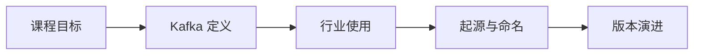

# 第 1 章：课程导学与 Kafka 身世

先回答 Kafka 是什么、谁在用、为什么诞生，以及版本如何演进。

## 整章核心讲解

Kafka 不是传统意义上只负责临时排队的内存队列。它把业务事件按 Topic 分类、按 Partition 追加到持久化日志中，让多个生产者和消费者围绕同一份事件流解耦协作。

这套系统最初由 LinkedIn 为大规模活动流和运营数据管道开发，后来进入 Apache。理解它的起源很重要：高吞吐、可扩展、可重放和持久化，都是围绕真实数据管道压力形成的。

## 先看懂整章数据流

## 本章逐节目录

1. [P1 课程概述](./p001-课程概述.md) · 01:54
2. [P2 What is Kafka？](./p002-What-is-Kafka.md) · 03:03
3. [P3 谁在使用Kafka](./p003-谁在使用Kafka.md) · 03:50
4. [P4 Kafka的起源](./p004-Kafka的起源.md) · 04:42
5. [P5 Kafka名字的由来](./p005-Kafka名字的由来.md) · 01:51
6. [P6 Kafka的发展历程](./p006-Kafka的发展历程.md) · 03:08
7. [P7 Kafka版本迭代演进](./p007-Kafka版本迭代演进.md) · 03:12

## 本章学习方法

1. 先把上面的流程图画在纸上，明确每节位于哪一步。
2. 读逐节正文，再用 ASR 核查老师的补充、口头提醒和演示顺序。
3. 遇到命令或代码课，必须记录“输入—配置—输出—失败原因”。
4. 学完后从头解释整章，不以“视频播放完”作为完成标准。
