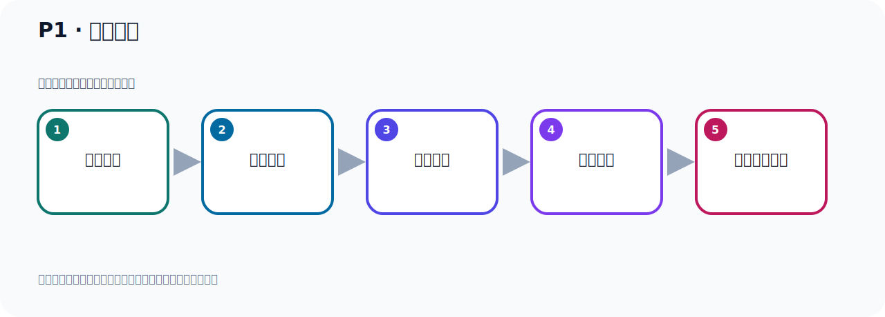

# P1：课程概述

> 笔记编号 1/156 · 时长 01:54 · [打开原视频 P1](https://www.bilibili.com/video/BV14J4m187jz?p=1)

[返回本章](./README.md) · [P2: What is Kafka？ →](../01-course-overview/p002-What-is-Kafka.md)

## 这节到底讲什么

**核心主题：课程概述。**

这是一节概念课。老师先交代背景，再给出定义、组成和作用，最后把概念放回 Kafka 整体架构。
本节属于“课程导学与 Kafka 身世”这一章；放在全章里看，它的作用是：先回答 Kafka 是什么、谁在用、为什么诞生，以及版本如何演进。

## 本节路线

## 老师的完整讲解（按视频顺序校正）

> 下面保留老师的完整讲解顺序，并修正 Kafka、Java、ZooKeeper、
> Topic、Partition、Offset 等常见识别错误。它不是压缩摘要；原始 ASR 在后面单独保留。

### 1. 00:00–00:48

大家好，下面给大家带来的一套精品视频课程：高性能消息中间件：Kafka 精讲。这套课程带你极速上手，全面实战。课程最主要的目标是一套课程让你全面搞定Kafka。课程突出，细致入微，深入浅出，值得大家反复观看。我们知道，Kafka在企业开发中使用非常广泛。不管是Java 后端开发，或者是大数据开发，处处都有 Kafka 的身影。我们看一下，这是企业的招聘要求。要求掌握消息队列，掌握Kafka。那么这里也是招聘Java 后端，要求掌握Kafka。招聘Java 后端开发，要求掌握Kafka。我们从企业的招聘信息中可以可见一斑，Kafka其重要性不言而喻。

### 2. 00:48–01:43

所以提升技术，升职加薪，一定要掌握Kafka。那么我们这套课程一定会帮助到你。这套课程从标题就可以看出，最大的特点就是精细，细节满满。这也是我的课程的一大特点，带你少走弯路，少踩坑。课程采用目前最新的版本，Kafka 3.7.0，可以概括为如下的几个特点。细致入微，深入浅出，循序渐进，通俗易懂。课程以非常通俗易懂的语言，加上详细的文档，代码的演示，特别是大量的图表。让你轻松掌握Kafka。这是我们的文档，文档非常的细致，每一个操作步骤都有详细的记录，并配备一些图表，让大家轻松理解和掌握Kafka。这是我们Kafka消息发送和接收的一个流程，我们会进行详细的剖析。

### 3. 01:43–01:52

最后大家在学习过程中遇到什么问题，也可以在评论区回复，我会及时回复大家。记得要点赞和关注哦！

## 关键术语

- **Kafka：** Apache 开源的分布式事件流平台，常用于高吞吐消息传递、数据管道和流处理。

## 完整原声逐段记录

[查看本节带时间戳的本地 ASR](./transcripts/p001-课程概述-ASR.md)。主笔记负责可读性和术语校正；ASR 页面负责完整性复核。

## 读完记住

- 本节主题是 **课程概述**，它服务于本章目标：先回答 Kafka 是什么、谁在用、为什么诞生，以及版本如何演进。
- 理解顺序是：提出背景 → 给出定义 → 拆解组成 → 解释作用 → 放回整体架构。
- 学习时要同时核对老师的解释、画面中的配置/代码，以及最终运行结果。

## 最容易踩的坑

不要只背术语定义；需要同时说清它解决什么问题、与哪些组件交互、失效时会出现什么现象。

## 自测

1. 不看笔记，用自己的话解释“课程概述”解决了什么问题。
2. 按顺序复述：提出背景、给出定义、拆解组成、解释作用、放回整体架构。
3. 如果运行结果和老师不同，你会先检查哪三个输入或环境条件？

## 学完检查

- [ ] 我能不看视频复述本节完整思路
- [ ] 我能指出关键命令、配置、类或接口的作用
- [ ] 我能解释画面中的输入与输出为什么对应
- [ ] 我核对过完整 ASR，没有跳过老师的补充说明
- [ ] 我完成了本节自测或复现实验
