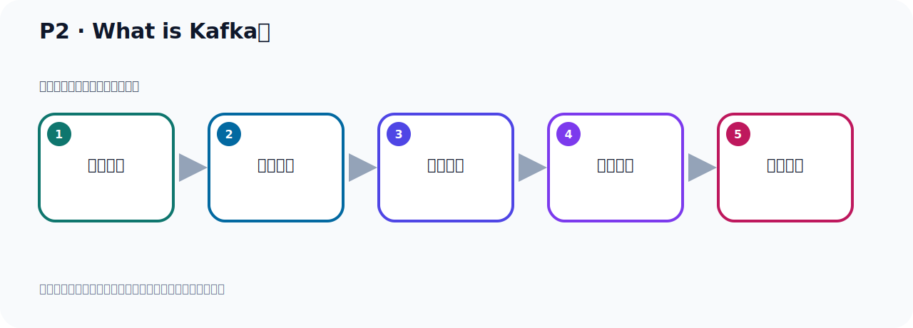

# P2：What is Kafka？

> 笔记编号 2/156 · 时长 03:03 · [打开原视频 P2](https://www.bilibili.com/video/BV14J4m187jz?p=2)

[← P1: 课程概述](../01-course-overview/p001-课程概述.md) · [返回本章](./README.md) · [P3: 谁在使用Kafka →](../01-course-overview/p003-谁在使用Kafka.md)

## 这节到底讲什么

**核心主题：What is Kafka？。**

这节继续完善 Kafka 的完整知识链。请按老师的讲解顺序理解动机、做法和结果。
本节属于“课程导学与 Kafka 身世”这一章；放在全章里看，它的作用是：先回答 Kafka 是什么、谁在用、为什么诞生，以及版本如何演进。

## 本节路线

## 老师的完整讲解顺序（ASR 辅助复核）

> 下面按时间顺序保留经过基础术语替换的 ASR，方便核对老师是否提到某个细节。
> 人名、命令、代码和英文参数仍可能识别错误；准确结论以本节白话说明、代码块和实操速查表为准。

### 1. 00:00–01:02

下面我们要开始学习一个课程，这个课程就是Kafka。首先我们是给大家介绍一下Kafka，所以我这里有个标题叫WaterEaseKafka，Kafka是什么？Kafka是什么？它的官网有介绍，所以我们第一步打开官网，Apache这个网站，它是Apache下的一个项目，点进来，打开。那么这就是Kafka的官网，首先它有个LOGO，是这个图标，有很多小圆圈连在一起的，然后可以传递数据，表达这么一个含义，各个节点之间可以传递数据。下面这个地方是它的一个介绍，然后下面有很多公司在使用它这个产品。下面还有一些特性一些介绍，这个我们快速浏览一下。

### 2. 01:02–02:13

什么是Kafka，我们可以把它的这一段描述翻译一下，它就介绍了什么是Kafka，我课件中已经把它翻译过来，我们看一下。Kafka超过80%的财富100强公司信任并使用Kafka，也就是Kafka在很多财富100强公司都在使用它，因为这些公司都是大公司，数据量比较大，采用了Kafka。Kafka是Apache下的一个开源项目，它是一个开源的，就是开放源代码的，然后它是分布式的，然后是事件流平台，它把它的数据叫做事件流。这个事件流就是它的数据，我们的数据消息等等日志，所有的一切的数据，就是事件流。我们业务程序所产生的这些数据叫事件流，它是一个分布式的事件流平台，被数千家公司用于高信任数据管道，用Kafka传输数据。

### 3. 02:14–02:54

数据的分析，就是事件流的数据的分析，数据的集成，还有一些核心关键，任务业务程序，都使用了Kafka。以上是我们对Kafka的介绍，那么这个介绍是基于它官方的文档，做了个介绍。那么在国内也有很多公司使用Kafka，我们通常听到Kafka是一个消息队列，是个消息服务器，那么用这个消息服务器，我们可以发出消息到这个消息服务器，然后从这个消息服务器可以接收消息，它可以作为一个数据管道。好，以上就是我们Kafka。

## 关键术语

- **Kafka：** Apache 开源的分布式事件流平台，常用于高吞吐消息传递、数据管道和流处理。

## 完整原声逐段记录

[查看本节带时间戳的本地 ASR](./transcripts/p002-What-is-Kafka-ASR.md)。主笔记负责可读性和术语校正；ASR 页面负责完整性复核。

## 读完记住

- 本节主题是 **What is Kafka？**，它服务于本章目标：先回答 Kafka 是什么、谁在用、为什么诞生，以及版本如何演进。
- 理解顺序是：问题背景 → 关键对象 → 处理过程 → 结果验证 → 应用边界。
- 学习时要同时核对老师的解释、画面中的配置/代码，以及最终运行结果。

## 最容易踩的坑

不要把孤立 API 或配置项当成完整能力；始终把它放回生产、存储、消费或集群链路中理解。

## 自测

1. 不看笔记，用自己的话解释“What is Kafka？”解决了什么问题。
2. 按顺序复述：问题背景、关键对象、处理过程、结果验证、应用边界。
3. 如果运行结果和老师不同，你会先检查哪三个输入或环境条件？

## 学完检查

- [ ] 我能不看视频复述本节完整思路
- [ ] 我能指出关键命令、配置、类或接口的作用
- [ ] 我能解释画面中的输入与输出为什么对应
- [ ] 我核对过完整 ASR，没有跳过老师的补充说明
- [ ] 我完成了本节自测或复现实验
