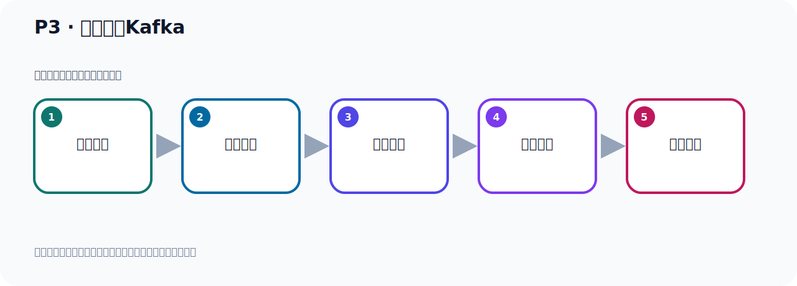
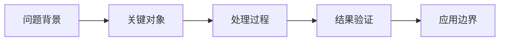

# P3：谁在使用Kafka

> 笔记编号 3/156 · 时长 03:50 · [打开原视频 P3](https://www.bilibili.com/video/BV14J4m187jz?p=3)

[← P2: What is Kafka？](../01-course-overview/p002-What-is-Kafka.md) · [返回本章](./README.md) · [P4: Kafka的起源 →](../01-course-overview/p004-Kafka的起源.md)

## 这节到底讲什么

**核心主题：谁在使用Kafka。**

这节继续完善 Kafka 的完整知识链。请按老师的讲解顺序理解动机、做法和结果。
本节属于“课程导学与 Kafka 身世”这一章；放在全章里看，它的作用是：先回答 Kafka 是什么、谁在用、为什么诞生，以及版本如何演进。

## 本节路线

## 老师的完整讲解顺序（ASR 辅助复核）

> 下面按时间顺序保留经过基础术语替换的 ASR，方便核对老师是否提到某个细节。
> 人名、命令、代码和英文参数仍可能识别错误；准确结论以本节白话说明、代码块和实操速查表为准。

### 1. 00:00–01:15

接下来我们来看一下谁在使用Kafka。这里有一张截图，这个截图是来自于它官网，我们打开官网看一下。就是这个官网。就是哪些行业在使用Kafka，我们翻译一下。这个图表示制造业，10个制造业有10个在用。它所列的10个表示在制造业里面，最大的10个公司有10个在用Kafka，然后这个是银行，在银行这个行业，10个最大的银行有7个在用Kafka，那么这个是保险，10个最大的保险公司有10个在使用Kafka，然后这是电信，电信行业有10个最大的银行公司，其中有8个都在使用Kafka，这是它官方的这个图，这个地方你看它有个list，一个完全列表，for list，。

### 2. 01:15–02:16

这个完全列表我们翻译一下，看一下，那我这里有个翻译的，就右边这个翻译。那么在保险公司里面，最大规模的保险公司，其中排比前10个最大的保险公司，有10个都在使用Kafka，那这里就是10个最大的制造公司有10个在用，10个最大的讯息技术和服务公司有10个在用，10个最大的电工师有8个在用，这里还有10个最大的运输公司有8个在用，10个最大的零售公司有7个在用，10个最大的银行和金融公司有7个在用，10个最大的零元和公用事业组织有6个在用。那么你看一下它这里面都是那些比较大的工师，因为比较大的公司它的数据量比较大，我们Kafka它的性能非常好，就非常适合用Kafka，。

### 3. 02:16–03:22

所以Kafka在很多大的企业，大的公司都会用到Kafka，好，这个以上就是Kafka官方给我们提供的排名前10大的公司使用情况，当然这个Kafka在我们国内有大量的公司也在使用Kafka，我们这个可以通过一些招聘信息可以查阅到，比如说它招聘里面，它要求熟悉熟练掌握Kafka，那表明他们公司在使用Kafka这个产品，好，那我这里可以看一下，从这个招聘网站上，我就随便来找几个招聘信息，这个Java 后端开发，那你可以看一下，它需要熟悉对列，那么需要Kafka掌握Kafka，再比如说这些公司也是一样，它也需要掌握Kafka，好，那我就随便找两个，那你可以看看招聘信息，大量的招聘信息都需要大家掌握Kafka，。

### 4. 03:23–03:46

所以Kafka在国内使用也是非常非常广泛的，所以我们作为后端开发的话，非常有必要掌握Kafka，同时Kafka在大数据领域使用也非常广泛，如果说你是一个大数据工程师，那也需要掌握Kafka，好，那么这就是Kafka，谁在使用Kafka？

## 关键术语

- **Kafka：** Apache 开源的分布式事件流平台，常用于高吞吐消息传递、数据管道和流处理。

## 完整原声逐段记录

[查看本节带时间戳的本地 ASR](./transcripts/p003-谁在使用Kafka-ASR.md)。主笔记负责可读性和术语校正；ASR 页面负责完整性复核。

## 读完记住

- 本节主题是 **谁在使用Kafka**，它服务于本章目标：先回答 Kafka 是什么、谁在用、为什么诞生，以及版本如何演进。
- 理解顺序是：问题背景 → 关键对象 → 处理过程 → 结果验证 → 应用边界。
- 学习时要同时核对老师的解释、画面中的配置/代码，以及最终运行结果。

## 最容易踩的坑

不要把孤立 API 或配置项当成完整能力；始终把它放回生产、存储、消费或集群链路中理解。

## 自测

1. 不看笔记，用自己的话解释“谁在使用Kafka”解决了什么问题。
2. 按顺序复述：问题背景、关键对象、处理过程、结果验证、应用边界。
3. 如果运行结果和老师不同，你会先检查哪三个输入或环境条件？

## 学完检查

- [ ] 我能不看视频复述本节完整思路
- [ ] 我能指出关键命令、配置、类或接口的作用
- [ ] 我能解释画面中的输入与输出为什么对应
- [ ] 我核对过完整 ASR，没有跳过老师的补充说明
- [ ] 我完成了本节自测或复现实验
