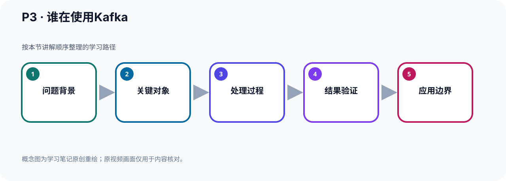
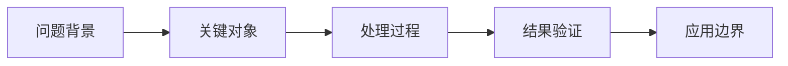

# P3：谁在使用Kafka

> 笔记编号 3/156 · 时长 03:50 · [打开原视频 P3](https://www.bilibili.com/video/BV14J4m187jz?p=3)

[← P2: What is Kafka？](../01-course-overview/p002-What-is-Kafka.md) · [返回本章](./README.md) · [P4: Kafka的起源 →](../01-course-overview/p004-Kafka的起源.md)

## 先看结论

> 这节围绕“谁在使用Kafka”串起问题背景、关键对象、操作过程和验证结果，并把结论放回 Kafka 完整链路中理解。它服务于本章目标：先回答 Kafka 是什么、谁在用、为什么诞生，以及版本如何演进。

## 老师怎么一步步讲

1. 第 1 步，围绕“谁在使用Kafka”完成问题背景。
2. 第 2 步，围绕“谁在使用Kafka”完成关键对象。
3. 第 3 步，围绕“谁在使用Kafka”完成处理过程。
4. 第 4 步，围绕“谁在使用Kafka”完成结果验证。
5. 第 5 步，围绕“谁在使用Kafka”完成应用边界。

## 老师的补充说明

下面按原声顺序整理老师的完整讲解脉络。保留原因、案例、对比、操作过程、边界条件和口头提醒；删除重复语气词，并把长口语拆成适合阅读的短段落。

> 技术术语已经过统一校正；仍无法确认的人名或口头英文会保留原意，并通过右侧时间范围返回视频核对。

### 先明确：谁在使用Kafka要解决什么 · 00:00–01:22

接下来我们来看一下谁在使用Kafka。这里有一张截图，这个截图是来自于它官网，我们打开官网看一下。就是这个官网。就是哪些行业在使用Kafka，我们翻译一下。这个图表示制造业，10个制造业有10个在用。

它所列的10个表示在制造业里面，最大的10个公司有10个在用Kafka，然后这个是银行，在银行这个行业，10个最大的银行有7个在用Kafka，那么这个是保险，10个最大的保险公司有10个在使用Kafka，然后这是电信，电信行业有10个最大的银行公司，其中有8个都在使用Kafka，这是它官方的这个图，这个地方你看它有个list，一个完全列表，for list，这个完全列表我们翻译一下，看一下，那我这里有个翻译的，就右边这个翻译。

### 老师用例子进一步解释 · 01:22–02:43

那么在保险公司里面，最大规模的保险公司，其中排比前10个最大的保险公司，有10个都在使用Kafka，那这里就是10个最大的制造公司有10个在用，10个最大的讯息技术和服务公司有10个在用，10个最大的电工师有8个在用，这里还有10个最大的运输公司有8个在用，10个最大的零售公司有7个在用，10个最大的银行和金融公司有7个在用，10个最大的零元和公用事业组织有6个在用。

那么你看一下它这里面都是那些比较大的工师，因为比较大的公司它的数据量比较大，我们Kafka它的性能非常好，就非常适合用Kafka，所以Kafka在很多大的企业，大的公司都会用到Kafka，好，这个以上就是Kafka官方给我们提供的排名前10大的公司使用情况，当然这个Kafka在我们国内有大量的公司也在使用Kafka，我们这个可以通过一些招聘信息可以查阅到，比如说它招聘里面，。

### 最后验证结果，并收束本节结论 · 02:43–03:46

它要求熟悉熟练掌握Kafka，那表明他们公司在使用Kafka这个产品，好，那我这里可以看一下，从这个招聘网站上，我就随便来找几个招聘信息，这个Java 后端开发，那你可以看一下，它需要熟悉对列，那么需要Kafka掌握Kafka，再比如说这些公司也是一样，它也需要掌握Kafka，好，那我就随便找两个，那你可以看看招聘信息，大量的招聘信息都需要大家掌握Kafka，所以Kafka在国内使用也是非常非常广泛的，所以我们作为后端开发的话，非常有必要掌握Kafka，同时Kafka在大数据领域使用也非常广泛，如果说你是一个大数据工程师，那也需要掌握Kafka，好，那么这就是Kafka，谁在使用Kafka？

## 放进整套课

本节属于 **课程导学与 Kafka 身世**。这一章要解决的是：先回答 Kafka 是什么、谁在用、为什么诞生，以及版本如何演进。

这节继续完善 Kafka 的完整知识链。请按老师的讲解顺序理解动机、做法和结果。

### 记忆路线

```mermaid
flowchart LR
    N0["问题背景"]
    N1["关键对象"]
    N0 --> N1
    N2["处理过程"]
    N1 --> N2
    N3["结果验证"]
    N2 --> N3
    N4["应用边界"]
    N3 --> N4
```

## 用在工作里

| 项目 | 内容 |
|---|---|
| 先回答 | 先指出本节在 Kafka 完整数据链路中的位置。 |
| 立刻做 | 跟着老师复现关键步骤，并记录输入、处理与输出。 |
| 留下证据 | 留下可以独立复述的结论和一次验证结果。 |

## 关键术语

- **Kafka：** Apache 开源的分布式事件流平台，常用于高吞吐消息传递、数据管道和流处理。

## 最容易踩的坑

不要把孤立 API 或配置项当成完整能力；始终把它放回生产、存储、消费或集群链路中理解。

## 自测

1. 不看笔记，用自己的话解释“谁在使用Kafka”解决了什么问题。
2. 按顺序复述：问题背景、关键对象、处理过程、结果验证、应用边界。
3. 如果运行结果和老师不同，你会先检查哪三个输入或环境条件？

## 学完检查

- [ ] 我能不看视频复述本节完整思路
- [ ] 我能指出关键命令、配置、类或接口的作用
- [ ] 我能解释画面中的输入与输出为什么对应
- [ ] 我读完了老师的详细讲解正文，没有只看路线图和要点
- [ ] 我完成了本节自测或复现实验

## 需要核对原话时

[查看本节带时间戳的完整 ASR](./transcripts/p003-谁在使用Kafka-ASR.md)。主笔记负责理解与实践；ASR 页面负责逐句完整性复核。
