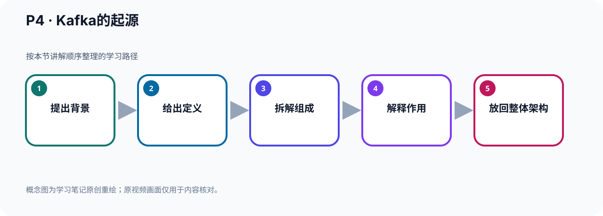

# P4：Kafka的起源

> 笔记编号 4/156 · 时长 04:42 · [打开原视频 P4](https://www.bilibili.com/video/BV14J4m187jz?p=4)

[← P3: 谁在使用Kafka](../01-course-overview/p003-谁在使用Kafka.md) · [返回本章](./README.md) · [P5: Kafka名字的由来 →](../01-course-overview/p005-Kafka名字的由来.md)

## 先看结论

> 这节通过“Kafka的起源”回答概念从哪里来、由什么组成、解决什么问题，以及它在 Kafka 整体架构中的位置。它服务于本章目标：先回答 Kafka 是什么、谁在用、为什么诞生，以及版本如何演进。

## 老师怎么一步步讲

1. 第 1 步，围绕“Kafka的起源”完成提出背景。
2. 第 2 步，围绕“Kafka的起源”完成给出定义。
3. 第 3 步，围绕“Kafka的起源”完成拆解组成。
4. 第 4 步，围绕“Kafka的起源”完成解释作用。
5. 第 5 步，围绕“Kafka的起源”完成放回整体架构。

## 老师的补充说明

下面按原声顺序整理老师的完整讲解脉络。保留原因、案例、对比、操作过程、边界条件和口头提醒；删除重复语气词，并把长口语拆成适合阅读的短段落。

> 技术术语已经过统一校正；仍无法确认的人名或口头英文会保留原意，并通过右侧时间范围返回视频核对。

### 先明确：Kafka的起源要解决什么 · 00:00–00:55

接下来我们继续来看一下Kafka的起源，Kafka怎么发展起来的。Kafka最早是由LinkedIn 公司开发的，由他们设计开发的。那么这个LinkedIn 公司是什么公司？它是全球最大的面向职场人士的社交网站，是一个网站。我们下面去看一下这个网站，我们把这个来去搜索一下。这是LinkedIn 公司，我们这里点进来。点进来之后它跳到一个错误页，我们把后面这一端路径去掉，访问一下。点com，访问之后它现在已经跳到中文网站了，它在我们国内也有分公司，所以跳到中文网站了。

### 老师用例子进一步解释 · 00:56–02:07

它的英文网站应该是点com结尾，我们看一下这边，比如说这个列结点进来，这是点com结尾，这个时候你可以注册一个账号，然后给登进去，它是一个面向职场人士的社交网站。最早是他们这个公司设计开发Kafka。接着我们再看一下，他们最早设计Kafka是为了解决LinkedIn 公司的数据管道问题。它内部的网站，它的业务有很多数据，这个数据需要投地，需要传递，需要数据进行交换，那么它需要解这个问题。

于是它就设计开发了Kafka，用于LinkedIn 公司，它的网站的活动流数据和运营数据的处理，这样一个工具，就是Kafka。这里面包括一个叫网站的活动流数据，还有运营数据，那么这个活动流数据就是说，我这个网站，比如说网站的一个页面的访问量，。

### 老师用例子进一步解释 · 02:08–03:40

被查看页面的内容，哪些内容被查看过了，还有它这个搜索的一些情况，把这个数据我需要一个管道进行运输传递，它需要一个这边一个产品，那么它开发设计的Kafka。包括运营数据，运营数据就是你的一些服务系的信仰数据，比如说CPU的使用率、AO的使用率、请求时间、服务日治等等这些数据，那么这些数据它通过一个系统传输给另外一个系统，另外一个系统采集到这个数据之后可以进行数据的分析，方便我们更好的对这个网站要进行优化。

那刚开始的这个LinkedIn 公司，他采了实这个ActiveMQ进行这个数据的交换，数据的传递，大约在2010年前后来，那个时候的我们这个ActiveMQ还远远无法满足，那他满足LinkedIn 公司对数据交换传输的要求，就是不满足要求的，遇到瓶颈了，经常由于各种缺陷而导致消息阻涉，或者是服务无法正常访问，遇到了瓶颈。这个ActiveMQ也是Apa旗下的一个开源项目，它是一个消息服务器，实现了我们这个JMS 规范的这个消息服务器。

他刚开始用的是这个消息服务器，但是他遇到一些瓶颈无法满足他的一个要求，所以他为了解决这个问题，。

### 最后验证结果，并收束本节结论 · 03:41–04:37

LinkedIn 公司就决定研发自己的这个消息传递系统，就是我们那个Kafka，在2010年这个时间。当时的LinkedIn 公司有个价格师，这个名字怎么读啊，这个我们就不去追究了。他就开始组织这个团队进行开发，开发了这一款消息服务器，就是Kafka。据说，当时这个价格师这个人，他当时正在学习一个编程语言，叫Scala这个编程语言。所以Kafka当时是用Scala这个编程语言开发的，这么一个情况。这是Kafka起源，那么这个呢，大家了解一下即可，不是非常重要，了解一下即可。

只是说，让大家这个知识体系更加完善，所以我们把这个起源给它介绍一下，让大家对这个呢也了解一下。

## 放进整套课

本节属于 **课程导学与 Kafka 身世**。这一章要解决的是：先回答 Kafka 是什么、谁在用、为什么诞生，以及版本如何演进。

这是一节概念课。老师先交代背景，再给出定义、组成和作用，最后把概念放回 Kafka 整体架构。

### 记忆路线

```mermaid
flowchart LR
    N0["提出背景"]
    N1["给出定义"]
    N0 --> N1
    N2["拆解组成"]
    N1 --> N2
    N3["解释作用"]
    N2 --> N3
    N4["放回整体架构"]
    N3 --> N4
```

## 用在工作里

| 项目 | 内容 |
|---|---|
| 先回答 | 先用一句话说明这个概念解决的问题。 |
| 立刻做 | 把它与 Topic、Partition、Broker、Producer 或 Consumer 的关系画出来。 |
| 留下证据 | 用一个正常场景和一个失败场景检验自己是否真正理解。 |

## 关键术语

- **Kafka：** Apache 开源的分布式事件流平台，常用于高吞吐消息传递、数据管道和流处理。

## 最容易踩的坑

不要只背术语定义；需要同时说清它解决什么问题、与哪些组件交互、失效时会出现什么现象。

## 自测

1. 不看笔记，用自己的话解释“Kafka的起源”解决了什么问题。
2. 按顺序复述：提出背景、给出定义、拆解组成、解释作用、放回整体架构。
3. 如果运行结果和老师不同，你会先检查哪三个输入或环境条件？

## 学完检查

- [ ] 我能不看视频复述本节完整思路
- [ ] 我能指出关键命令、配置、类或接口的作用
- [ ] 我能解释画面中的输入与输出为什么对应
- [ ] 我读完了老师的详细讲解正文，没有只看路线图和要点
- [ ] 我完成了本节自测或复现实验

## 需要核对原话时

[查看本节带时间戳的完整 ASR](./transcripts/p004-Kafka的起源-ASR.md)。主笔记负责理解与实践；ASR 页面负责逐句完整性复核。
