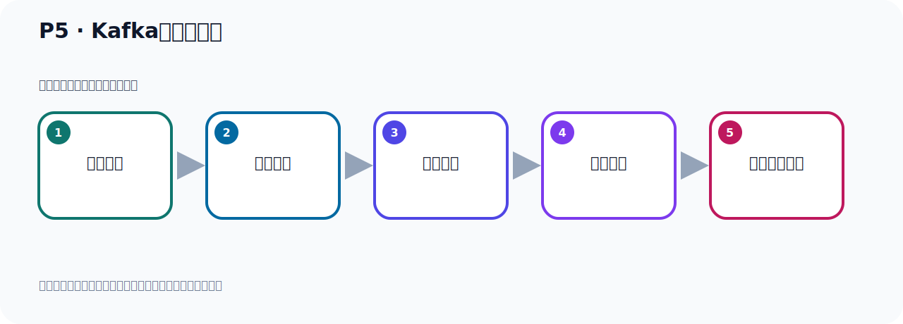

# P5：Kafka名字的由来

> 笔记编号 5/156 · 时长 01:51 · [打开原视频 P5](https://www.bilibili.com/video/BV14J4m187jz?p=5)

[← P4: Kafka的起源](../01-course-overview/p004-Kafka的起源.md) · [返回本章](./README.md) · [P6: Kafka的发展历程 →](../01-course-overview/p006-Kafka的发展历程.md)

## 这节到底讲什么

**核心主题：Kafka名字的由来。**

这是一节概念课。老师先交代背景，再给出定义、组成和作用，最后把概念放回 Kafka 整体架构。
本节属于“课程导学与 Kafka 身世”这一章；放在全章里看，它的作用是：先回答 Kafka 是什么、谁在用、为什么诞生，以及版本如何演进。

## 本节路线

## 老师的完整讲解顺序（ASR 辅助复核）

> 下面按时间顺序保留经过基础术语替换的 ASR，方便核对老师是否提到某个细节。
> 人名、命令、代码和英文参数仍可能识别错误；准确结论以本节白话说明、代码块和实操速查表为准。

### 1. 00:00–01:07

好，那接下来我们继续来看一下Kafka名字的由来。好，那么这个大家只要了解一下就可以，我们快速介绍一下。那为什么把这样一款消息传递系统，他要把它叫做Kafka呢？好，这是因为Kafka他的作者就是我们原来这个LinkedIn 公司的一个架构师，他呢是非常喜欢一个作家。这个作家叫弗兰茲Kafka，这个作家是奥匆帝国的一位使用德语的小托家和短片犹太人故事家。被评论家认为是二十世纪作家中最具影响力的一位作家。好，那么Kafka的作者呢非常喜欢这个作家，据说Kafka作者当时正在看一篇小说，叫变形剂。这样一篇小说，他非常喜欢这个作家。好，他并且觉得呢这个Kafka这个名字非常酷，你看这个发音Kafka确实很酷啊。

### 2. 01:07–01:47

所以呢我们这个作者，这个作者Kafka这个作者就把这样一款消息传递系统取名叫Kafka。好，是这样得来的啊，没有特殊的含义，就是根据这个作者他自己的喜好取了名字。所以你看这个大师们这个取名字啊也是根据自己的喜好来取名，在我们看来有可能感觉很随意啊，因为他没有什么关联性。两个完全不相关的啊，一个是作家，一个是我们这样一个消息传递系统，一个消息服务器。好，这就是我们这个Kafka名字的由来，大家了解一下就可以。

## 关键术语

- **Kafka：** Apache 开源的分布式事件流平台，常用于高吞吐消息传递、数据管道和流处理。

## 完整原声逐段记录

[查看本节带时间戳的本地 ASR](./transcripts/p005-Kafka名字的由来-ASR.md)。主笔记负责可读性和术语校正；ASR 页面负责完整性复核。

## 读完记住

- 本节主题是 **Kafka名字的由来**，它服务于本章目标：先回答 Kafka 是什么、谁在用、为什么诞生，以及版本如何演进。
- 理解顺序是：提出背景 → 给出定义 → 拆解组成 → 解释作用 → 放回整体架构。
- 学习时要同时核对老师的解释、画面中的配置/代码，以及最终运行结果。

## 最容易踩的坑

不要只背术语定义；需要同时说清它解决什么问题、与哪些组件交互、失效时会出现什么现象。

## 自测

1. 不看笔记，用自己的话解释“Kafka名字的由来”解决了什么问题。
2. 按顺序复述：提出背景、给出定义、拆解组成、解释作用、放回整体架构。
3. 如果运行结果和老师不同，你会先检查哪三个输入或环境条件？

## 学完检查

- [ ] 我能不看视频复述本节完整思路
- [ ] 我能指出关键命令、配置、类或接口的作用
- [ ] 我能解释画面中的输入与输出为什么对应
- [ ] 我核对过完整 ASR，没有跳过老师的补充说明
- [ ] 我完成了本节自测或复现实验
