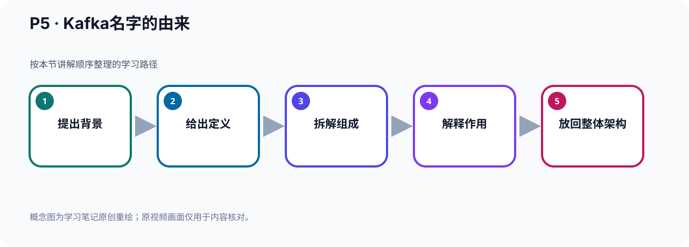

# P5：Kafka名字的由来

> 笔记编号 5/156 · 时长 01:51 · [打开原视频 P5](https://www.bilibili.com/video/BV14J4m187jz?p=5)

[← P4: Kafka的起源](../01-course-overview/p004-Kafka的起源.md) · [返回本章](./README.md) · [P6: Kafka的发展历程 →](../01-course-overview/p006-Kafka的发展历程.md)

## 先看结论

> 这节通过“Kafka名字的由来”回答概念从哪里来、由什么组成、解决什么问题，以及它在 Kafka 整体架构中的位置。它服务于本章目标：先回答 Kafka 是什么、谁在用、为什么诞生，以及版本如何演进。

## 老师怎么一步步讲

1. 第 1 步，围绕“Kafka名字的由来”完成提出背景。
2. 第 2 步，围绕“Kafka名字的由来”完成给出定义。
3. 第 3 步，围绕“Kafka名字的由来”完成拆解组成。
4. 第 4 步，围绕“Kafka名字的由来”完成解释作用。
5. 第 5 步，围绕“Kafka名字的由来”完成放回整体架构。

## 老师的补充说明

下面按原声顺序整理老师的完整讲解脉络。保留原因、案例、对比、操作过程、边界条件和口头提醒；删除重复语气词，并把长口语拆成适合阅读的短段落。

> 技术术语已经过统一校正；仍无法确认的人名或口头英文会保留原意，并通过右侧时间范围返回视频核对。

### 先明确：Kafka名字的由来要解决什么 · 00:00–00:38

那接下来我们继续来看一下Kafka名字的由来。那么这个大家只要了解一下就可以，我们快速介绍一下。那为什么把这样一款消息传递系统，他要把它叫做Kafka呢？这是因为Kafka他的作者就是我们原来这个LinkedIn 公司的一个架构师，他呢是非常喜欢一个作家。这个作家叫弗兰茲Kafka，这个作家是奥匆帝国的一位使用德语的小托家和短片犹太人故事家。

### 继续拆解给出定义 · 00:38–01:16

被评论家认为是二十世纪作家中最具影响力的一位作家。那么Kafka的作者呢非常喜欢这个作家，据说Kafka作者当时正在看一篇小说，叫变形剂。这样一篇小说，他非常喜欢这个作家。他并且觉得呢这个Kafka这个名字非常酷，你看这个发音Kafka确实很酷啊。所以呢我们这个作者，这个作者Kafka这个作者就把这样一款消息传递系统取名叫Kafka。

### 最后验证结果，并收束本节结论 · 01:17–01:47

是这样得来的啊，没有特殊的含义，就是根据这个作者他自己的喜好取了名字。所以你看这个大师们这个取名字啊也是根据自己的喜好来取名，在我们看来有可能感觉很随意啊，因为他没有什么关联性。两个完全不相关的啊，一个是作家，一个是我们这样一个消息传递系统，一个消息服务器。这就是我们这个Kafka名字的由来，大家了解一下就可以。

## 放进整套课

本节属于 **课程导学与 Kafka 身世**。这一章要解决的是：先回答 Kafka 是什么、谁在用、为什么诞生，以及版本如何演进。

这是一节概念课。老师先交代背景，再给出定义、组成和作用，最后把概念放回 Kafka 整体架构。

### 记忆路线

```mermaid
flowchart LR
    N0["提出背景"]
    N1["给出定义"]
    N0 --> N1
    N2["拆解组成"]
    N1 --> N2
    N3["解释作用"]
    N2 --> N3
    N4["放回整体架构"]
    N3 --> N4
```

## 用在工作里

| 项目 | 内容 |
|---|---|
| 先回答 | 先用一句话说明这个概念解决的问题。 |
| 立刻做 | 把它与 Topic、Partition、Broker、Producer 或 Consumer 的关系画出来。 |
| 留下证据 | 用一个正常场景和一个失败场景检验自己是否真正理解。 |

## 关键术语

- **Kafka：** Apache 开源的分布式事件流平台，常用于高吞吐消息传递、数据管道和流处理。

## 最容易踩的坑

不要只背术语定义；需要同时说清它解决什么问题、与哪些组件交互、失效时会出现什么现象。

## 自测

1. 不看笔记，用自己的话解释“Kafka名字的由来”解决了什么问题。
2. 按顺序复述：提出背景、给出定义、拆解组成、解释作用、放回整体架构。
3. 如果运行结果和老师不同，你会先检查哪三个输入或环境条件？

## 学完检查

- [ ] 我能不看视频复述本节完整思路
- [ ] 我能指出关键命令、配置、类或接口的作用
- [ ] 我能解释画面中的输入与输出为什么对应
- [ ] 我读完了老师的详细讲解正文，没有只看路线图和要点
- [ ] 我完成了本节自测或复现实验

## 需要核对原话时

[查看本节带时间戳的完整 ASR](./transcripts/p005-Kafka名字的由来-ASR.md)。主笔记负责理解与实践；ASR 页面负责逐句完整性复核。
