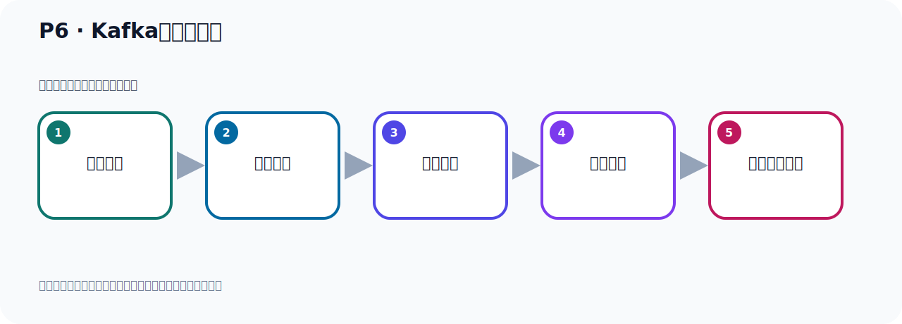

# P6：Kafka的发展历程

> 笔记编号 6/156 · 时长 03:08 · [打开原视频 P6](https://www.bilibili.com/video/BV14J4m187jz?p=6)

[← P5: Kafka名字的由来](../01-course-overview/p005-Kafka名字的由来.md) · [返回本章](./README.md) · [P7: Kafka版本迭代演进 →](../01-course-overview/p007-Kafka版本迭代演进.md)

## 这节到底讲什么

**核心主题：Kafka的发展历程。**

这是一节概念课。老师先交代背景，再给出定义、组成和作用，最后把概念放回 Kafka 整体架构。
本节属于“课程导学与 Kafka 身世”这一章；放在全章里看，它的作用是：先回答 Kafka 是什么、谁在用、为什么诞生，以及版本如何演进。

## 本节路线

## 老师的完整讲解（按视频顺序校正）

> 下面保留老师的完整讲解顺序，并修正 Kafka、Java、ZooKeeper、
> Topic、Partition、Offset 等常见识别错误。它不是压缩摘要；原始 ASR 在后面单独保留。

### 1. 00:00–00:58

接下来我们继续来看一下Kafka的发展历程。好，那么这个东西大家也是简单快速了解一下就可以知道它是怎么发展过来的。首先我们知道Kafka是LinkedIn 公司最早开发设计的。那么当时是在2010年底他们开发的Kafka。好，那么这个时候它就在Github上把它开源了，开放元旦吧。那么这种开源精神很值得我们尊敬。它的初始版本是0.7点零，最早的版本开源版本是0.7点零。那么在2011年7月的时候，因为这个开源中在业绩大家很推草，很关注这样一个项目。好，由于它备受关注，那么这个项目就被纳入到阿帕奇这个服化气象。就是我们这个项目想成为阿帕奇的一个指项目或者说一个顶级项目，。

### 2. 00:58–01:51

那么首先第一步要成为它的服化气象，就像你进入个公司也要成为一个正式员工，你首先也是试用期三个月，然后变成正式员工，就是这么个道理。所以首先是在阿帕奇下进行服化，服化之后后面变成一个正式的顶级项目。那么到2012年10月的时候，这个Kafka这个项目从阿帕奇服化气项目毕业，毕业之后就成为顶级项目。所以现在是阿帕奇这个顶级项目，那么阿帕奇的顶级项目，它这个域名有个顶级域名，就是直接Kafka，然后后面是阿帕奇.com，点org，那你比如TOMKED也是一个顶级项目，所以是TOMKED点阿帕奇.org。你的ZooKeeper也是一个顶级项目，所以你ZooKeeper点阿帕奇.org，这个域名都不一样。

### 3. 01:51–02:50

如果说指项目的话，它其实后面是个斜杠，斜杠后面加你的项目名字，那就是指项目。顶级项目就直接这个项目名加上阿帕奇这个域名。那么在这个时候就成为个顶级项目了，2012年的时候，那现在十几年过去了。那么在2014年的时候，那么Kafka这个架构式上，这个作者就离开了领衣公司离职了，他自己创立了一个conflict这个公司。他自己成家公司，那么此后的Kafka就是由领衣公司还有这个作者conflict这个公司一起开发，他们里面的一些成员一起开发的。因为他这个开源项目，有这两个公司的这个核心成员贡献这个代码，写这个升级，贡献代码，自内于Kafka的版本迭代升级以及这个推广应用。

### 4. 02:50–03:04

好，一直到现在，那现在呢，我们这个Kafka发展的现在的话已经有十几年了。好，这是我们Kafka的一个发展历程，大家呢，快说了解一下就可以，他不是很重要，了解一下就可以。

## 关键术语

- **Kafka：** Apache 开源的分布式事件流平台，常用于高吞吐消息传递、数据管道和流处理。
- **ZooKeeper：** 旧版 Kafka 用于集群元数据和控制器协调的外部服务。

## 完整原声逐段记录

[查看本节带时间戳的本地 ASR](./transcripts/p006-Kafka的发展历程-ASR.md)。主笔记负责可读性和术语校正；ASR 页面负责完整性复核。

## 读完记住

- 本节主题是 **Kafka的发展历程**，它服务于本章目标：先回答 Kafka 是什么、谁在用、为什么诞生，以及版本如何演进。
- 理解顺序是：提出背景 → 给出定义 → 拆解组成 → 解释作用 → 放回整体架构。
- 学习时要同时核对老师的解释、画面中的配置/代码，以及最终运行结果。

## 最容易踩的坑

不要只背术语定义；需要同时说清它解决什么问题、与哪些组件交互、失效时会出现什么现象。

## 自测

1. 不看笔记，用自己的话解释“Kafka的发展历程”解决了什么问题。
2. 按顺序复述：提出背景、给出定义、拆解组成、解释作用、放回整体架构。
3. 如果运行结果和老师不同，你会先检查哪三个输入或环境条件？

## 学完检查

- [ ] 我能不看视频复述本节完整思路
- [ ] 我能指出关键命令、配置、类或接口的作用
- [ ] 我能解释画面中的输入与输出为什么对应
- [ ] 我核对过完整 ASR，没有跳过老师的补充说明
- [ ] 我完成了本节自测或复现实验
