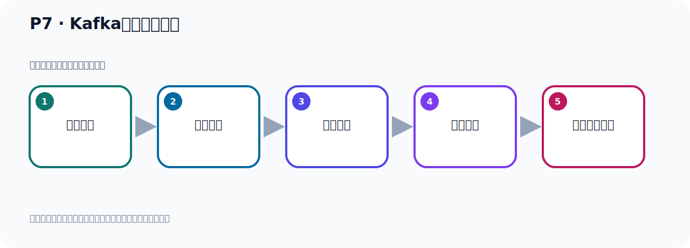

# P7：Kafka版本迭代演进

> 笔记编号 7/156 · 时长 03:12 · [打开原视频 P7](https://www.bilibili.com/video/BV14J4m187jz?p=7)

[← P6: Kafka的发展历程](../01-course-overview/p006-Kafka的发展历程.md) · [返回本章](./README.md) · [P8: Kafka运行环境前置要求 →](../02-environment-deployment/p008-Kafka运行环境前置要求.md)

## 这节到底讲什么

**核心主题：Kafka版本迭代演进。**

这是一节概念课。老师先交代背景，再给出定义、组成和作用，最后把概念放回 Kafka 整体架构。
本节属于“课程导学与 Kafka 身世”这一章；放在全章里看，它的作用是：先回答 Kafka 是什么、谁在用、为什么诞生，以及版本如何演进。

## 本节路线

## 老师的完整讲解（按视频顺序校正）

> 下面保留老师的完整讲解顺序，并修正 Kafka、Java、ZooKeeper、
> Topic、Partition、Offset 等常见识别错误。它不是压缩摘要；原始 ASR 在后面单独保留。

### 1. 00:00–01:06

好，那接下来我们就继续来看一下Kafka版本迭代演技。好，我们来看一下。那么Kafka它前期的项目版本似乎看起来有点乱。为什么有点乱呢？因为Kafka在1.0版本之前，它是用4位版本好。太长了，看起来有点乱，比如说0.8，0.2，0.2太长了，不易越堵，所以看起来有点乱。好，所以它从1.0版本开始，它Kafka它就用3位版本好，这样就清晰一些短一些。好，那么第一位这个的是大版本，大版本通常是一些重大改变，升级一个大升级。它可能会对这个低版本有可能不兼容，这是大版本。然后第二个版本号就是小版本，表示一些新功能的添加，增加一些新的功能。

### 2. 01:06–02:12

然后第三位就是修正版，表示为了修改一些bug发布的版本，它现在是三位版本好。比方说我们现在讲Kafka2.1.3，那么这个2就是我们的大版本，然后这个小版本1就是我们的小版本，然后这个3就是修改bug发布的第三个版本，它现在是三位版本好。那目前为止Kafka它总共发布了八个大版本，那前面的几个都是0.什么什么开始的，有0.7，0.8，0.9，0.10和0.11，这是1这个版本之前的几个大版本，然后之后它是三位版本好，那么就是1.x，2.x，3.x，那目前我们是3.x这个系列，也就是3这个系列，然后截止到目前为止，最新版本的Kafka就是3.7.0，那么三是大版本，。

### 3. 02:12–03:04

其一是这个小版本，能一式那个修改bug发布的第几个版本，这是我们这个版本好，3.7.0是目前最稳定的版本，那我们本货成啊，就采用了是这个最新的啊，这个稳定的版本3.7.0，可能一段时间它会发布这个4.x的系列，它也在不断的升级啊，不断的这个更新的，它这样一个开源的项目，好那以上这个就是我们Kafka这个版本别的的卧嘴，大家的这个版本了解一下，可能有的时候你看一些资料，它的版本啊有可能啊，比如说是0.10x，什么0.11啊这个版本，是比较比较早期的版本，现在最新的版本是3啊，比如说早一两年可能是2，21啊这个版本，现在已经是3这个版本，它的不断的升级，。

### 4. 03:04–03:08

好我们现在就以这个最新的版本来进行学习，。

## 关键术语

- **Kafka：** Apache 开源的分布式事件流平台，常用于高吞吐消息传递、数据管道和流处理。

## 完整原声逐段记录

[查看本节带时间戳的本地 ASR](./transcripts/p007-Kafka版本迭代演进-ASR.md)。主笔记负责可读性和术语校正；ASR 页面负责完整性复核。

## 读完记住

- 本节主题是 **Kafka版本迭代演进**，它服务于本章目标：先回答 Kafka 是什么、谁在用、为什么诞生，以及版本如何演进。
- 理解顺序是：提出背景 → 给出定义 → 拆解组成 → 解释作用 → 放回整体架构。
- 学习时要同时核对老师的解释、画面中的配置/代码，以及最终运行结果。

## 最容易踩的坑

不要只背术语定义；需要同时说清它解决什么问题、与哪些组件交互、失效时会出现什么现象。

## 自测

1. 不看笔记，用自己的话解释“Kafka版本迭代演进”解决了什么问题。
2. 按顺序复述：提出背景、给出定义、拆解组成、解释作用、放回整体架构。
3. 如果运行结果和老师不同，你会先检查哪三个输入或环境条件？

## 学完检查

- [ ] 我能不看视频复述本节完整思路
- [ ] 我能指出关键命令、配置、类或接口的作用
- [ ] 我能解释画面中的输入与输出为什么对应
- [ ] 我核对过完整 ASR，没有跳过老师的补充说明
- [ ] 我完成了本节自测或复现实验
