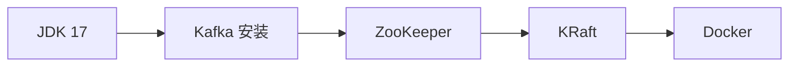

# 第 2 章：环境准备与三种部署方式

完成 JDK、Kafka、ZooKeeper、KRaft 与 Docker 环境的安装、启动和验证。

## 整章核心讲解

课程同时讲 ZooKeeper、KRaft 和 Docker，是为了让你区分 Kafka 的业务进程、元数据协调方式和运行载体。ZooKeeper 与 KRaft 是控制面选择；Docker 是部署方式。

所有安装课都要形成同一个闭环：版本满足要求，配置文件指向正确路径，相关端口没有冲突，服务进程成功启动，最后用日志或命令验证 Broker 确实可用。

## 先看懂整章数据流

## 本章逐节目录

1. [P8 Kafka运行环境前置要求](./p008-Kafka运行环境前置要求.md) · 05:12
2. [P9 JDK17的下载](./p009-JDK17的下载.md) · 03:24
3. [P10 JDK17的安装与配置](./p010-JDK17的安装与配置.md) · 04:37
4. [P11 Kafka的下载和安装](./p011-Kafka的下载和安装.md) · 03:58
5. [P12 Kafka环境启动的两种方式](./p012-Kafka环境启动的两种方式.md) · 03:38
6. [P13 Kafka安装目录的介绍](./p013-Kafka安装目录的介绍.md) · 02:43
7. [P14 Zookeeper服务器的启动](./p014-Zookeeper服务器的启动.md) · 04:55
8. [P15 Kafka服务器的启动](./p015-Kafka服务器的启动.md) · 04:48
9. [P16 Zookeeper和Kafka服务器的关闭](./p016-Zookeeper和Kafka服务器的关闭.md) · 02:50
10. [P17 Zookeeper服务器的下载](./p017-Zookeeper服务器的下载.md) · 03:56
11. [P18 Zookeeper服务器的安装](./p018-Zookeeper服务器的安装.md) · 03:48
12. [P19 Zookeeper服务器的配置](./p019-Zookeeper服务器的配置.md) · 02:50
13. [P20 Zookeeper服务器的启动](./p020-Zookeeper服务器的启动.md) · 03:44
14. [P21 Zookeeper服务器与Tomcat端口冲突处理](./p021-Zookeeper服务器与Tomcat端口冲突处理.md) · 06:53
15. [P22 使用独立的Zookeeper启动Kafka](./p022-使用独立的Zookeeper启动Kafka.md) · 04:47
16. [P23 Kafka启动使用KRaft生成Cluster UUID](./p023-Kafka启动使用KRaft生成Cluster-UUID.md) · 05:20
17. [P24 kafka-storage.sh脚本参数解读](./p024-kafka-storage.sh脚本参数解读.md) · 05:54
18. [P25 Kafka启动使用KRaft](./p025-Kafka启动使用KRaft.md) · 08:31
19. [P26 自定义Cluster UUID启动Kafka](./p026-自定义Cluster-UUID启动Kafka.md) · 08:04
20. [P27 Docker的卸载和安装](./p027-Docker的卸载和安装.md) · 04:50
21. [P28 Docker的卸载和安装](./p028-Docker的卸载和安装.md) · 06:44
22. [P29 Docker引擎启动与关闭](./p029-Docker引擎启动与关闭.md) · 07:06
23. [P30 拉取Kafka的Docker镜像](./p030-拉取Kafka的Docker镜像.md) · 05:16
24. [P31 启动Kafka的Docker容器](./p031-启动Kafka的Docker容器.md) · 03:48

## 本章学习方法

1. 先把上面的流程图画在纸上，明确每节位于哪一步。
2. 读逐节正文，再用 ASR 核查老师的补充、口头提醒和演示顺序。
3. 遇到命令或代码课，必须记录“输入—配置—输出—失败原因”。
4. 学完后从头解释整章，不以“视频播放完”作为完成标准。
