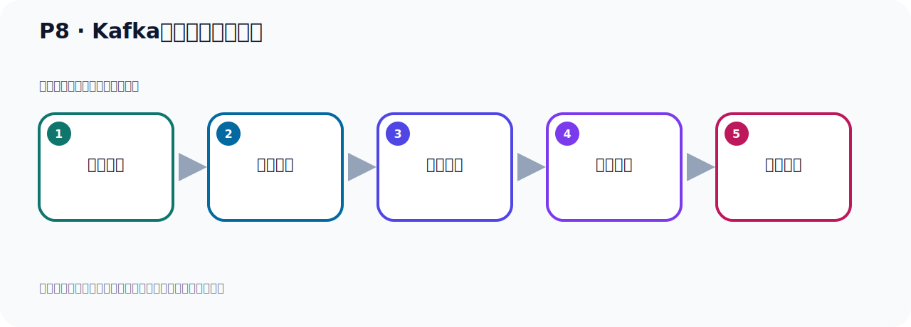

# P8：Kafka运行环境前置要求

> 笔记编号 8/156 · 时长 05:12 · [打开原视频 P8](https://www.bilibili.com/video/BV14J4m187jz?p=8)

[← P7: Kafka版本迭代演进](../01-course-overview/p007-Kafka版本迭代演进.md) · [返回本章](./README.md) · [P9: JDK17的下载 →](../02-environment-deployment/p009-JDK17的下载.md)

## 这节到底讲什么

**核心主题：Kafka运行环境前置要求。**

这节继续完善 Kafka 的完整知识链。请按老师的讲解顺序理解动机、做法和结果。
本节属于“环境准备与三种部署方式”这一章；放在全章里看，它的作用是：完成 JDK、Kafka、ZooKeeper、KRaft 与 Docker 环境的安装、启动和验证。

## 本节路线

## 老师的完整讲解顺序（ASR 辅助复核）

> 下面按时间顺序保留经过基础术语替换的 ASR，方便核对老师是否提到某个细节。
> 人名、命令、代码和英文参数仍可能识别错误；准确结论以本节白话说明、代码块和实操速查表为准。

### 1. 00:00–01:02

接下来就来看一下Kafka：它运行环境前置要求。前面给大家介绍过，Kafka是由Skeleton 编程语言开发的。据说当时Kafka作者正在学习编程语言，所以它是第一次使用Skeleton 编程语言开发Kafka。Skeleton 编程语言也是运行在Java 虚拟机之上的，兼容我们Java程序。所以我们在部属安装Kafka的时候，需要先安装GTK，因为它也是运行在GVM 之上，所以需要安装GTK。如果没有安装GTK的话，当你去启动Kafka服务器的时候，它其实会报一个处，提示你这个Java 命令找不到。因为需要安装GTK，没有GTK的话，它会提出这个错误。

### 2. 01:03–02:08

那么Kafka 原代码在Github上，我们这里可以打开看一下。我们这个网址打开，它是APA旗下的一个项目。这就是它的原代码，只开原道。那么它有很多版本，在发行版本这里面，我们点一下，在类似里面，然后点Tag，它是通过标签的方式，打的标签。那么当前最新版本就是3.7.0这个版本，版本号是3位的，它现在都是3位版本号，这是它的原代码。另外它这个Scala 编程语言，我们可以打开看一下这个官网，在这里。这个我们了解一下就可以。这也是一个编程语言，预行在GTWM 之上的，是它的官网。然后我们需要安装一下这个环境，到时候才可以正常预行Kafka。

### 3. 02:08–03:11

那么这个环境呢，你安装要安装GTK 8或者8以上，至少是8。那我们建议你用8，11，17或者21，因为这几个版本是GTK 长期支持版。这几个，其他版本它不是长期支持版。那目前我在这个客人中，我们选用的是什么，是11，17，这个版本。因为后面我们开发的时候，用的是10分布特3，那么10分布特3这个版本，它需要GTK 117 的一个支持。所以我们装了也是117，选这个版本。好，我们看一下这个GTK 长期支持版，在这个地方。你看一下哪些版本是长期支持版，那你打开这个页片看一看。好，这是GTK 长期支持版。它下面有一个表格，我们打开看一下，就这个表格。

### 4. 03:12–04:05

你看一下，你看这个8是LTS，LTS就是长期支持版。那你看这个9到10都是NO LTS，就是不是长期支持版。所以8是长期支持版，然后这个11是长期支持版。然后后面这个12到16都不是了，17是长期支持版。好，那中间这三个人都不是，然后就21。21之后，这三个都不是，就到25了。所以我们长期支持版到时候就是什么，要么就是8，要么是1111，要么是17，要么是21，要么就是25。当时25应该没有发布，对吧，还没有发布。那么现在对期的话，长期支持版应该就是21的。好，那我们认为是17，其实17在企业中目前来说还没有大量的去使用，。

### 5. 04:06–05:02

其实大量的省略还是8这样一个版本，那当然有些公司也在矚目的切换到17这个版本。好，那我们用17这个版本来，既兼顾知情，又着眼未来，未来的几年，所以这个版本还是可以的，非常恰当，也不算特别超前，也不是很智厚，所以选那个版本，因为我们使命部的三样也需要这个版本，所以我们安装的是17。好，这就是我们的环境的一个前置要求，就是把GTK这个环境要准备一下，我们用17。那这个环境要求其实在它的Kafka的网站上也有说明，我看一下它下面有一个文档中也有说明，它要求8，17，21，就是8以上就可以，8或者8以上这个版本就可以，它是里面这个说明的。

### 6. 05:03–05:11

好，以上我们把前置要求给大家介绍一下，说明一下。好，我们现在就介绍一下，我们把这些线索和线索和线索和线。

## 关键术语

- **Kafka：** Apache 开源的分布式事件流平台，常用于高吞吐消息传递、数据管道和流处理。

## 完整原声逐段记录

[查看本节带时间戳的本地 ASR](./transcripts/p008-Kafka运行环境前置要求-ASR.md)。主笔记负责可读性和术语校正；ASR 页面负责完整性复核。

## 读完记住

- 本节主题是 **Kafka运行环境前置要求**，它服务于本章目标：完成 JDK、Kafka、ZooKeeper、KRaft 与 Docker 环境的安装、启动和验证。
- 理解顺序是：问题背景 → 关键对象 → 处理过程 → 结果验证 → 应用边界。
- 学习时要同时核对老师的解释、画面中的配置/代码，以及最终运行结果。

## 最容易踩的坑

不要把孤立 API 或配置项当成完整能力；始终把它放回生产、存储、消费或集群链路中理解。

## 自测

1. 不看笔记，用自己的话解释“Kafka运行环境前置要求”解决了什么问题。
2. 按顺序复述：问题背景、关键对象、处理过程、结果验证、应用边界。
3. 如果运行结果和老师不同，你会先检查哪三个输入或环境条件？

## 学完检查

- [ ] 我能不看视频复述本节完整思路
- [ ] 我能指出关键命令、配置、类或接口的作用
- [ ] 我能解释画面中的输入与输出为什么对应
- [ ] 我核对过完整 ASR，没有跳过老师的补充说明
- [ ] 我完成了本节自测或复现实验
