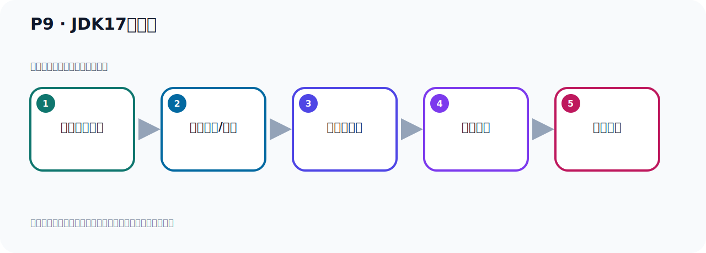

# P9：JDK17的下载

> 笔记编号 9/156 · 时长 03:24 · [打开原视频 P9](https://www.bilibili.com/video/BV14J4m187jz?p=9)

[← P8: Kafka运行环境前置要求](../02-environment-deployment/p008-Kafka运行环境前置要求.md) · [返回本章](./README.md) · [P10: JDK17的安装与配置 →](../02-environment-deployment/p010-JDK17的安装与配置.md)

## 这节到底讲什么

**核心主题：JDK17的下载。**

这是一节动手课。不要只记命令，要把前置条件、操作步骤、关键参数和成功信号连成一条验证链。
本节属于“环境准备与三种部署方式”这一章；放在全章里看，它的作用是：完成 JDK、Kafka、ZooKeeper、KRaft 与 Docker 环境的安装、启动和验证。

## 本节路线

## 老师的完整讲解（按视频顺序校正）

> 下面保留老师的完整讲解顺序，并修正 Kafka、Java、ZooKeeper、
> Topic、Partition、Offset 等常见识别错误。它不是压缩摘要；原始 ASR 在后面单独保留。

### 1. 00:00–01:01

前面介紹了Kamakar運行需要一個JDK：CNN裝JDK才可以運行。下面我們需要安裝一下JDK：安裝JDK：讓第一步去下一個JDK：JDK：去Oluqa官網下載。打開Oluqa官網。官網把後面這個地址去掉。這是之前打開的，回到手頁。回到手頁之後，我們看一下，他在菜單一個產品點進來，然後往下拖一下，這裡有個java，我們點一下java，點一下。點一下之後，到這裡，往下拖一下，下面有個下載地址，看一下。這裡有個叫download，我們點一下。好，進來之後，這就是他到一個下載頁面，因為這個地址就是download下載頁面。

### 2. 01:01–02:00

現在的最新版本，他是JDK121的最新版本，新發布的。我們剛才說的，我們選的是117，選117，那就是說我們相與點117，點這裡，點一下。點一下之後，就在下載，右邊這個地方去下載。他有Lidlx版本，也有MAC版本，有Windows版本，我們現在用Lidlx版本，因為我們把Kafka打算安裝到Lidlx環境下，所以我們在Lidlx環境下裝一個JDK。他有一些版本，我們選哪一個呢？就選六四位，六四位多少呢？壓縮版，壓縮版本下載Tat.gz這個壓縮包，點一下這個下載，點一下，他就彈出下載，就可以確定下載就可以了。那麼JDK117我本地已經下載過了，。

### 3. 02:00–02:57

所以我就不再下載了，給大家看一下就行了，我不下載了，我已經下載過了。那下Windows的話，你點Windows，我也喜歡用Z版，你也可以用安裝版，安裝版就是安裝版，或者安裝版可以，我用Z版，如果你想像21的話，這個比較新推出來的，比較新用的不多，你想用21的話，你點21，這個對應來去下載，下壓縮版就可以了。JDK811也可以，那麼往下拖一下，下面也有JDK8，還有JDK11的下載，你看，這有JDK8的下載，這個地方有JDK11的下載，8的話，下面也有這個下壁子，然後JDK11這裡，JDK11這裡也有這個下壁子，你可以下這個Windows，。

### 4. 02:57–03:23

也可以下Windows，都可以，好，這是他下載，那我們現在是JDK17，這個地方點一下，好，下載，那麼他地址就這個地方了，下地址這個，我們把這個地址放在我們客間裡面去，如果你以後找不到地址的話，你可以從這個客間裡面去找一下，好，我們插入個鏈接，插入個超鏈接，確定一下，好，那下載，就下載完了，。

## 关键术语

- **Kafka：** Apache 开源的分布式事件流平台，常用于高吞吐消息传递、数据管道和流处理。

## 完整原声逐段记录

[查看本节带时间戳的本地 ASR](./transcripts/p009-JDK17的下载-ASR.md)。主笔记负责可读性和术语校正；ASR 页面负责完整性复核。

## 读完记住

- 本节主题是 **JDK17的下载**，它服务于本章目标：完成 JDK、Kafka、ZooKeeper、KRaft 与 Docker 环境的安装、启动和验证。
- 理解顺序是：确认前置条件 → 执行安装/配置 → 启动或应用 → 观察输出 → 排查失败。
- 学习时要同时核对老师的解释、画面中的配置/代码，以及最终运行结果。

## 最容易踩的坑

只照抄命令而不核对当前目录、版本、端口和配置文件路径，最容易造成“命令没报错但服务不可用”。

## 自测

1. 不看笔记，用自己的话解释“JDK17的下载”解决了什么问题。
2. 按顺序复述：确认前置条件、执行安装/配置、启动或应用、观察输出、排查失败。
3. 如果运行结果和老师不同，你会先检查哪三个输入或环境条件？

## 学完检查

- [ ] 我能不看视频复述本节完整思路
- [ ] 我能指出关键命令、配置、类或接口的作用
- [ ] 我能解释画面中的输入与输出为什么对应
- [ ] 我核对过完整 ASR，没有跳过老师的补充说明
- [ ] 我完成了本节自测或复现实验
