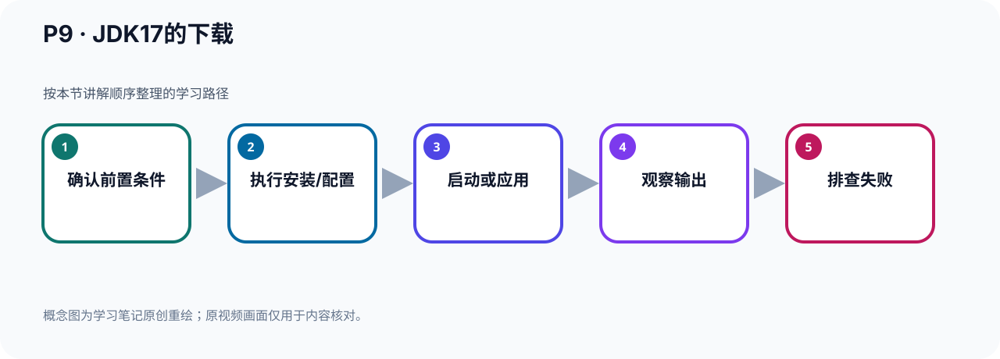

# P9：JDK17的下载

> 笔记编号 9/156 · 时长 03:24 · [打开原视频 P9](https://www.bilibili.com/video/BV14J4m187jz?p=9)

[← P8: Kafka运行环境前置要求](../02-environment-deployment/p008-Kafka运行环境前置要求.md) · [返回本章](./README.md) · [P10: JDK17的安装与配置 →](../02-environment-deployment/p010-JDK17的安装与配置.md)

## 先看结论

> 这节通过“JDK17的下载”完成一条可验证的操作链：先核对前置条件，再执行配置或命令，最后用日志和运行结果确认环境真正可用。它服务于本章目标：完成 JDK、Kafka、ZooKeeper、KRaft 与 Docker 环境的安装、启动和验证。

## 老师怎么一步步讲

1. 第 1 步，围绕“JDK17的下载”完成确认前置条件。
2. 第 2 步，围绕“JDK17的下载”完成执行安装/配置。
3. 第 3 步，围绕“JDK17的下载”完成启动或应用。
4. 第 4 步，围绕“JDK17的下载”完成观察输出。
5. 第 5 步，围绕“JDK17的下载”完成排查失败。

## 老师的补充说明

下面按原声顺序整理老师的完整讲解脉络。保留原因、案例、对比、操作过程、边界条件和口头提醒；删除重复语气词，并把长口语拆成适合阅读的短段落。

> 技术术语已经过统一校正；仍无法确认的人名或口头英文会保留原意，并通过右侧时间范围返回视频核对。

### 先明确：JDK17的下载要解决什么 · 00:00–01:24

前面介紹了Kamakar運行需要一個JDK：CNN裝JDK才可以運行。下面我們需要安裝一下JDK：安裝JDK：讓第一步去下一個JDK：JDK：去Oluqa官網下載。打開Oluqa官網。官網把後面這個地址去掉。這是之前打開的，回到手頁。回到手頁之後，我們看一下，他在菜單一個產品點進來，然後往下拖一下，這裡有個java，我們點一下java，點一下。點一下之後，到這裡，往下拖一下，下面有個下載地址，看一下。這裡有個叫download，我們點一下。

進來之後，這就是他到一個下載頁面，因為這個地址就是download下載頁面。現在的最新版本，他是JDK121的最新版本，新發布的。我們剛才說的，我們選的是117，選117，那就是說我們相與點117，點這裡，點一下。點一下之後，就在下載，右邊這個地方去下載。他有Lidlx版本，也有MAC版本，有Windows版本，。

### 对比不同情况，明确条件和边界 · 01:24–02:31

我們現在用Lidlx版本，因為我們把Kafka打算安裝到Lidlx環境下，所以我們在Lidlx環境下裝一個JDK。他有一些版本，我們選哪一個呢？就選六四位，六四位多少呢？壓縮版，壓縮版本下載Tat.gz這個壓縮包，點一下這個下載，點一下，他就彈出下載，就可以確定下載就可以了。那麼JDK117我本地已經下載過了，所以我就不再下載了，給大家看一下就行了，我不下載了，我已經下載過了。

那下Windows的話，你點Windows，我也喜歡用Z版，你也可以用安裝版，安裝版就是安裝版，或者安裝版可以，我用Z版，如果你想像21的話，這個比較新推出來的，比較新用的不多，你想用21的話，你點21，。

### 最后验证结果，并收束本节结论 · 02:31–03:23

這個對應來去下載，下壓縮版就可以了。

JDK811也可以，那麼往下拖一下，下面也有JDK8，還有JDK11的下載，你看，這有JDK8的下載，這個地方有JDK11的下載，8的話，下面也有這個下壁子，然後JDK11這裡，JDK11這裡也有這個下壁子，你可以下這個Windows，也可以下Windows，都可以，好，這是他下載，那我們現在是JDK17，這個地方點一下，好，下載，那麼他地址就這個地方了，下地址這個，我們把這個地址放在我們客間裡面去，如果你以後找不到地址的話，你可以從這個客間裡面去找一下，好，我們插入個鏈接，插入個超鏈接，確定一下，好，那下載，就下載完了，。

## 放进整套课

本节属于 **环境准备与三种部署方式**。这一章要解决的是：完成 JDK、Kafka、ZooKeeper、KRaft 与 Docker 环境的安装、启动和验证。

这是一节动手课。不要只记命令，要把前置条件、操作步骤、关键参数和成功信号连成一条验证链。

### 记忆路线

```mermaid
flowchart LR
    N0["确认前置条件"]
    N1["执行安装/配置"]
    N0 --> N1
    N2["启动或应用"]
    N1 --> N2
    N3["观察输出"]
    N2 --> N3
    N4["排查失败"]
    N3 --> N4
```

## 用在工作里

| 项目 | 内容 |
|---|---|
| 先回答 | 先确认版本、目录、端口和依赖服务是否满足本节前置条件。 |
| 立刻做 | 按老师的顺序复现安装或配置，并记录每条命令的输入与输出。 |
| 留下证据 | 留下一份包含成功信号和失败排查过程的实验记录。 |

## 关键术语

- **Kafka：** Apache 开源的分布式事件流平台，常用于高吞吐消息传递、数据管道和流处理。

## 最容易踩的坑

只照抄命令而不核对当前目录、版本、端口和配置文件路径，最容易造成“命令没报错但服务不可用”。

## 自测

1. 不看笔记，用自己的话解释“JDK17的下载”解决了什么问题。
2. 按顺序复述：确认前置条件、执行安装/配置、启动或应用、观察输出、排查失败。
3. 如果运行结果和老师不同，你会先检查哪三个输入或环境条件？

## 学完检查

- [ ] 我能不看视频复述本节完整思路
- [ ] 我能指出关键命令、配置、类或接口的作用
- [ ] 我能解释画面中的输入与输出为什么对应
- [ ] 我读完了老师的详细讲解正文，没有只看路线图和要点
- [ ] 我完成了本节自测或复现实验

## 需要核对原话时

[查看本节带时间戳的完整 ASR](./transcripts/p009-JDK17的下载-ASR.md)。主笔记负责理解与实践；ASR 页面负责逐句完整性复核。
