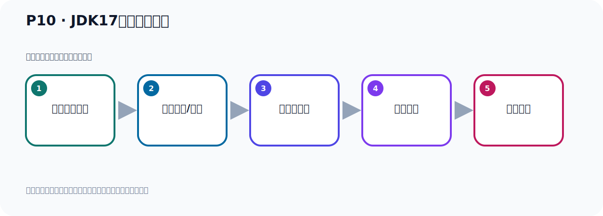

# P10：JDK17的安装与配置

> 笔记编号 10/156 · 时长 04:37 · [打开原视频 P10](https://www.bilibili.com/video/BV14J4m187jz?p=10)

[← P9: JDK17的下载](../02-environment-deployment/p009-JDK17的下载.md) · [返回本章](./README.md) · [P11: Kafka的下载和安装 →](../02-environment-deployment/p011-Kafka的下载和安装.md)

## 这节到底讲什么

**核心主题：JDK17的安装与配置。**

这是一节动手课。不要只记命令，要把前置条件、操作步骤、关键参数和成功信号连成一条验证链。
本节属于“环境准备与三种部署方式”这一章；放在全章里看，它的作用是：完成 JDK、Kafka、ZooKeeper、KRaft 与 Docker 环境的安装、启动和验证。

## 本节路线

## 老师的完整讲解顺序（ASR 辅助复核）

> 下面按时间顺序保留经过基础术语替换的 ASR，方便核对老师是否提到某个细节。
> 人名、命令、代码和英文参数仍可能识别错误；准确结论以本节白话说明、代码块和实操速查表为准。

### 1. 00:00–00:50

下来完之后，我们开始解压说，然后去安装。第一步，我们要准备一个Lilix环境。在这里，我已经准备好了一个Lilix了。我在VMW软件里面，装SendOS，这样一个Lilix，并且我已经把它启动起来了，就这个。我们就用一个工具连上去，我们用X系列工具连上去。后来连上去。AP是11.18连上去。连上去之后，我的这个软件，GTK这个软件放哪里的？我放了这个硕虎的目像，所以我们进入硕虎的目像，CD技能，看一下。这就是我们GTK这个软件，是吧？那我开始去解压，解压的话，用个命令解压，那么这个你只要学过Lilix，那应该都知道这个命令什么意思，是吧？

### 2. 00:50–01:44

它这个命令，后面跟上这个参数，后面这是我们压缩包的名字，后面有个Gang大写C，这个是指定我要把文件解压到哪个地方去，我要把这个压缩包这个文件解压到UserNocal这个目录下去，所以这个Gang大写C是指定要把它解压到哪里去，是这个意思。好，那么去操作一下，它GangCxvf，然后我们GTK，这个压缩包后面Gang大写C，我要把这个软件解压到UserNocal，解压到这个目录，好，那我们回车，好，那现在就解压完了，解压完了以后，我们就到UserNocal下去看一下UserNocal下，进来看一下，好，那我们GTKxvf就是刚刚解压说，。

### 3. 01:44–02:29

就是这个文件夹，这就是我们GTKxvf，我们可以进去看一下GTKxvf，好，这样就解说，抖到一个GTK的，它这个目录解构就这个样子，那么GTKxvf解说之后，现在你比如说你用Gang和Vo型看一下，你看它还是不识别这个Gang命令的，你GangC也是不识别的，是吧，都不识别的，说你这个命令找不到就是不识别，所以此时呢，我们需要干嘛呢？我们需要配一下这个GTKxvf的环境辨量，配置下GTKxvf辨量，好，那配置GTKxvf辨量，配置三行，导出Gang和Vo，导出PaaS，导出ColourPaaS，这样就可以了，好，那我们就配一下，。

### 4. 02:29–03:12

配一下的话，我就把这几行先考备一下，直接配置一下，这个鞋我相信大家如果学过Lidlbs的话，都应该会配，所以我这里面就操作一下，那就是Vim打开什么呢？ETC下的那个ProFile这个文件，好，打开，大家之后呢，我们再让这个文件最后，最后，在这里，好，我们开始编辑一下，把这个内容粘进来，好，就在三行，监控后盟，就是我们U的Norco，这是我们解压说的这个GTK，我们看对不对啊，我们在这地方打开新冲，我们看一样，检查一下对不对啊，那怎么检查呢？我们就看着这个路径写对的没有，把他这个复制一下，那这边呢，我们LL看一下，。

### 5. 03:12–03:58

LL看一下这路径对不对啊，对的，没问题，我们GTK就是这个目录下，好，这加过后盟，然后导出PASS，就是你加好后盟下那个B目录，就是PASS，好，后面这个多的PASS，是我们L6，它原先自己的PASS，因为你不能把它自己的那个PASS给弄丢了，所以放到后面，然后是Clap Pass，Clap Pass包括当前目录，还包括我们这个加过后盟下的那个内部目录，好，这三个导出，然后保存一下，好，这些我相信大家都应该会，所以我们就快速提一下，好，那现在我们就回律辨量，配置好了，配置好了回律辨量之后呢，你现在用加法，你看，你加法这个GUN模型，它还是不识别的啊，。

### 6. 03:58–04:32

还是不识别的，这个时候你需要把那个文件硕实一下，也就是说S，O，U，R，C，E，硕实下哪个文件呢，就是我们刚才的这个配置文件ETC，是吧，比如FIL这个文件，这个文件硕实一下，让你这个配置生效，不然那个配置没生效，所以你加法刚模型不识别，是吧，好，生效一下，生效了之后，这个是我们在加法模型看一下，这个找一下，你看这个是提示我们这个GTK安装好了，E17这个版本就安装好了，好，那么至此我们就把这个Kafka，运行的这个前置的环境要求就整好了，。

## 关键术语

- **Kafka：** Apache 开源的分布式事件流平台，常用于高吞吐消息传递、数据管道和流处理。

## 完整原声逐段记录

[查看本节带时间戳的本地 ASR](./transcripts/p010-JDK17的安装与配置-ASR.md)。主笔记负责可读性和术语校正；ASR 页面负责完整性复核。

## 读完记住

- 本节主题是 **JDK17的安装与配置**，它服务于本章目标：完成 JDK、Kafka、ZooKeeper、KRaft 与 Docker 环境的安装、启动和验证。
- 理解顺序是：确认前置条件 → 执行安装/配置 → 启动或应用 → 观察输出 → 排查失败。
- 学习时要同时核对老师的解释、画面中的配置/代码，以及最终运行结果。

## 最容易踩的坑

只照抄命令而不核对当前目录、版本、端口和配置文件路径，最容易造成“命令没报错但服务不可用”。

## 自测

1. 不看笔记，用自己的话解释“JDK17的安装与配置”解决了什么问题。
2. 按顺序复述：确认前置条件、执行安装/配置、启动或应用、观察输出、排查失败。
3. 如果运行结果和老师不同，你会先检查哪三个输入或环境条件？

## 学完检查

- [ ] 我能不看视频复述本节完整思路
- [ ] 我能指出关键命令、配置、类或接口的作用
- [ ] 我能解释画面中的输入与输出为什么对应
- [ ] 我核对过完整 ASR，没有跳过老师的补充说明
- [ ] 我完成了本节自测或复现实验
