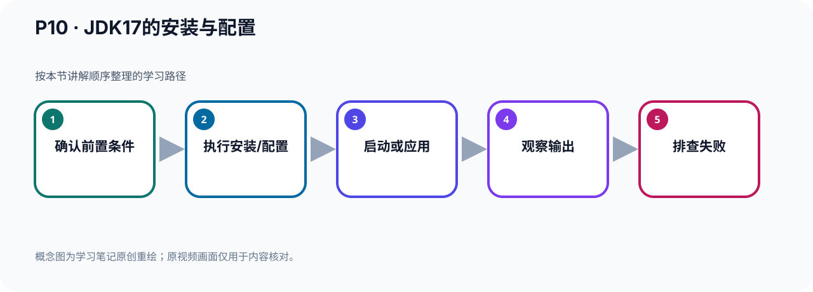

# P10：JDK17的安装与配置

> 笔记编号 10/156 · 时长 04:37 · [打开原视频 P10](https://www.bilibili.com/video/BV14J4m187jz?p=10)

[← P9: JDK17的下载](../02-environment-deployment/p009-JDK17的下载.md) · [返回本章](./README.md) · [P11: Kafka的下载和安装 →](../02-environment-deployment/p011-Kafka的下载和安装.md)

## 先看结论

> 这节通过“JDK17的安装与配置”完成一条可验证的操作链：先核对前置条件，再执行配置或命令，最后用日志和运行结果确认环境真正可用。它服务于本章目标：完成 JDK、Kafka、ZooKeeper、KRaft 与 Docker 环境的安装、启动和验证。

## 老师怎么一步步讲

1. 第 1 步，围绕“JDK17的安装与配置”完成确认前置条件。
2. 第 2 步，围绕“JDK17的安装与配置”完成执行安装/配置。
3. 第 3 步，围绕“JDK17的安装与配置”完成启动或应用。
4. 第 4 步，围绕“JDK17的安装与配置”完成观察输出。
5. 第 5 步，围绕“JDK17的安装与配置”完成排查失败。

## 老师的补充说明

下面按原声顺序整理老师的完整讲解脉络。保留原因、案例、对比、操作过程、边界条件和口头提醒；删除重复语气词，并把长口语拆成适合阅读的短段落。

> 技术术语已经过统一校正；仍无法确认的人名或口头英文会保留原意，并通过右侧时间范围返回视频核对。

### 先明确：JDK17的安装与配置要解决什么 · 00:00–01:21

下来完之后，我们开始解压说，然后去安装。第一步，我们要准备一个Lilix环境。在这里，我已经准备好了一个Lilix了。我在VMW软件里面，装SendOS，这样一个Lilix，并且我已经把它启动起来了，就这个。我们就用一个工具连上去，我们用X系列工具连上去。后来连上去。AP是11.18连上去。连上去之后，我的这个软件，GTK这个软件放哪里的？我放了这个硕虎的目像，所以我们进入硕虎的目像，CD技能，看一下。这就是我们GTK这个软件，是吧？

那我开始去解压，解压的话，用个命令解压，那么这个你只要学过Lilix，那应该都知道这个命令什么意思，是吧？它这个命令，后面跟上这个参数，后面这是我们压缩包的名字，后面有个Gang大写C，这个是指定我要把文件解压到哪个地方去，我要把这个压缩包这个文件解压到UserNocal这个目录下去，所以这个Gang大写C是指定要把它解压到哪里去，是这个意思。那么去操作一下，它GangCxvf，然后我们GTK，。

### 老师用例子进一步解释 · 01:21–02:22

这个压缩包后面Gang大写C，我要把这个软件解压到UserNocal，解压到这个目录，好，那我们回车，好，那现在就解压完了，解压完了以后，我们就到UserNocal下去看一下UserNocal下，进来看一下，好，那我们GTKxvf就是刚刚解压说，就是这个文件夹，这就是我们GTKxvf，我们可以进去看一下GTKxvf，好，这样就解说，抖到一个GTK的，它这个目录解构就这个样子，那么GTKxvf解说之后，现在你比如说你用Gang和Vo型看一下，你看它还是不识别这个Gang命令的，你GangC也是不识别的，是吧，都不识别的，说你这个命令找不到就是不识别，所以此时呢，我们需要干嘛呢？

我们需要配一下这个GTKxvf的环境辨量，配置下GTKxvf辨量，好，那配置GTKxvf辨量，。

### 对比不同情况，明确条件和边界 · 02:22–03:19

配置三行，导出Gang和Vo，导出PaaS，导出ColourPaaS，这样就可以了，好，那我们就配一下，配一下的话，我就把这几行先考备一下，直接配置一下，这个鞋我相信大家如果学过Lidlbs的话，都应该会配，所以我这里面就操作一下，那就是Vim打开什么呢？

ETC下的那个ProFile这个文件，好，打开，大家之后呢，我们再让这个文件最后，最后，在这里，好，我们开始编辑一下，把这个内容粘进来，好，就在三行，监控后盟，就是我们U的Norco，这是我们解压说的这个GTK，我们看对不对啊，我们在这地方打开新冲，我们看一样，检查一下对不对啊，那怎么检查呢？我们就看着这个路径写对的没有，把他这个复制一下，那这边呢，我们LL看一下，LL看一下这路径对不对啊，对的，没问题，我们GTK就是这个目录下，。

### 最后验证结果，并收束本节结论 · 03:19–04:32

这加过后盟，然后导出PASS，就是你加好后盟下那个B目录，就是PASS，好，后面这个多的PASS，是我们L6，它原先自己的PASS，因为你不能把它自己的那个PASS给弄丢了，所以放到后面，然后是Clap Pass，Clap Pass包括当前目录，还包括我们这个加过后盟下的那个内部目录，好，这三个导出，然后保存一下，好，这些我相信大家都应该会，所以我们就快速提一下，好，那现在我们就回律辨量，配置好了，配置好了回律辨量之后呢，你现在用Java，你看，你Java这个GUN模型，它还是不识别的啊，还是不识别的，这个时候你需要把那个文件硕实一下，也就是说S，O，U，R，C，E，硕实下哪个文件呢，就是我们刚才的这个配置文件ETC，是吧，比如FIL这个文件，这个文件硕实一下，让你这个配置生效，不然那个配置没生效，

所以你Java刚模型不识别，是吧，好，生效一下，生效了之后，这个是我们在Java模型看一下，这个找一下，你看这个是提示我们这个GTK安装好了，E17这个版本就安装好了，好，那么至此我们就把这个Kafka，运行的这个前置的环境要求就整好了，。

## 放进整套课

本节属于 **环境准备与三种部署方式**。这一章要解决的是：完成 JDK、Kafka、ZooKeeper、KRaft 与 Docker 环境的安装、启动和验证。

这是一节动手课。不要只记命令，要把前置条件、操作步骤、关键参数和成功信号连成一条验证链。

### 记忆路线

```mermaid
flowchart LR
    N0["确认前置条件"]
    N1["执行安装/配置"]
    N0 --> N1
    N2["启动或应用"]
    N1 --> N2
    N3["观察输出"]
    N2 --> N3
    N4["排查失败"]
    N3 --> N4
```

## 用在工作里

| 项目 | 内容 |
|---|---|
| 先回答 | 先确认版本、目录、端口和依赖服务是否满足本节前置条件。 |
| 立刻做 | 按老师的顺序复现安装或配置，并记录每条命令的输入与输出。 |
| 留下证据 | 留下一份包含成功信号和失败排查过程的实验记录。 |

## 关键术语

- **Kafka：** Apache 开源的分布式事件流平台，常用于高吞吐消息传递、数据管道和流处理。

## 最容易踩的坑

只照抄命令而不核对当前目录、版本、端口和配置文件路径，最容易造成“命令没报错但服务不可用”。

## 自测

1. 不看笔记，用自己的话解释“JDK17的安装与配置”解决了什么问题。
2. 按顺序复述：确认前置条件、执行安装/配置、启动或应用、观察输出、排查失败。
3. 如果运行结果和老师不同，你会先检查哪三个输入或环境条件？

## 学完检查

- [ ] 我能不看视频复述本节完整思路
- [ ] 我能指出关键命令、配置、类或接口的作用
- [ ] 我能解释画面中的输入与输出为什么对应
- [ ] 我读完了老师的详细讲解正文，没有只看路线图和要点
- [ ] 我完成了本节自测或复现实验

## 需要核对原话时

[查看本节带时间戳的完整 ASR](./transcripts/p010-JDK17的安装与配置-ASR.md)。主笔记负责理解与实践；ASR 页面负责逐句完整性复核。
