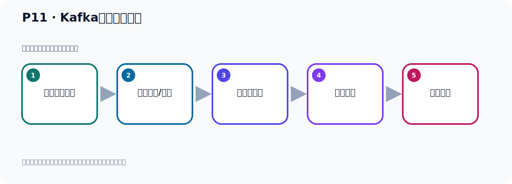

# P11：Kafka的下载和安装

> 笔记编号 11/156 · 时长 03:58 · [打开原视频 P11](https://www.bilibili.com/video/BV14J4m187jz?p=11)

[← P10: JDK17的安装与配置](../02-environment-deployment/p010-JDK17的安装与配置.md) · [返回本章](./README.md) · [P12: Kafka环境启动的两种方式 →](../02-environment-deployment/p012-Kafka环境启动的两种方式.md)

## 这节到底讲什么

**核心主题：Kafka的下载和安装。**

这是一节动手课。不要只记命令，要把前置条件、操作步骤、关键参数和成功信号连成一条验证链。
本节属于“环境准备与三种部署方式”这一章；放在全章里看，它的作用是：完成 JDK、Kafka、ZooKeeper、KRaft 与 Docker 环境的安装、启动和验证。

## 本节路线

## 老师的完整讲解（按视频顺序校正）

> 下面保留老师的完整讲解顺序，并修正 Kafka、Java、ZooKeeper、
> Topic、Partition、Offset 等常见识别错误。它不是压缩摘要；原始 ASR 在后面单独保留。

### 1. 00:00–00:54

好，我们把Kafka运行的前置环境DK整个好了，接下来我们就可以准备一下Kafka的环境。好，现在我们就开始在Kafka的下载环庄。第一步就去下载获取Kafka，下载的话去它的官网，去下载，此时我们打开一下，我们这里打开Kafka官网，Kafka。好，点RF旗。这是Kafka的官网，打开之后我们直接这里就有一个Download下载，点这个，点一下Download，这个点一下。好，目前的最新版本就是3.7.0。好，那么下载的时候你看一下，它这里面有一些下载，什么原代码下载，还有这个Docker镜像，我们后面会给大家介绍一下，用Docker的方式安装Kafka。

### 2. 00:55–01:56

好，那么我们用二G字下载，那么下载的时候它有两个，那下哪一个呢？我们下这个史卡拉2.13，因为这个是新的嘛，那就是下载这个压缩包。它这个名字啊，Kafka-2.13，前面这个2.13表示的是史卡拉这个编程语言的版本，也就是我用的是2.13这个史卡拉语言编写的，是吧？后面这个3.7.0这个三个数字，才是我们Kafka本身的版本，所以它这个软件的版本就是由史卡拉语言版本加上Kafka本身的版本构成的。好，再说我们这个软件包啊，好，那么我们下载这个二G字软件包，那么我们点一下这里，点一下。好，就它啊，就它，好，那么这个软件呢，我已经下工了，所以我就不再下载了，我点一下取消，你没有下过的话，你下载一下就可以了。

### 3. 01:56–02:52

好，那么这就是它的一个下载啊。好，那下载好之后呢，我们接下来就是安装，那么安装非常的简单啊，它只需要解压梭就行了。解压梭之后呢，这个Kafka就安装完成了，不需要做其他操作，非常简单。好，那下面我们就去安装一下，安装一下呢，我们打开我们这个，第一个是，我们首先找到我们这个软件，我们软件在哪里来看一下，这个3.7.0Kafka，就这个软件。好，我把这个软件呢，统一移到那个梭芙的目录下，移到这个当前目录下这个梭芙的目录下，我们先夹一下。好，移过去了，我们在梭芙的目录下看一下，好，这就是我们Kafka这个压梭包，那么解压就行了，它，Gang， XVF，然后跟上这个压梭包。

### 4. 02:53–03:46

好，这就可以了。那然后呢，我们后面也可以加个Gang什么大写C，是吧，指内解压梭的目录，那么指印到UserNocal下。好，这样我们回车，好，就可以了。好，意思是我们这一方上面改一下，到时候把它解压到来，加个Gang大写C，是吧，然后解压到这个User，解压到这个UserNocal，解压这个目录下去。好，那现在我们就解压到这里去了，然后去之后呢，我们到这个目录下去看一下，当前目是没有的，然后到UserNocal，好，进来，那这里面就有个这个压梭包，解压之后得这个面夹，我们这个时候CD到这个面夹下看一下。好，那么这就是我们解压梭之后的Kafka，就这个样子，里面有这么一些面夹，好，那至此我们就把Kafka就相当于安装完成了。

### 5. 03:47–03:54

它的安装品简单解压梭之后就可以，就安装完了。好，那这就是我们的下载和安装。

## 关键术语

- **Kafka：** Apache 开源的分布式事件流平台，常用于高吞吐消息传递、数据管道和流处理。

## 完整原声逐段记录

[查看本节带时间戳的本地 ASR](./transcripts/p011-Kafka的下载和安装-ASR.md)。主笔记负责可读性和术语校正；ASR 页面负责完整性复核。

## 读完记住

- 本节主题是 **Kafka的下载和安装**，它服务于本章目标：完成 JDK、Kafka、ZooKeeper、KRaft 与 Docker 环境的安装、启动和验证。
- 理解顺序是：确认前置条件 → 执行安装/配置 → 启动或应用 → 观察输出 → 排查失败。
- 学习时要同时核对老师的解释、画面中的配置/代码，以及最终运行结果。

## 最容易踩的坑

只照抄命令而不核对当前目录、版本、端口和配置文件路径，最容易造成“命令没报错但服务不可用”。

## 自测

1. 不看笔记，用自己的话解释“Kafka的下载和安装”解决了什么问题。
2. 按顺序复述：确认前置条件、执行安装/配置、启动或应用、观察输出、排查失败。
3. 如果运行结果和老师不同，你会先检查哪三个输入或环境条件？

## 学完检查

- [ ] 我能不看视频复述本节完整思路
- [ ] 我能指出关键命令、配置、类或接口的作用
- [ ] 我能解释画面中的输入与输出为什么对应
- [ ] 我核对过完整 ASR，没有跳过老师的补充说明
- [ ] 我完成了本节自测或复现实验
