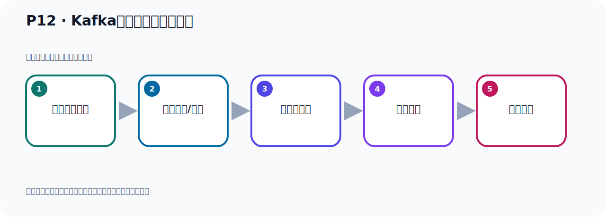

# P12：Kafka环境启动的两种方式

> 笔记编号 12/156 · 时长 03:38 · [打开原视频 P12](https://www.bilibili.com/video/BV14J4m187jz?p=12)

[← P11: Kafka的下载和安装](../02-environment-deployment/p011-Kafka的下载和安装.md) · [返回本章](./README.md) · [P13: Kafka安装目录的介绍 →](../02-environment-deployment/p013-Kafka安装目录的介绍.md)

## 这节到底讲什么

**核心主题：Kafka环境启动的两种方式。**

这是一节动手课。不要只记命令，要把前置条件、操作步骤、关键参数和成功信号连成一条验证链。
本节属于“环境准备与三种部署方式”这一章；放在全章里看，它的作用是：完成 JDK、Kafka、ZooKeeper、KRaft 与 Docker 环境的安装、启动和验证。

## 本节路线

## 老师的完整讲解顺序（ASR 辅助复核）

> 下面按时间顺序保留经过基础术语替换的 ASR，方便核对老师是否提到某个细节。
> 人名、命令、代码和英文参数仍可能识别错误；准确结论以本节白话说明、代码块和实操速查表为准。

### 1. 00:00–00:54

前面我们把Kafka下载并安装好了。接下来我们继续看一下。我们接下来就是启动运行我们Kafka。首先我们要求运行Kafka。首先你需要把你安装好JDK。这个我们前面已经安装好了，并且我们安装的是JDK17，他要求至少是JDK8或者8以上。因为我们用的是Kafka3.7这个版本。那么Kafka启动可以有两种启动方式。我们这个Kafka也叫ApacheKafka，因为它是Apache下的一个顶级的开源项目，所以有时候也叫ApacheKafka。这个Kafka它可以使用RokiaG举起动，也可以用Karabda起动，两种方式。

### 2. 00:54–01:34

当然你只能使用其中一种方式，你不能同时使用这两种方式。也就是说你要不就用RokiaG举起动Kafka，你要不就用Karabda去起动Kafka，选择其中一种方式就行了。好，那这里面一个是RokiaG举起动Karabda，这里面的东西我们稍微介绍一下。同样RokiaG举起动Karabda，可能这个大家应该是知道，如果说你之前学过一些加法相关的一些课程，那你应该是听过这个Kafka的。你是应该听过这个RokiaG举起动Karabda，RokiaG举起动Karabda是一个分布式协调服务，它也是一个服务器，你需要安装一下。

### 3. 01:35–02:28

比如说我们在有一个IPC调用框架Double，那么它的重拾中心就可以使用RokiaG举起动Karabda做重拾中心。然后我们比如说要实现一个分布式锁，我们也可以用RokiaG举起动一个分布式锁，它是个服务器，这个RokiaG举起动Karabda是什么呢？这个Karabda是Kafka开发的，是我们ApacheKafka类似的一套共识机制，就是协调机制，用来取代Apache的RokiaG举起动Karabda，用来取代RokiaG举起动Karabda。那么这个有一个发展历史，因为早期的Karabda它的运行需要依赖于RokiaG，就是我这个Karabda服务器，但是我需要依赖RokiaG，我是依赖它的和它绑定的。

### 4. 02:28–03:22

没有RokiaG，那我是不行的，相应和它绑定的。而且那个时候我们要启动Karabda的话，你首先要把RokiaG启动。RokiaG启动之后，然后你再启动Karabda，因为Karabda需要连接到RokiaG上去。是这样的。好，那么后面我们这个Karabda它希望不要与RokiaG这样强行的绑定，希望有一套内部的机制能够脱离RokiaG。所以它就开发了一套内置的一个协调机制，自己去实现的，取个名字，叫Karabda，也就是KafkaRabda。这个意思，用来取代RokiaG，取代RokiaG的功能。那这一块我们像我们现在Kafka3.0这个版本，它就不需要RokiaG了，没有RokiaG，我也可以独立的运行。

### 5. 03:23–03:35

好，这就是我们这个Karabda。好，那这个介绍我们先介绍这里，我们要么用RokiaG启动，要么用Karabda启动。那接下来我们用具体去操作一下。

## 关键术语

- **Kafka：** Apache 开源的分布式事件流平台，常用于高吞吐消息传递、数据管道和流处理。

## 完整原声逐段记录

[查看本节带时间戳的本地 ASR](./transcripts/p012-Kafka环境启动的两种方式-ASR.md)。主笔记负责可读性和术语校正；ASR 页面负责完整性复核。

## 读完记住

- 本节主题是 **Kafka环境启动的两种方式**，它服务于本章目标：完成 JDK、Kafka、ZooKeeper、KRaft 与 Docker 环境的安装、启动和验证。
- 理解顺序是：确认前置条件 → 执行安装/配置 → 启动或应用 → 观察输出 → 排查失败。
- 学习时要同时核对老师的解释、画面中的配置/代码，以及最终运行结果。

## 最容易踩的坑

只照抄命令而不核对当前目录、版本、端口和配置文件路径，最容易造成“命令没报错但服务不可用”。

## 自测

1. 不看笔记，用自己的话解释“Kafka环境启动的两种方式”解决了什么问题。
2. 按顺序复述：确认前置条件、执行安装/配置、启动或应用、观察输出、排查失败。
3. 如果运行结果和老师不同，你会先检查哪三个输入或环境条件？

## 学完检查

- [ ] 我能不看视频复述本节完整思路
- [ ] 我能指出关键命令、配置、类或接口的作用
- [ ] 我能解释画面中的输入与输出为什么对应
- [ ] 我核对过完整 ASR，没有跳过老师的补充说明
- [ ] 我完成了本节自测或复现实验
