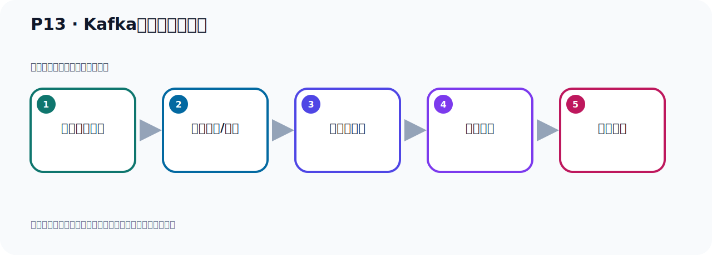

# P13：Kafka安装目录的介绍

> 笔记编号 13/156 · 时长 02:43 · [打开原视频 P13](https://www.bilibili.com/video/BV14J4m187jz?p=13)

[← P12: Kafka环境启动的两种方式](../02-environment-deployment/p012-Kafka环境启动的两种方式.md) · [返回本章](./README.md) · [P14: Zookeeper服务器的启动 →](../02-environment-deployment/p014-Zookeeper服务器的启动.md)

## 这节到底讲什么

**核心主题：Kafka安装目录的介绍。**

这是一节动手课。不要只记命令，要把前置条件、操作步骤、关键参数和成功信号连成一条验证链。
本节属于“环境准备与三种部署方式”这一章；放在全章里看，它的作用是：完成 JDK、Kafka、ZooKeeper、KRaft 与 Docker 环境的安装、启动和验证。

## 本节路线

## 老师的完整讲解顺序（ASR 辅助复核）

> 下面按时间顺序保留经过基础术语替换的 ASR，方便核对老师是否提到某个细节。
> 人名、命令、代码和英文参数仍可能识别错误；准确结论以本节白话说明、代码块和实操速查表为准。

### 1. 00:00–01:01

下面我们就开始启动Kafka。首先我们采用第一种方式，就是用ZooKeeper的方式来启动Kafka。我们回到LiliKos一下。Kafka在这个位置，我们看一下。它下面有这么一些目录。我们就进入到它的B目录下。B目录就是一些启动的脚本。Covid目录是一些配置的文件。Label目录是一些架某。Lesson是许可证。包括下面的Lesson目录，下面也是许可证。我们可以看一下Lesson。你看一下，里面都是一些许可证文件。都是一些文本文件。你看它打开，随便打开来看一下，里面都是文本文件，就是许可证。这个就是许可证。然后这个Logos里面是日志，放日志的Logos看一下。

### 2. 01:01–02:02

里面都是写日志文件，日志在里面去查看。再看一下，Notix就是一些公告、注意事项这些东西。我们打开看一下Logos，通知公告这些东西。里面也是个文本文件。然后下面就是SiteDogos，这是文档。里面是文档，我们进去看一下。它是一个压缩包，里面是一些Kafka的文档。整个文件脚我们都做了一个基本的认识。现在我们启动的话是通过这个并目录里面去启动。我们切换到并目录下。这个目录下，我们看一下有很多SH结尾的卸药脚本。这是Liligos的卸药脚本。通过它进行启动、超做Kafka伏气。它启动的时候需要有个配置文件。配置文件是在config下面，我们进入到config下看一下。

### 3. 02:02–02:41

这里面有一些properties文件，就是配置文件。建值对的方式进行配置，properties文件。然后我们这个level目录也看一下，level目录主要就是一些价包，你看一下，这个level是看一下进来。这里面有很多的价包，Kafka下面放了很多的价包。比如说它里面到时候依耐一个rupeable，那么这个时候它把rupeable的价包放进去了。这就是rupeable的价包，放这里的，在那个目录下。这样我们对它的整个文件夹的目录我们做了一个了解。

## 关键术语

- **Kafka：** Apache 开源的分布式事件流平台，常用于高吞吐消息传递、数据管道和流处理。
- **ZooKeeper：** 旧版 Kafka 用于集群元数据和控制器协调的外部服务。

## 完整原声逐段记录

[查看本节带时间戳的本地 ASR](./transcripts/p013-Kafka安装目录的介绍-ASR.md)。主笔记负责可读性和术语校正；ASR 页面负责完整性复核。

## 读完记住

- 本节主题是 **Kafka安装目录的介绍**，它服务于本章目标：完成 JDK、Kafka、ZooKeeper、KRaft 与 Docker 环境的安装、启动和验证。
- 理解顺序是：确认前置条件 → 执行安装/配置 → 启动或应用 → 观察输出 → 排查失败。
- 学习时要同时核对老师的解释、画面中的配置/代码，以及最终运行结果。

## 最容易踩的坑

只照抄命令而不核对当前目录、版本、端口和配置文件路径，最容易造成“命令没报错但服务不可用”。

## 自测

1. 不看笔记，用自己的话解释“Kafka安装目录的介绍”解决了什么问题。
2. 按顺序复述：确认前置条件、执行安装/配置、启动或应用、观察输出、排查失败。
3. 如果运行结果和老师不同，你会先检查哪三个输入或环境条件？

## 学完检查

- [ ] 我能不看视频复述本节完整思路
- [ ] 我能指出关键命令、配置、类或接口的作用
- [ ] 我能解释画面中的输入与输出为什么对应
- [ ] 我核对过完整 ASR，没有跳过老师的补充说明
- [ ] 我完成了本节自测或复现实验
