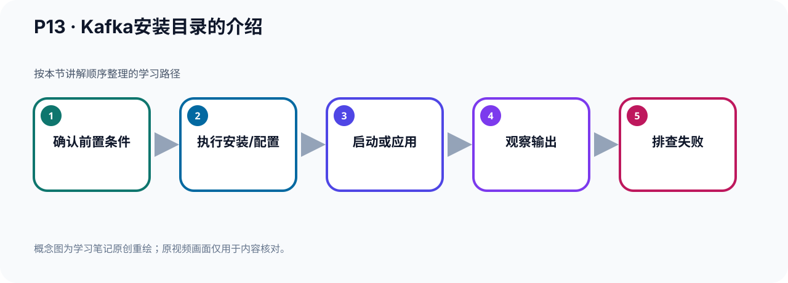

# P13：Kafka安装目录的介绍

> 笔记编号 13/156 · 时长 02:43 · [打开原视频 P13](https://www.bilibili.com/video/BV14J4m187jz?p=13)

[← P12: Kafka环境启动的两种方式](../02-environment-deployment/p012-Kafka环境启动的两种方式.md) · [返回本章](./README.md) · [P14: Zookeeper服务器的启动 →](../02-environment-deployment/p014-Zookeeper服务器的启动.md)

## 先看结论

> 这节通过“Kafka安装目录的介绍”完成一条可验证的操作链：先核对前置条件，再执行配置或命令，最后用日志和运行结果确认环境真正可用。它服务于本章目标：完成 JDK、Kafka、ZooKeeper、KRaft 与 Docker 环境的安装、启动和验证。

## 老师怎么一步步讲

1. 第 1 步，围绕“Kafka安装目录的介绍”完成确认前置条件。
2. 第 2 步，围绕“Kafka安装目录的介绍”完成执行安装/配置。
3. 第 3 步，围绕“Kafka安装目录的介绍”完成启动或应用。
4. 第 4 步，围绕“Kafka安装目录的介绍”完成观察输出。
5. 第 5 步，围绕“Kafka安装目录的介绍”完成排查失败。

## 老师的补充说明

下面按原声顺序整理老师的完整讲解脉络。保留原因、案例、对比、操作过程、边界条件和口头提醒；删除重复语气词，并把长口语拆成适合阅读的短段落。

> 技术术语已经过统一校正；仍无法确认的人名或口头英文会保留原意，并通过右侧时间范围返回视频核对。

### 先明确：Kafka安装目录的介绍要解决什么 · 00:00–00:49

下面我们就开始启动Kafka。首先我们采用第一种方式，就是用ZooKeeper的方式来启动Kafka。我们回到LiliKos一下。Kafka在这个位置，我们看一下。它下面有这么一些目录。我们就进入到它的B目录下。B目录就是一些启动的脚本。Covid目录是一些配置的文件。Label目录是一些架某。Lesson是许可证。包括下面的Lesson目录，下面也是许可证。我们可以看一下Lesson。你看一下，里面都是一些许可证文件。都是一些文本文件。

### 跟着老师操作，并观察运行结果 · 00:49–01:48

你看它打开，随便打开来看一下，里面都是文本文件，就是许可证。这个就是许可证。然后这个logs里面是日志，放日志的logs看一下。里面都是写日志文件，日志在里面去查看。再看一下，NOTICE就是一些公告、注意事项这些东西。我们打开看一下logs，通知公告这些东西。里面也是个文本文件。然后下面就是site-docs，这是文档。里面是文档，我们进去看一下。它是一个压缩包，里面是一些Kafka的文档。整个文件夹我们都做了一个基本的认识。

现在我们启动的话是通过这个bin 目录里面去启动。我们切换到bin 目录下。这个目录下，我们看一下有很多SH结尾的Shell 脚本。

### 最后验证结果，并收束本节结论 · 01:48–02:41

这是Liligos的Shell 脚本。通过它进行启动、超做Kafka伏气。它启动的时候需要有个配置文件。配置文件是在config下面，我们进入到config下看一下。这里面有一些properties文件，就是配置文件。建值对的方式进行配置，properties文件。然后我们这个level目录也看一下，level目录主要就是一些JAR 包，你看一下，这个level是看一下进来。这里面有很多的JAR 包，Kafka下面放了很多的JAR 包。

比如说它里面到时候依耐一个rupeable，那么这个时候它把rupeable的JAR 包放进去了。这就是rupeable的JAR 包，放这里的，在那个目录下。这样我们对它的整个文件夹的目录我们做了一个了解。

## 放进整套课

本节属于 **环境准备与三种部署方式**。这一章要解决的是：完成 JDK、Kafka、ZooKeeper、KRaft 与 Docker 环境的安装、启动和验证。

这是一节动手课。不要只记命令，要把前置条件、操作步骤、关键参数和成功信号连成一条验证链。

### 记忆路线

```mermaid
flowchart LR
    N0["确认前置条件"]
    N1["执行安装/配置"]
    N0 --> N1
    N2["启动或应用"]
    N1 --> N2
    N3["观察输出"]
    N2 --> N3
    N4["排查失败"]
    N3 --> N4
```

## 用在工作里

| 项目 | 内容 |
|---|---|
| 先回答 | 先确认版本、目录、端口和依赖服务是否满足本节前置条件。 |
| 立刻做 | 按老师的顺序复现安装或配置，并记录每条命令的输入与输出。 |
| 留下证据 | 留下一份包含成功信号和失败排查过程的实验记录。 |

## 关键术语

- **Kafka：** Apache 开源的分布式事件流平台，常用于高吞吐消息传递、数据管道和流处理。
- **ZooKeeper：** 旧版 Kafka 用于集群元数据和控制器协调的外部服务。

## 最容易踩的坑

只照抄命令而不核对当前目录、版本、端口和配置文件路径，最容易造成“命令没报错但服务不可用”。

## 自测

1. 不看笔记，用自己的话解释“Kafka安装目录的介绍”解决了什么问题。
2. 按顺序复述：确认前置条件、执行安装/配置、启动或应用、观察输出、排查失败。
3. 如果运行结果和老师不同，你会先检查哪三个输入或环境条件？

## 学完检查

- [ ] 我能不看视频复述本节完整思路
- [ ] 我能指出关键命令、配置、类或接口的作用
- [ ] 我能解释画面中的输入与输出为什么对应
- [ ] 我读完了老师的详细讲解正文，没有只看路线图和要点
- [ ] 我完成了本节自测或复现实验

## 需要核对原话时

[查看本节带时间戳的完整 ASR](./transcripts/p013-Kafka安装目录的介绍-ASR.md)。主笔记负责理解与实践；ASR 页面负责逐句完整性复核。
