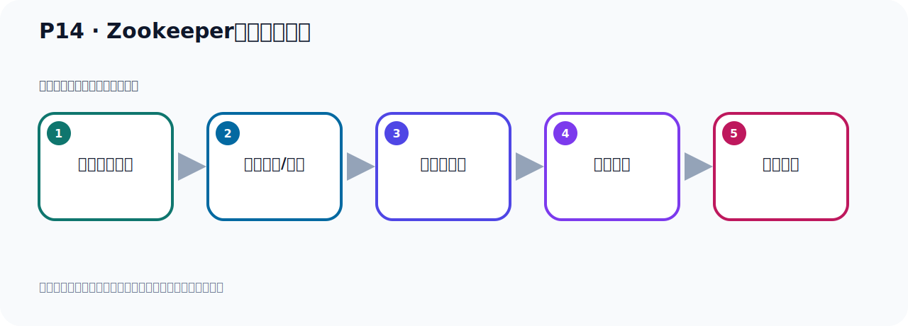

# P14：Zookeeper服务器的启动

> 笔记编号 14/156 · 时长 04:55 · [打开原视频 P14](https://www.bilibili.com/video/BV14J4m187jz?p=14)

[← P13: Kafka安装目录的介绍](../02-environment-deployment/p013-Kafka安装目录的介绍.md) · [返回本章](./README.md) · [P15: Kafka服务器的启动 →](../02-environment-deployment/p015-Kafka服务器的启动.md)

## 这节到底讲什么

**核心主题：Zookeeper服务器的启动。**

这是一节动手课。不要只记命令，要把前置条件、操作步骤、关键参数和成功信号连成一条验证链。
本节属于“环境准备与三种部署方式”这一章；放在全章里看，它的作用是：完成 JDK、Kafka、ZooKeeper、KRaft 与 Docker 环境的安装、启动和验证。

## 本节路线

## 老师的完整讲解顺序（ASR 辅助复核）

> 下面按时间顺序保留经过基础术语替换的 ASR，方便核对老师是否提到某个细节。
> 人名、命令、代码和英文参数仍可能识别错误；准确结论以本节白话说明、代码块和实操速查表为准。

### 1. 00:00–00:50

了解之后，我们现在去启动，首先第一种方式通过ZooKeeper启动，那就是在并部下有一个ZooKeeper Server Start脚本，然后后面我们跟上configure目录下ZooKeeper这个配置文件，这样去启动。那么后面这个语号表示后台启动，语号是后台启动。那么这个启动它分前台启动和后台启动，前台启动就是你执行完之后，它就在这个命令行就打印很多日志，然后你退出命令行，那你这个进程就结束了，就停下来了，这就是前台启动。你一回车退出命令行以后，它就停下来了。那么后台启动就是你回车回到命令行以后，它依然在我们服务端继续在运行，在后台运行。

### 2. 00:50–01:26

所以我们像这种服务器我们肯定是后台运行，即便是我把这个X-L的工具关掉，它也在后台运行，那么这就是后台启动。好，那么你启动一下，那启动的时候它要配置文件，配置文件在config下，我们看一下它说通过这个zoo keyboard点proble文件去启动，那么在文件我们大概来看一点，大家看一下里面它有些配置效，那么这里面配置效呢zoo keyboard的端口是2181，好，你知道下它有这么一个端口，是2181zoo keyboard端口，是2181端口，到时候要连到这个端口上，zoo keyboard启动它会占用2181端口，。

### 3. 01:26–02:13

好，那么配置的这一块呢，我们先默认不做修改，后续需要修改的时候我们再来修改，所以刚开始我们就默认，默认就不动，什么都不动，好，这是配置文件，好，那我这是，我这是帽号，警号，什么感当号，不保存，好，那配置文件开完之后呢我们就启动，那么这个时候回到这个并步下，并步下来通过了Roo keyboard的脚本，先启动Roo keyboard，那么zoo这个脚本，是server，然后是data，好，启动，然后后面跟配置文件，那就说点点上去属于目录下，一个config，这个目录下，然后有个Roo keyboard，婆婆的指纹文件，好，后面加个语号，后台启动就可以了，通过我们这个Roo keyboard这个脚本，。

### 4. 02:13–02:54

启动Roo keyboard服务器，然后跟上这个配置文件，启动Roo keyboard服务器，好，那么这个时候我们回车，回来之后它就会打一些日志，这个日志，好，打完之后呢，骂这个Roo keyboard就启完了，启完了之后我们就按一个回车，就回到并步行了，那这个时候呢我们这个Roo keyboard就启动好了啊，好，启动后之后呢我们这个时候你可以ps查一下，gamf，然后管到然后grayv，然后我们Roo keyboard，zokep2，是吧，Roo keyboard查一下，好，这个时候你可以看到这个进程啊，这个进程比较成，昨天在它里面，这些信息里面包含很多价包，它把那个，它叫价包的这个名字都打印在这个进程名称里面的，。

### 5. 02:54–03:30

这就是我们Roo keyboard，你看，Roo keyboard，对吧，好，它已经启动好了啊，你如果看到这个进程就说明它启动好了，同时呢我们也可以看一下它的端口叫2181，那怎么看呢，我们通过light，site这个短，这个命令，这样我们可以查看一下，我们查看一下这里面有个2181短口啊，它是一个进程号是2780，2780你看一下是哪个进程呢，2780这个进程号，现在就是我们这个Roo keyboard这个进程号，所以这的话我们这个Roo keyboard就2780这个进程就启动完了，它占用一个短口是2181短口，。

### 6. 03:30–04:11

这是我们的Roo keyboard，它也是一个加发进程，为什么是个加发进程，因为Roo keyboard它本身是用加发语言开发的，所以它是个加发进程，好，这是Roo keyboard系统，那我们这个卡富卡啊，我们当前不是在卡富卡木里面吗，这个卡富卡里面怎么会有个Roo keyboard呢，好，那么卡富卡呢，为了我们这个部署的方便，它把这个卡富卡把这个Roo keyboard帮你加进了，就把它的价包已经加进了，所以在这个安装完这个卡富卡之后呢，它里面来帮你自带了一个这个Roo keyboard，你通过脚本去启动它就可以了，它自带一个Roo keyboard，其实它就是那个价包，你看，。

### 7. 04:11–04:52

我们刚才看过在内部目录下不是有个价包吗，你看这个内部目录下就可以看到这里面就有Roo keyboard价包，它启动Roo keyboard，实际上就是在它的内部目录下已经把Roo keyboard那个价包拿进了，然后到时候启动这个Roo keyboard，把Roo keyboard服务器给它启动，当然了我们也可以单独装一个Roo keyboard，也是可以的，单独下载并且安装一个Roo keyboard，这样也可以，那现在我们用的是这个卡富卡自带的这个Roo keyboard，它把Roo keyboard已经拿进了，放进了，所以你用它的脚本就可以直接启动，那现在我们第一步就把这个Roo keyboard就启动完了，。

### 8. 04:52–04:53

这是Roo keyboard启动，。

## 关键术语

- **ZooKeeper：** 旧版 Kafka 用于集群元数据和控制器协调的外部服务。

## 完整原声逐段记录

[查看本节带时间戳的本地 ASR](./transcripts/p014-Zookeeper服务器的启动-ASR.md)。主笔记负责可读性和术语校正；ASR 页面负责完整性复核。

## 读完记住

- 本节主题是 **Zookeeper服务器的启动**，它服务于本章目标：完成 JDK、Kafka、ZooKeeper、KRaft 与 Docker 环境的安装、启动和验证。
- 理解顺序是：确认前置条件 → 执行安装/配置 → 启动或应用 → 观察输出 → 排查失败。
- 学习时要同时核对老师的解释、画面中的配置/代码，以及最终运行结果。

## 最容易踩的坑

只照抄命令而不核对当前目录、版本、端口和配置文件路径，最容易造成“命令没报错但服务不可用”。

## 自测

1. 不看笔记，用自己的话解释“Zookeeper服务器的启动”解决了什么问题。
2. 按顺序复述：确认前置条件、执行安装/配置、启动或应用、观察输出、排查失败。
3. 如果运行结果和老师不同，你会先检查哪三个输入或环境条件？

## 学完检查

- [ ] 我能不看视频复述本节完整思路
- [ ] 我能指出关键命令、配置、类或接口的作用
- [ ] 我能解释画面中的输入与输出为什么对应
- [ ] 我核对过完整 ASR，没有跳过老师的补充说明
- [ ] 我完成了本节自测或复现实验
