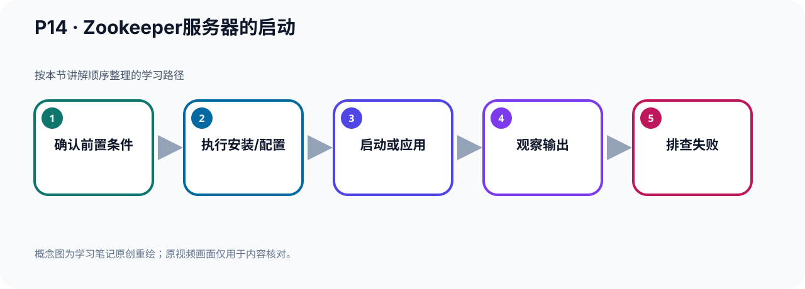

# P14：Zookeeper服务器的启动

> 笔记编号 14/156 · 时长 04:55 · [打开原视频 P14](https://www.bilibili.com/video/BV14J4m187jz?p=14)

[← P13: Kafka安装目录的介绍](../02-environment-deployment/p013-Kafka安装目录的介绍.md) · [返回本章](./README.md) · [P15: Kafka服务器的启动 →](../02-environment-deployment/p015-Kafka服务器的启动.md)

## 先看结论

> 这节通过“Zookeeper服务器的启动”完成一条可验证的操作链：先核对前置条件，再执行配置或命令，最后用日志和运行结果确认环境真正可用。它服务于本章目标：完成 JDK、Kafka、ZooKeeper、KRaft 与 Docker 环境的安装、启动和验证。

## 老师怎么一步步讲

1. 第 1 步，围绕“Zookeeper服务器的启动”完成确认前置条件。
2. 第 2 步，围绕“Zookeeper服务器的启动”完成执行安装/配置。
3. 第 3 步，围绕“Zookeeper服务器的启动”完成启动或应用。
4. 第 4 步，围绕“Zookeeper服务器的启动”完成观察输出。
5. 第 5 步，围绕“Zookeeper服务器的启动”完成排查失败。

## 老师的补充说明

下面按原声顺序整理老师的完整讲解脉络。保留原因、案例、对比、操作过程、边界条件和口头提醒；删除重复语气词，并把长口语拆成适合阅读的短段落。

> 技术术语已经过统一校正；仍无法确认的人名或口头英文会保留原意，并通过右侧时间范围返回视频核对。

### 先明确：Zookeeper服务器的启动要解决什么 · 00:00–01:08

了解之后，我们现在去启动，首先第一种方式通过ZooKeeper启动，那就是在并部下有一个ZooKeeper Server Start脚本，然后后面我们跟上configure目录下ZooKeeper这个配置文件，这样去启动。那么后面这个语号表示后台启动，语号是后台启动。那么这个启动它分前台启动和后台启动，前台启动就是你执行完之后，它就在这个命令行就打印很多日志，然后你退出命令行，那你这个进程就结束了，就停下来了，这就是前台启动。你一回车退出命令行以后，它就停下来了。

那么后台启动就是你回车回到命令行以后，它依然在我们服务端继续在运行，在后台运行。所以我们像这种服务器我们肯定是后台运行，即便是我把这个X-L的工具关掉，它也在后台运行，那么这就是后台启动。那么你启动一下，那启动的时候它要配置文件，配置文件在config下，我们看一下它说通过这个zoo keyboard点proble文件去启动，。

### 跟着老师操作，并观察运行结果 · 01:08–02:35

那么在文件我们大概来看一点，大家看一下里面它有些配置效，那么这里面配置效呢zoo keyboard的端口是2181，好，你知道下它有这么一个端口，是2181zoo keyboard端口，是2181端口，到时候要连到这个端口上，zoo keyboard启动它会占用2181端口，好，那么配置的这一块呢，我们先默认不做修改，后续需要修改的时候我们再来修改，所以刚开始我们就默认，默认就不动，什么都不动，好，这是配置文件，好，那我这是，我这是帽号，警号，什么感当号，不保存，好，那配置文件开完之后呢我们就启动，那么这个时候回到这个并步下，并步下来通过了Roo keyboard的脚本，先启动Roo keyboard，那么zoo这个脚本，是server，然后是data，好，启动，然后后面跟配置文件，那就说点点上去属于目录下，

一个config，这个目录下，然后有个Roo keyboard，婆婆的指纹文件，好，后面加个语号，后台启动就可以了，通过我们这个Roo keyboard这个脚本，启动Roo keyboard服务器，然后跟上这个配置文件，启动Roo keyboard服务器，好，那么这个时候我们回车，回来之后它就会打一些日志，这个日志，好，打完之后呢，骂这个Roo keyboard就启完了，启完了之后我们就按一个回车，就回到并步行了，那这个时候呢我们这个Roo keyboard就启动好了啊，好，启动后之后呢我们这个时候你可以ps查一下，。

### 跟着老师操作，并观察运行结果 · 02:35–03:52

gamf，然后管到然后grayv，然后我们Roo keyboard，zokep2，是吧，Roo keyboard查一下，好，这个时候你可以看到这个进程啊，这个进程比较成，昨天在它里面，这些信息里面包含很多JAR 包，它把那个，它叫JAR 包的这个名字都打印在这个进程名称里面的，这就是我们Roo keyboard，你看，Roo keyboard，对吧，好，它已经启动好了啊，你如果看到这个进程就说明它启动好了，同时呢我们也可以看一下它的端口叫2181，那怎么看呢，我们通过light，site这个短，这个命令，这样我们可以查看一下，我们查看一下这里面有个2181短口啊，它是一个进程号是2780，2780你看一下是哪个进程呢，2780这个进程号，现在就是我们这个Roo keyboard这个进程号，

所以这的话我们这个Roo keyboard就2780这个进程就启动完了，它占用一个短口是2181短口，这是我们的Roo keyboard，它也是一个加发进程，为什么是个加发进程，因为Roo keyboard它本身是用加发语言开发的，所以它是个加发进程，好，这是Roo keyboard系统，那我们这个卡富卡啊，我们当前不是在卡富卡木里面吗，这个卡富卡里面怎么会有个Roo keyboard呢，好，那么卡富卡呢，为了我们这个部署的方便，。

### 最后验证结果，并收束本节结论 · 03:53–04:53

它把这个卡富卡把这个Roo keyboard帮你加进了，就把它的JAR 包已经加进了，所以在这个安装完这个卡富卡之后呢，它里面来帮你自带了一个这个Roo keyboard，你通过脚本去启动它就可以了，它自带一个Roo keyboard，其实它就是那个JAR 包，你看，我们刚才看过在内部目录下不是有个JAR 包吗，你看这个内部目录下就可以看到这里面就有Roo keyboardJAR 包，它启动Roo keyboard，实际上就是在它的内部目录下已经把Roo keyboard那个JAR 包拿进了，然后到时候启动这个Roo keyboard，把Roo keyboard服务器给它启动，当然了我们也可以单独装一个Roo keyboard，也是可以的，单独下载并且安装一个Roo keyboard，这样也可以，

那现在我们用的是这个卡富卡自带的这个Roo keyboard，它把Roo keyboard已经拿进了，放进了，所以你用它的脚本就可以直接启动，那现在我们第一步就把这个Roo keyboard就启动完了，这是Roo keyboard启动，。

## 放进整套课

本节属于 **环境准备与三种部署方式**。这一章要解决的是：完成 JDK、Kafka、ZooKeeper、KRaft 与 Docker 环境的安装、启动和验证。

这是一节动手课。不要只记命令，要把前置条件、操作步骤、关键参数和成功信号连成一条验证链。

### 记忆路线

```mermaid
flowchart LR
    N0["确认前置条件"]
    N1["执行安装/配置"]
    N0 --> N1
    N2["启动或应用"]
    N1 --> N2
    N3["观察输出"]
    N2 --> N3
    N4["排查失败"]
    N3 --> N4
```

## 用在工作里

| 项目 | 内容 |
|---|---|
| 先回答 | 先确认版本、目录、端口和依赖服务是否满足本节前置条件。 |
| 立刻做 | 按老师的顺序复现安装或配置，并记录每条命令的输入与输出。 |
| 留下证据 | 留下一份包含成功信号和失败排查过程的实验记录。 |

## 关键术语

- **ZooKeeper：** 旧版 Kafka 用于集群元数据和控制器协调的外部服务。

## 最容易踩的坑

只照抄命令而不核对当前目录、版本、端口和配置文件路径，最容易造成“命令没报错但服务不可用”。

## 自测

1. 不看笔记，用自己的话解释“Zookeeper服务器的启动”解决了什么问题。
2. 按顺序复述：确认前置条件、执行安装/配置、启动或应用、观察输出、排查失败。
3. 如果运行结果和老师不同，你会先检查哪三个输入或环境条件？

## 学完检查

- [ ] 我能不看视频复述本节完整思路
- [ ] 我能指出关键命令、配置、类或接口的作用
- [ ] 我能解释画面中的输入与输出为什么对应
- [ ] 我读完了老师的详细讲解正文，没有只看路线图和要点
- [ ] 我完成了本节自测或复现实验

## 需要核对原话时

[查看本节带时间戳的完整 ASR](./transcripts/p014-Zookeeper服务器的启动-ASR.md)。主笔记负责理解与实践；ASR 页面负责逐句完整性复核。
