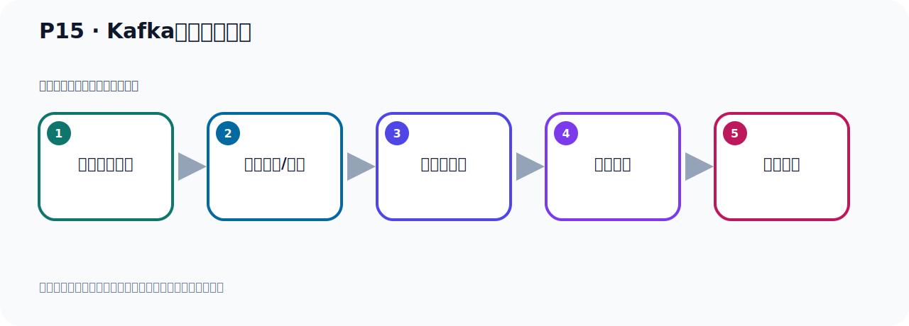

# P15：Kafka服务器的启动

> 笔记编号 15/156 · 时长 04:48 · [打开原视频 P15](https://www.bilibili.com/video/BV14J4m187jz?p=15)

[← P14: Zookeeper服务器的启动](../02-environment-deployment/p014-Zookeeper服务器的启动.md) · [返回本章](./README.md) · [P16: Zookeeper和Kafka服务器的关闭 →](../02-environment-deployment/p016-Zookeeper和Kafka服务器的关闭.md)

## 这节到底讲什么

**核心主题：Kafka服务器的启动。**

这是一节动手课。不要只记命令，要把前置条件、操作步骤、关键参数和成功信号连成一条验证链。
本节属于“环境准备与三种部署方式”这一章；放在全章里看，它的作用是：完成 JDK、Kafka、ZooKeeper、KRaft 与 Docker 环境的安装、启动和验证。

## 本节路线

## 老师的完整讲解（按视频顺序校正）

> 下面保留老师的完整讲解顺序，并修正 Kafka、Java、ZooKeeper、
> Topic、Partition、Offset 等常见识别错误。它不是压缩摘要；原始 ASR 在后面单独保留。

### 1. 00:00–00:33

好，那接下来我们第二个网就是什么？就是启动Kafka。那么这个顺序不零相反，你先启动ZooKeeper再启动Kafka。你不零先启动Kafka，因为Kafka它需要连到ZooKeeper上面去。那你ZooKeeper都没有启动，你Kafka连不上，是吧？当时Kafka启动它需要连ZooKeeper，那连的时候发现了没有ZooKeeper，所以不行。所以你应该是先启动ZooKeeper，然后再启动Kafka，这个顺序是不零颠倒的。好，那我们ZooKeeper启动了之后，接下来启动Kafka。启动Kafka在B目录下，它有Kafka的Server这个实战的脚本。

### 2. 00:33–01:18

然后跟上Kafka自己本身服务的配置文件，Server点POP文件，然后通过后援启动就可以了。好，现在我们去看一下，首先我们在B目录下可以看一下，它有KafkaServer实战的这个脚本，这个需要脚本。然后它配置文件，我们在Kof目录下，Kof一个目录下看一下，它有个Server这个配置文件。好，这个文件我们大概去看一眼，Server，这是Kafka的服务端的配置文件，打开。打开之后你发现它里面是有很多配置项的，里面很多，往它走一下看一下。是吧，很多配像，那么后续我们需要修改的时候，我们再来修改，目前我都不做调整，我用默认的这个值。

### 3. 01:18–02:05

后面我们要改的时候，我们再来改这个文件，好，这个文件大家看一下就可以了。好，这我们退出一下，退出之后我们启动，那这个时候我们进入到B目录下。好，那么这个时候我们通过KafkaServer，然后start。好，然后后面跟上配置文件，然后在上入程目录下一个Kafka，然后一个Server这个文件，好，后台启动加个语号，加语号，好，回车。那这一回来就启动了我们Kafka这个服务器，好，然后启动一下。好，启动之后它打印了很多日志，然后我们先看一下这个日志，从这开始的，从这个，我们这个屏幕都看不到。它日志比较多，但是这个日志里面其实它是没有错误，你看一下这边有些空格对吧，其实这边是什么，它的一些配置值，。

### 4. 02:05–02:59

你要config什么Values，这些配置值这些不是异常，不是异常，是没有问题的，没有错误。这些都是正常的，是它的一些配置信息，配置值这些，所以它不是错误，你给我要拖一下。都是配置值，好，我们看一下。好，那么这是我们整个Kafka的日志，那我们这个时候二人回车就回到密利航了，因为我们加了个语号，它在后台运行，所以你回到密利航，它这个Kafka依然在运行，那怎么检测一下呢，我们通过PS，高EF，Gorip，Gorip，尝一下，然后Kafka，这个时候你可以看到这个进程，它的名字也很长，昨天它里面包含了很多架包的名字，所以导致这个进程的名字特别长了，这么多，那么它的这个进程编号是多少呢，。

### 5. 02:59–03:46

进程编号应该是3205，那么上面这个地方也有一个这个名字，这是因为上面这个应该是RuKiPo，你看，上面这个是2780是RuKiPo，是RuKiPo，好，我们下面这个，下面这个进程号3205，这个就是我们Kafka，是吧，好，这就是我们Kafka，这样就起到了，起到后来我们也通过NightSTAT，是吧，然后更NLPT这个参数，那我们看一下有没有占用什么端头来我们看一下，这个时候我们看到，它这里面其实多了一个叫9092这个端口，这个之前是没有的，之前没有这个端口，现在它多了个这个端口，9092，我们下面这个2180U这个是我们RuKiPo端口，那上面这个东西，你看，它的进程编号是多少呢，是3205吧，。

### 6. 03:47–04:36

305，这个2780是我们RuKiPo，对不对，然后下面还有一个305，它还占了一个什么37557这个端口，你通过进程号可以看到，所以我们RuKiPo，我们的Kafka强制后，它其实占了两个端口，一个是9092，然后还有一个37557这个端口，然后上面这个是我们RuKiPo的端口，2181是RuKiPo端口，你通过这个进程号可以看到，这个PID就是进程编号，当然我们这个RuKiPo你看这个2780是吧，这个RuKiPo吧，这个RuKiPo其实它还占了个什么4142端口，对不对，通过进程号可以看到，所以你看到这个RuKiPo占了两个端口，RuKiPo是2780这个进程号，所以占了两个端口，然后我们3205这个是Kafka，它也占两个端口号，。

### 7. 04:36–04:45

好，那这就是我们的这个通过RuKiPo方式，我们启动了我们这个Kafka弧气，好，这是它的启动方式，。

## 关键术语

- **Kafka：** Apache 开源的分布式事件流平台，常用于高吞吐消息传递、数据管道和流处理。
- **ZooKeeper：** 旧版 Kafka 用于集群元数据和控制器协调的外部服务。

## 完整原声逐段记录

[查看本节带时间戳的本地 ASR](./transcripts/p015-Kafka服务器的启动-ASR.md)。主笔记负责可读性和术语校正；ASR 页面负责完整性复核。

## 读完记住

- 本节主题是 **Kafka服务器的启动**，它服务于本章目标：完成 JDK、Kafka、ZooKeeper、KRaft 与 Docker 环境的安装、启动和验证。
- 理解顺序是：确认前置条件 → 执行安装/配置 → 启动或应用 → 观察输出 → 排查失败。
- 学习时要同时核对老师的解释、画面中的配置/代码，以及最终运行结果。

## 最容易踩的坑

只照抄命令而不核对当前目录、版本、端口和配置文件路径，最容易造成“命令没报错但服务不可用”。

## 自测

1. 不看笔记，用自己的话解释“Kafka服务器的启动”解决了什么问题。
2. 按顺序复述：确认前置条件、执行安装/配置、启动或应用、观察输出、排查失败。
3. 如果运行结果和老师不同，你会先检查哪三个输入或环境条件？

## 学完检查

- [ ] 我能不看视频复述本节完整思路
- [ ] 我能指出关键命令、配置、类或接口的作用
- [ ] 我能解释画面中的输入与输出为什么对应
- [ ] 我核对过完整 ASR，没有跳过老师的补充说明
- [ ] 我完成了本节自测或复现实验
