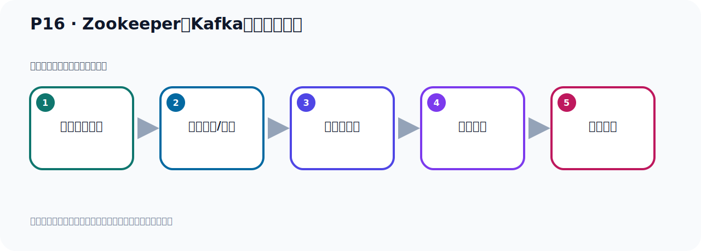

# P16：Zookeeper和Kafka服务器的关闭

> 笔记编号 16/156 · 时长 02:50 · [打开原视频 P16](https://www.bilibili.com/video/BV14J4m187jz?p=16)

[← P15: Kafka服务器的启动](../02-environment-deployment/p015-Kafka服务器的启动.md) · [返回本章](./README.md) · [P17: Zookeeper服务器的下载 →](../02-environment-deployment/p017-Zookeeper服务器的下载.md)

## 这节到底讲什么

**核心主题：Zookeeper和Kafka服务器的关闭。**

这是一节动手课。不要只记命令，要把前置条件、操作步骤、关键参数和成功信号连成一条验证链。
本节属于“环境准备与三种部署方式”这一章；放在全章里看，它的作用是：完成 JDK、Kafka、ZooKeeper、KRaft 与 Docker 环境的安装、启动和验证。

## 本节路线

## 老师的完整讲解顺序（ASR 辅助复核）

> 下面按时间顺序保留经过基础术语替换的 ASR，方便核对老师是否提到某个细节。
> 人名、命令、代码和英文参数仍可能识别错误；准确结论以本节白话说明、代码块和实操速查表为准。

### 1. 00:00–00:47

下面是关闭，关闭的方式是B目录下有个脚本，使舵铺这个脚本，然后跟上配置文件就关了。这个我们也给它诚试一下，看一下它怎么关了，这就是我们去执行的命令就可以了。我们在这个目录下看一下，它有个使舵铺这个脚本，就是Server使舵铺，那就是我们这个时候当前目录下执行KafkaServer使舵铺，然后跟上它那个配置文件，Server点扩布这个文件。好，回车，它会打一些字，打一些字之后，好，它在这里你看，它提示，shadow，conflate完成了，关闭完成了。好，我们按回车就回来命令好了，回来命令好了之后，这个我们先是尝一下Grip，然后这个Kafka，是吧，尝一下。

### 2. 00:47–01:43

好，尝一下之后，你那个2780，那个Kafka就没有了，现在留下来这个东西是什么，现在留下来这个了，是我们这个2780，这个是什么，是我们Rukip。也就是说我们这个Kafka服务性一关了，Rukip是我们另外启动的，所以Rukip还没有关，那Rukip也想关一下，那怎么办呢，那么在避布下来，它给我们提问了一个叫Rukip这个使舵铺，这个脚本，它关了，那这个是我们关下Rukip了，那就是在当地户下，执行它，然后servo使舵铺，好，跟上配置文件，config，然后这个Rukip配置文件，好，这样我们回车，这样就把Rukip关了，好，回车，好，回到执行了，执行之后，那么这个是我们在PS查一下，看看Rukip这个是关了没有，ZOK，直接ZOK就可以了，后面那个不写也可以，我们去查询一下，好，查一下没有了，对吧，当你写完整也可以，K，EE，K，EE，E，E，E。

### 3. 01:43–02:45

查一下，没有了，好，这样我们Rukip关了，Kafka也关了，没有，Kafka查一下也没有，好，那么支持我们这个通过Rukip方式，如何启动，如何关闭这个Kafka，好，我们给大家做了个演示，这个是它的第一种运行它这个环境的一个方式，那我们把这个关闭这个Rukip这个也放这里，把这个文档也写一下，就是关闭这个Rukip，关闭Rukip那就是它有一个十度谱脚本，我们这里写一下，那就是这样，就是这个地方就是十度谱，哎，top，然后跟上这个配置键，这个关闭你就不用语号了，它直接执行一下bd就可以了，好，这就是我们这个第四种方式啊，哎，这就是关闭Rukip，上面是关闭卡Kafka，下面是关闭Rukip，好，那么这个操作我们就演示完了。

## 关键术语

- **Kafka：** Apache 开源的分布式事件流平台，常用于高吞吐消息传递、数据管道和流处理。
- **ZooKeeper：** 旧版 Kafka 用于集群元数据和控制器协调的外部服务。

## 完整原声逐段记录

[查看本节带时间戳的本地 ASR](./transcripts/p016-Zookeeper和Kafka服务器的关闭-ASR.md)。主笔记负责可读性和术语校正；ASR 页面负责完整性复核。

## 读完记住

- 本节主题是 **Zookeeper和Kafka服务器的关闭**，它服务于本章目标：完成 JDK、Kafka、ZooKeeper、KRaft 与 Docker 环境的安装、启动和验证。
- 理解顺序是：确认前置条件 → 执行安装/配置 → 启动或应用 → 观察输出 → 排查失败。
- 学习时要同时核对老师的解释、画面中的配置/代码，以及最终运行结果。

## 最容易踩的坑

只照抄命令而不核对当前目录、版本、端口和配置文件路径，最容易造成“命令没报错但服务不可用”。

## 自测

1. 不看笔记，用自己的话解释“Zookeeper和Kafka服务器的关闭”解决了什么问题。
2. 按顺序复述：确认前置条件、执行安装/配置、启动或应用、观察输出、排查失败。
3. 如果运行结果和老师不同，你会先检查哪三个输入或环境条件？

## 学完检查

- [ ] 我能不看视频复述本节完整思路
- [ ] 我能指出关键命令、配置、类或接口的作用
- [ ] 我能解释画面中的输入与输出为什么对应
- [ ] 我核对过完整 ASR，没有跳过老师的补充说明
- [ ] 我完成了本节自测或复现实验
