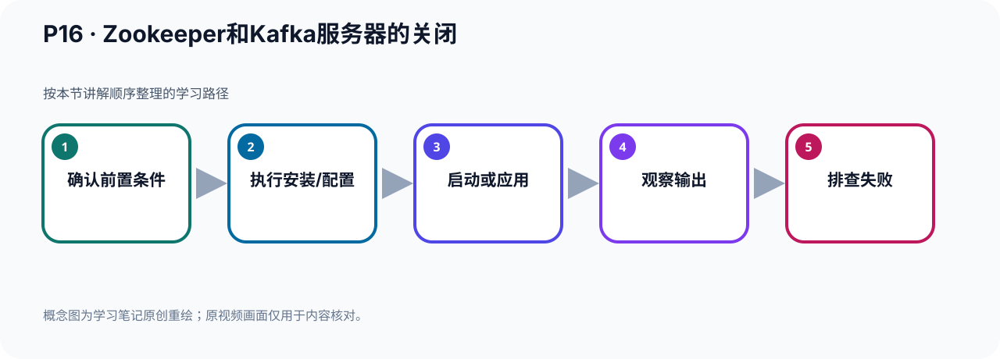

# P16：Zookeeper和Kafka服务器的关闭

> 笔记编号 16/156 · 时长 02:50 · [打开原视频 P16](https://www.bilibili.com/video/BV14J4m187jz?p=16)

[← P15: Kafka服务器的启动](../02-environment-deployment/p015-Kafka服务器的启动.md) · [返回本章](./README.md) · [P17: Zookeeper服务器的下载 →](../02-environment-deployment/p017-Zookeeper服务器的下载.md)

## 先看结论

> 这节通过“Zookeeper和Kafka服务器的关闭”完成一条可验证的操作链：先核对前置条件，再执行配置或命令，最后用日志和运行结果确认环境真正可用。它服务于本章目标：完成 JDK、Kafka、ZooKeeper、KRaft 与 Docker 环境的安装、启动和验证。

## 老师怎么一步步讲

1. 第 1 步，围绕“Zookeeper和Kafka服务器的关闭”完成确认前置条件。
2. 第 2 步，围绕“Zookeeper和Kafka服务器的关闭”完成执行安装/配置。
3. 第 3 步，围绕“Zookeeper和Kafka服务器的关闭”完成启动或应用。
4. 第 4 步，围绕“Zookeeper和Kafka服务器的关闭”完成观察输出。
5. 第 5 步，围绕“Zookeeper和Kafka服务器的关闭”完成排查失败。

## 老师的补充说明

下面按原声顺序整理老师的完整讲解脉络。保留原因、案例、对比、操作过程、边界条件和口头提醒；删除重复语气词，并把长口语拆成适合阅读的短段落。

> 技术术语已经过统一校正；仍无法确认的人名或口头英文会保留原意，并通过右侧时间范围返回视频核对。

### 先明确：Zookeeper和Kafka服务器的关闭要解决什么 · 00:00–00:39

下面是关闭，关闭的方式是B目录下有个脚本，使舵铺这个脚本，然后跟上配置文件就关了。这个我们也给它诚试一下，看一下它怎么关了，这就是我们去执行的命令就可以了。我们在这个目录下看一下，它有个使舵铺这个脚本，就是Server使舵铺，那就是我们这个时候当前目录下执行KafkaServer使舵铺，然后跟上它那个配置文件，Server点扩布这个文件。回车，它会打一些字，打一些字之后，好，它在这里你看，它提示，shadow，conflate完成了，关闭完成了。

### 跟着老师操作，并观察运行结果 · 00:39–01:43

我们按回车就回来命令好了，回来命令好了之后，这个我们先是尝一下Grip，然后这个Kafka，是吧，尝一下。尝一下之后，你那个2780，那个Kafka就没有了，现在留下来这个东西是什么，现在留下来这个了，是我们这个2780，这个是什么，是我们Rukip。

也就是说我们这个Kafka服务性一关了，Rukip是我们另外启动的，所以Rukip还没有关，那Rukip也想关一下，那怎么办呢，那么在避布下来，它给我们提问了一个叫Rukip这个使舵铺，这个脚本，它关了，那这个是我们关下Rukip了，那就是在当地户下，执行它，然后servo使舵铺，好，跟上配置文件，config，然后这个Rukip配置文件，好，这样我们回车，这样就把Rukip关了，好，回车，好，回到执行了，执行之后，那么这个是我们在PS查一下，看看Rukip这个是关了没有，ZOK，直接ZOK就可以了，后面那个不写也可以，我们去查询一下，好，查一下没有了，对吧，当你写完整也可以，K，EE，K，EE，E，E，E，E，E。

### 最后验证结果，并收束本节结论 · 01:43–02:45

查一下，没有了，好，这样我们Rukip关了，Kafka也关了，没有，Kafka查一下也没有，好，那么支持我们这个通过Rukip方式，如何启动，如何关闭这个Kafka，好，我们给大家做了个演示，这个是它的第一种运行它这个环境的一个方式，那我们把这个关闭这个Rukip这个也放这里，把这个文档也写一下，就是关闭这个Rukip，关闭Rukip那就是它有一个十度谱脚本，我们这里写一下，那就是这样，就是这个地方就是十度谱，哎，top，然后跟上这个配置键，这个关闭你就不用语号了，它直接执行一下bd就可以了，好，这就是我们这个第四种方式啊，哎，这就是关闭Rukip，上面是关闭卡Kafka，下面是关闭Rukip，好，那么这个操作我们就演示完了。

## 放进整套课

本节属于 **环境准备与三种部署方式**。这一章要解决的是：完成 JDK、Kafka、ZooKeeper、KRaft 与 Docker 环境的安装、启动和验证。

这是一节动手课。不要只记命令，要把前置条件、操作步骤、关键参数和成功信号连成一条验证链。

### 记忆路线

```mermaid
flowchart LR
    N0["确认前置条件"]
    N1["执行安装/配置"]
    N0 --> N1
    N2["启动或应用"]
    N1 --> N2
    N3["观察输出"]
    N2 --> N3
    N4["排查失败"]
    N3 --> N4
```

## 用在工作里

| 项目 | 内容 |
|---|---|
| 先回答 | 先确认版本、目录、端口和依赖服务是否满足本节前置条件。 |
| 立刻做 | 按老师的顺序复现安装或配置，并记录每条命令的输入与输出。 |
| 留下证据 | 留下一份包含成功信号和失败排查过程的实验记录。 |

## 关键术语

- **Kafka：** Apache 开源的分布式事件流平台，常用于高吞吐消息传递、数据管道和流处理。
- **ZooKeeper：** 旧版 Kafka 用于集群元数据和控制器协调的外部服务。

## 最容易踩的坑

只照抄命令而不核对当前目录、版本、端口和配置文件路径，最容易造成“命令没报错但服务不可用”。

## 自测

1. 不看笔记，用自己的话解释“Zookeeper和Kafka服务器的关闭”解决了什么问题。
2. 按顺序复述：确认前置条件、执行安装/配置、启动或应用、观察输出、排查失败。
3. 如果运行结果和老师不同，你会先检查哪三个输入或环境条件？

## 学完检查

- [ ] 我能不看视频复述本节完整思路
- [ ] 我能指出关键命令、配置、类或接口的作用
- [ ] 我能解释画面中的输入与输出为什么对应
- [ ] 我读完了老师的详细讲解正文，没有只看路线图和要点
- [ ] 我完成了本节自测或复现实验

## 需要核对原话时

[查看本节带时间戳的完整 ASR](./transcripts/p016-Zookeeper和Kafka服务器的关闭-ASR.md)。主笔记负责理解与实践；ASR 页面负责逐句完整性复核。
