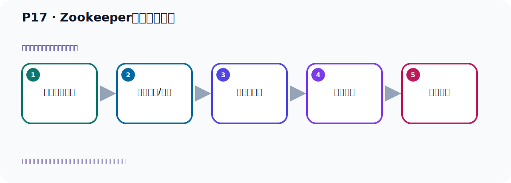

# P17：Zookeeper服务器的下载

> 笔记编号 17/156 · 时长 03:56 · [打开原视频 P17](https://www.bilibili.com/video/BV14J4m187jz?p=17)

[← P16: Zookeeper和Kafka服务器的关闭](../02-environment-deployment/p016-Zookeeper和Kafka服务器的关闭.md) · [返回本章](./README.md) · [P18: Zookeeper服务器的安装 →](../02-environment-deployment/p018-Zookeeper服务器的安装.md)

## 这节到底讲什么

**核心主题：Zookeeper服务器的下载。**

这是一节动手课。不要只记命令，要把前置条件、操作步骤、关键参数和成功信号连成一条验证链。
本节属于“环境准备与三种部署方式”这一章；放在全章里看，它的作用是：完成 JDK、Kafka、ZooKeeper、KRaft 与 Docker 环境的安装、启动和验证。

## 本节路线

## 老师的完整讲解顺序（ASR 辅助复核）

> 下面按时间顺序保留经过基础术语替换的 ASR，方便核对老师是否提到某个细节。
> 人名、命令、代码和英文参数仍可能识别错误；准确结论以本节白话说明、代码块和实操速查表为准。

### 1. 00:00–00:45

前面我们通过ZooKeeper的方式启动了Kafka。那么这个情况我们是用Kafka内部自己给我们内置一个ZooKeeper，也就是他把ZooKeeper已经放到他软件包里面去了。他本身在Kafka里面已经帮我们放了一个ZooKeeper，因为他内部工作下有ZooKeeper的一个价包。我们刚才已经看到了有ZooKeeper价包，现在我们也可以单独安装一个ZooKeeper，这样也可以，也就是我们不用他里面所包含的ZooKeeper，我们另外独立的搞一个ZooKeeper，那也可以。好，那么我们接下来搞一个独立的ZooKeeper，然后去操作一下。

### 2. 00:45–01:41

搞一个独立的ZooKeeper，第一步来我们就下一个ZooKeeper，下一个ZooKeeper，好，那这个时候我再给你增加一个课件，再给你们加一个课件。好，那就是我们来一个ZooKeeper的下载安装ZOKE，ZooKeeper下载安装，那么第一步我们是获取一下ZooKeeper，也就去下载一下，下载最新版本的ZooKeeper，然后我们到时候去安装ZooKeeper，那么下载的话ZooKeeper下载它应该是在ZOKEPER，这个网站，好，后面这个我先站着去掉一下。好，在这地方，那我们打开这个链接，然后去下载一个全新的ZooKeeper，好，打开，这是ZooKeeper，这个官网，好，打开之后呢，在这个页面上它有一些这个介绍，那我们这里直接去下载，它这个服务器啊，。

### 3. 01:41–02:40

它是用加瓦写的，我们点这个登录的这个链接，点一下，好，点一下之后呢，就到这个页面啊，到这个页面，它有版本，那么最新的就是这个3.9.2，是目前这个最新的一个版本，好，那现在我们就去下载一下，那就是下载它那个3.9.2，那就是这个，下面这是原代码，你看，这个suo是码，这是原代码包，我们下载它那个二进字包啊，下载上面这个，下面是原代码包，好，下载上面这个，我们点一下3.9.2，点进来，好，点一下之后呢，它就跳到这个地方，啊，然后呢，你通过这个它推荐我们用下面这个地址去下载，我们点一下下载就可以了，好，点下载我就给它放在这个桌面上啊，暂时先放桌面上，然后点下载，好，它就开始下载这个包，啊，它速度很快，我们下完之后，我们该传到立立个准备去，然后呢，我们去。

### 4. 02:40–03:44

把这个乳屁股安装一下好，我们等它下载一下啊好，那我们看一下它这个Kafka啊，它现在不再下载，我们看一下Kafka，它自己本身给我们带了一个乳屁股，那么这个乳屁股它的版本其实是3.8.3来，稍微老一点点啊，那我们现在下这个是3.9.2，还稍微新一点，3.9.2，好，这个地方正在下载，看一下啊好，快下完了这个乳屁股有点类似于Tombkite，它是加碼语言写的，然后呢，到时候它启动，其实是运行这个它的原代码里面，把那个运行法启动运行啊，然后把这个服务器就启动选了其实我们的Tombkite启动也是一样啊，也是它Tombkite原代码中它有个运行方法，这个代码的入口啊，通过启动运行这个运行方法，然后让这个服务器启动。

### 5. 03:45–03:54

好，是这样的好，现在我们这个乳屁股就下完了，下完之后再桌面上，我们看一下桌面好，就这个啊，这个压缩包。

## 关键术语

- **Kafka：** Apache 开源的分布式事件流平台，常用于高吞吐消息传递、数据管道和流处理。
- **ZooKeeper：** 旧版 Kafka 用于集群元数据和控制器协调的外部服务。

## 完整原声逐段记录

[查看本节带时间戳的本地 ASR](./transcripts/p017-Zookeeper服务器的下载-ASR.md)。主笔记负责可读性和术语校正；ASR 页面负责完整性复核。

## 读完记住

- 本节主题是 **Zookeeper服务器的下载**，它服务于本章目标：完成 JDK、Kafka、ZooKeeper、KRaft 与 Docker 环境的安装、启动和验证。
- 理解顺序是：确认前置条件 → 执行安装/配置 → 启动或应用 → 观察输出 → 排查失败。
- 学习时要同时核对老师的解释、画面中的配置/代码，以及最终运行结果。

## 最容易踩的坑

只照抄命令而不核对当前目录、版本、端口和配置文件路径，最容易造成“命令没报错但服务不可用”。

## 自测

1. 不看笔记，用自己的话解释“Zookeeper服务器的下载”解决了什么问题。
2. 按顺序复述：确认前置条件、执行安装/配置、启动或应用、观察输出、排查失败。
3. 如果运行结果和老师不同，你会先检查哪三个输入或环境条件？

## 学完检查

- [ ] 我能不看视频复述本节完整思路
- [ ] 我能指出关键命令、配置、类或接口的作用
- [ ] 我能解释画面中的输入与输出为什么对应
- [ ] 我核对过完整 ASR，没有跳过老师的补充说明
- [ ] 我完成了本节自测或复现实验
