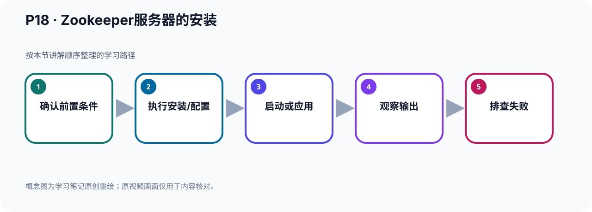

# P18：Zookeeper服务器的安装

> 笔记编号 18/156 · 时长 03:48 · [打开原视频 P18](https://www.bilibili.com/video/BV14J4m187jz?p=18)

[← P17: Zookeeper服务器的下载](../02-environment-deployment/p017-Zookeeper服务器的下载.md) · [返回本章](./README.md) · [P19: Zookeeper服务器的配置 →](../02-environment-deployment/p019-Zookeeper服务器的配置.md)

## 先看结论

> 这节通过“Zookeeper服务器的安装”完成一条可验证的操作链：先核对前置条件，再执行配置或命令，最后用日志和运行结果确认环境真正可用。它服务于本章目标：完成 JDK、Kafka、ZooKeeper、KRaft 与 Docker 环境的安装、启动和验证。

## 老师怎么一步步讲

1. 第 1 步，围绕“Zookeeper服务器的安装”完成确认前置条件。
2. 第 2 步，围绕“Zookeeper服务器的安装”完成执行安装/配置。
3. 第 3 步，围绕“Zookeeper服务器的安装”完成启动或应用。
4. 第 4 步，围绕“Zookeeper服务器的安装”完成观察输出。
5. 第 5 步，围绕“Zookeeper服务器的安装”完成排查失败。

## 老师的补充说明

下面按原声顺序整理老师的完整讲解脉络。保留原因、案例、对比、操作过程、边界条件和口头提醒；删除重复语气词，并把长口语拆成适合阅读的短段落。

> 技术术语已经过统一校正；仍无法确认的人名或口头英文会保留原意，并通过右侧时间范围返回视频核对。

### 先明确：Zookeeper服务器的安装要解决什么 · 00:00–00:52

我们就开始传到Leader上去，我们在这里传一下。我们在这个束缚的目录下，这个目录下我们给它传上来，传上来就是IS、通过密地，然后回车。回车之后我们就打开到我们的桌面，桌面之后找到这个压缩包，打开。那么这样就传记了。在我们这个压缩包，传闻之后我们去解压缩，那么它的压缩包就是这个名字，我们把这个课件也给它同步给它完善一下。这就是解压缩，那就是TAR，然后跟上软件包的名字。后面是解的U的罗克目录下，这里可以了，好，我们就执意这个密地，那这个时候我们在这里就是TARGUN，。

### 跟着老师操作，并观察运行结果 · 00:53–02:11

GUN這個XVF，不是GUNZXVF，然后APPARCHIE，好，后面刚刚大写的C，然后指令，解压缩的目录U的LOCK，好，这个说没回车一下。我看看我之前这边有没有这个ROCKIP，我看一下我的服务器，U的LOCK下我看之前有没有INTOINCLEAN ROCKIP，我之前这边INTOINCLEAN ROCKIP是老的版本，第一我把这个ROCKIP给删掉了，APPARCHIE这个ROCKIP，之前这个版本删掉，再往删了，就把之前这个删掉，让我们这个看一下。

现在我这边就没有ROCKIP了，现在没有了，没有了之后我就可以解压说我们这个新的ROCKIP，删了9.2，好，这时候回车。

解压完了，我们这边看一下U的LOCK下看一下，好，现在有个ROCKIP，就是我们这个ROCKIP，好，那这个ROCKIP，解压完了，好，我们进去看一下ROCKIP，它的目录呢，就是这么几个目录，好，这个B一般就是它的启动的这个程序，启动脚本，康乎就是配置文件，多个是就是它的文档，然后内部是就是一些JAR 包，然后这个Lessons是许可证，是吧，许可协议，开源协议。

### 最后验证结果，并收束本节结论 · 02:11–03:44

NOTICE是一些公告啊，终于事项，Ridemis，这是一个Magnum文件，就是一些说明啊，让你阅读一下它，好，下面这也是一个Ridemis，一个文件，一个Magnum文件。

所以它的主要就是上面有几个评言，那么进到并布下，这里面是一些脚本，启动脚本，什么这个ZK也就是ZooKeeper server，通过这个脚本，那么这个CMD是Windows脚本，是吧，那另一个手柄是通过这个server，点SH这个脚本，去启动，这是它的这个脚本啊，然后这个Config看一下，里面就是配置文件啊，在它配置文件，好，再看一下，然后就是这个多个是，多个是文档，多个是文档，是吧，里面有一些这个IGT帽这个文档啊，这是文档，包括它的API文档啊，都在里面，好，然后呢，再看一下它这个Label，Label下就是一些JAR 包，看一下Label，这个ZooKeeper，那么它也会有一些JAR 包啊，你看，这里面差一些JAR 包啊，好，这是这样的，那这个目录结构，你要求新用之后，

我们接下来这个ZooKeeper就安装好了，它几家说之后就安装好了，所以我们这里有个课件里面，稍微完成一下，那就是，我们可以切换了这个目录下，是吧，它是个目，然后你可以看一下它的文件结构，我们刚才一看完了，所以它减压缩之后就安装完了，好，那么支持在我们这个ZooKeeper就安装好了，这是ZooKeeper的那个下载和安装。

## 放进整套课

本节属于 **环境准备与三种部署方式**。这一章要解决的是：完成 JDK、Kafka、ZooKeeper、KRaft 与 Docker 环境的安装、启动和验证。

这是一节动手课。不要只记命令，要把前置条件、操作步骤、关键参数和成功信号连成一条验证链。

### 记忆路线

```mermaid
flowchart LR
    N0["确认前置条件"]
    N1["执行安装/配置"]
    N0 --> N1
    N2["启动或应用"]
    N1 --> N2
    N3["观察输出"]
    N2 --> N3
    N4["排查失败"]
    N3 --> N4
```

## 用在工作里

| 项目 | 内容 |
|---|---|
| 先回答 | 先确认版本、目录、端口和依赖服务是否满足本节前置条件。 |
| 立刻做 | 按老师的顺序复现安装或配置，并记录每条命令的输入与输出。 |
| 留下证据 | 留下一份包含成功信号和失败排查过程的实验记录。 |

## 关键术语

- **ZooKeeper：** 旧版 Kafka 用于集群元数据和控制器协调的外部服务。

## 最容易踩的坑

只照抄命令而不核对当前目录、版本、端口和配置文件路径，最容易造成“命令没报错但服务不可用”。

## 自测

1. 不看笔记，用自己的话解释“Zookeeper服务器的安装”解决了什么问题。
2. 按顺序复述：确认前置条件、执行安装/配置、启动或应用、观察输出、排查失败。
3. 如果运行结果和老师不同，你会先检查哪三个输入或环境条件？

## 学完检查

- [ ] 我能不看视频复述本节完整思路
- [ ] 我能指出关键命令、配置、类或接口的作用
- [ ] 我能解释画面中的输入与输出为什么对应
- [ ] 我读完了老师的详细讲解正文，没有只看路线图和要点
- [ ] 我完成了本节自测或复现实验

## 需要核对原话时

[查看本节带时间戳的完整 ASR](./transcripts/p018-Zookeeper服务器的安装-ASR.md)。主笔记负责理解与实践；ASR 页面负责逐句完整性复核。
