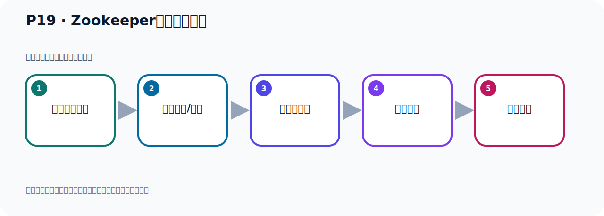

# P19：Zookeeper服务器的配置

> 笔记编号 19/156 · 时长 02:50 · [打开原视频 P19](https://www.bilibili.com/video/BV14J4m187jz?p=19)

[← P18: Zookeeper服务器的安装](../02-environment-deployment/p018-Zookeeper服务器的安装.md) · [返回本章](./README.md) · [P20: Zookeeper服务器的启动 →](../02-environment-deployment/p020-Zookeeper服务器的启动.md)

## 这节到底讲什么

**核心主题：Zookeeper服务器的配置。**

这是一节动手课。不要只记命令，要把前置条件、操作步骤、关键参数和成功信号连成一条验证链。
本节属于“环境准备与三种部署方式”这一章；放在全章里看，它的作用是：完成 JDK、Kafka、ZooKeeper、KRaft 与 Docker 环境的安装、启动和验证。

## 本节路线

## 老师的完整讲解顺序（ASR 辅助复核）

> 下面按时间顺序保留经过基础术语替换的 ASR，方便核对老师是否提到某个细节。
> 人名、命令、代码和英文参数仍可能识别错误；准确结论以本节白话说明、代码块和实操速查表为准。

### 1. 00:00–00:49

好，那刚才我们把ZooKeeper下载并且安装好了，那接下来我们就是配置ZooKeeper并且启动ZooKeeper。好，那这里我们补充一个课件，那我们把这个课件复制一份。复制一份之后我们看一下呢。这是我们原来这个课件到这，好，我们改一下，那么就是ZooKeeper的配置和启动，配置和它的一个启动。好，首先我们看一下怎么去配置ZooKeeper，那我把这些先给它删一下。那配置ZooKeeper的话呢，我们首先就到我们这个安装好的ZooKeeper，在我们之前安装好的ZooKeeper，对吧。好，它的配置文件在康复这个幕下，我们进到康复幕下。

### 2. 00:50–01:39

那目前这里面它有这么三个文件，那么ZooKeeper的配置文件，它名字必须叫ZOO然后点CFG，那目前它没有，所以我们可以通过它这个样立文件，考备一份，它这个样立文件其实是配置好的，把它完全不动考备一份就可以了。然后我们的ZooKeeper配置文件就准备好了，所以我们平时都是这样配的，首先Cp考备一个这个样立文件，考备之后的名字叫ZOO.CFG，变成这个名字，就是把这个renbo去掉就可以了。好，这样我们回车，回车之后我们就复制哪个这个文件，所以我们配置的话就是把它复制一下，执行这么一个操作，好，就这样，先复制一个这个文件出来。

### 3. 01:41–02:22

复制出来之后，那么这个文件复制完之后，我们看一下，用VAM打开一下ZOO这个文件，打开，大家之后看一下。好，那你发现这个文件里面有一些配置项，这大概有五个配置项，下面还有些注释掉的。那么这五个配置项，其实你也不需要修改，不需要修改，就可以使用。我们可以看到这里面有个端口号是2181，这是我们如Keyboard这个服务器启用之后，它会占用这个2181端口。到时候我们Kafka就连接这个2181端口连到我们如Keyboard上面来，它有这个端口，好，那这个文件我们不需要调整，所以我们直接保存一下就可以了，好，那么这个配置文件就准备好了。

### 4. 02:22–02:46

这就是我们如Keyboard配置，就复制一份这个文件，也不需要做什么修改，那么ZOO.CFG，不需要做什么修改，直接使用，即可，好，这样我们就配置好了，好，配置好之后，我们今天就开始去启动这个如Keyboard。

## 关键术语

- **Kafka：** Apache 开源的分布式事件流平台，常用于高吞吐消息传递、数据管道和流处理。
- **ZooKeeper：** 旧版 Kafka 用于集群元数据和控制器协调的外部服务。

## 完整原声逐段记录

[查看本节带时间戳的本地 ASR](./transcripts/p019-Zookeeper服务器的配置-ASR.md)。主笔记负责可读性和术语校正；ASR 页面负责完整性复核。

## 读完记住

- 本节主题是 **Zookeeper服务器的配置**，它服务于本章目标：完成 JDK、Kafka、ZooKeeper、KRaft 与 Docker 环境的安装、启动和验证。
- 理解顺序是：确认前置条件 → 执行安装/配置 → 启动或应用 → 观察输出 → 排查失败。
- 学习时要同时核对老师的解释、画面中的配置/代码，以及最终运行结果。

## 最容易踩的坑

只照抄命令而不核对当前目录、版本、端口和配置文件路径，最容易造成“命令没报错但服务不可用”。

## 自测

1. 不看笔记，用自己的话解释“Zookeeper服务器的配置”解决了什么问题。
2. 按顺序复述：确认前置条件、执行安装/配置、启动或应用、观察输出、排查失败。
3. 如果运行结果和老师不同，你会先检查哪三个输入或环境条件？

## 学完检查

- [ ] 我能不看视频复述本节完整思路
- [ ] 我能指出关键命令、配置、类或接口的作用
- [ ] 我能解释画面中的输入与输出为什么对应
- [ ] 我核对过完整 ASR，没有跳过老师的补充说明
- [ ] 我完成了本节自测或复现实验
