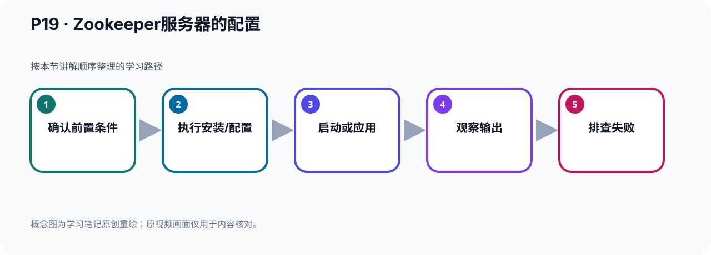

# P19：Zookeeper服务器的配置

> 笔记编号 19/156 · 时长 02:50 · [打开原视频 P19](https://www.bilibili.com/video/BV14J4m187jz?p=19)

[← P18: Zookeeper服务器的安装](../02-environment-deployment/p018-Zookeeper服务器的安装.md) · [返回本章](./README.md) · [P20: Zookeeper服务器的启动 →](../02-environment-deployment/p020-Zookeeper服务器的启动.md)

## 先看结论

> 这节通过“Zookeeper服务器的配置”完成一条可验证的操作链：先核对前置条件，再执行配置或命令，最后用日志和运行结果确认环境真正可用。它服务于本章目标：完成 JDK、Kafka、ZooKeeper、KRaft 与 Docker 环境的安装、启动和验证。

## 老师怎么一步步讲

1. 第 1 步，围绕“Zookeeper服务器的配置”完成确认前置条件。
2. 第 2 步，围绕“Zookeeper服务器的配置”完成执行安装/配置。
3. 第 3 步，围绕“Zookeeper服务器的配置”完成启动或应用。
4. 第 4 步，围绕“Zookeeper服务器的配置”完成观察输出。
5. 第 5 步，围绕“Zookeeper服务器的配置”完成排查失败。

## 老师的补充说明

下面按原声顺序整理老师的完整讲解脉络。保留原因、案例、对比、操作过程、边界条件和口头提醒；删除重复语气词，并把长口语拆成适合阅读的短段落。

> 技术术语已经过统一校正；仍无法确认的人名或口头英文会保留原意，并通过右侧时间范围返回视频核对。

### 先明确：Zookeeper服务器的配置要解决什么 · 00:00–01:01

那刚才我们把ZooKeeper下载并且安装好了，那接下来我们就是配置ZooKeeper并且启动ZooKeeper。那这里我们补充一个课件，那我们把这个课件复制一份。复制一份之后我们看一下呢。这是我们原来这个课件到这，好，我们改一下，那么就是ZooKeeper的配置和启动，配置和它的一个启动。首先我们看一下怎么去配置ZooKeeper，那我把这些先给它删一下。

那配置ZooKeeper的话呢，我们首先就到我们这个安装好的ZooKeeper，在我们之前安装好的ZooKeeper，对吧。它的配置文件在康复这个幕下，我们进到康复幕下。那目前这里面它有这么三个文件，那么ZooKeeper的配置文件，它名字必须叫ZOO然后点CFG，那目前它没有，。

### 跟着老师操作，并观察运行结果 · 01:01–01:55

所以我们可以通过它这个样立文件，考备一份，它这个样立文件其实是配置好的，把它完全不动考备一份就可以了。然后我们的ZooKeeper配置文件就准备好了，所以我们平时都是这样配的，首先Cp考备一个这个样立文件，考备之后的名字叫ZOO.CFG，变成这个名字，就是把这个renbo去掉就可以了。这样我们回车，回车之后我们就复制哪个这个文件，所以我们配置的话就是把它复制一下，执行这么一个操作，好，就这样，先复制一个这个文件出来。

复制出来之后，那么这个文件复制完之后，我们看一下，用VAM打开一下ZOO这个文件，打开，大家之后看一下。那你发现这个文件里面有一些配置项，这大概有五个配置项，下面还有些注释掉的。

### 最后验证结果，并收束本节结论 · 01:55–02:46

那么这五个配置项，其实你也不需要修改，不需要修改，就可以使用。我们可以看到这里面有个端口号是2181，这是我们如Keyboard这个服务器启用之后，它会占用这个2181端口。到时候我们Kafka就连接这个2181端口连到我们如Keyboard上面来，它有这个端口，好，那这个文件我们不需要调整，所以我们直接保存一下就可以了，好，那么这个配置文件就准备好了。

这就是我们如Keyboard配置，就复制一份这个文件，也不需要做什么修改，那么ZOO.CFG，不需要做什么修改，直接使用，即可，好，这样我们就配置好了，好，配置好之后，我们今天就开始去启动这个如Keyboard。

## 放进整套课

本节属于 **环境准备与三种部署方式**。这一章要解决的是：完成 JDK、Kafka、ZooKeeper、KRaft 与 Docker 环境的安装、启动和验证。

这是一节动手课。不要只记命令，要把前置条件、操作步骤、关键参数和成功信号连成一条验证链。

### 记忆路线

```mermaid
flowchart LR
    N0["确认前置条件"]
    N1["执行安装/配置"]
    N0 --> N1
    N2["启动或应用"]
    N1 --> N2
    N3["观察输出"]
    N2 --> N3
    N4["排查失败"]
    N3 --> N4
```

## 用在工作里

| 项目 | 内容 |
|---|---|
| 先回答 | 先确认版本、目录、端口和依赖服务是否满足本节前置条件。 |
| 立刻做 | 按老师的顺序复现安装或配置，并记录每条命令的输入与输出。 |
| 留下证据 | 留下一份包含成功信号和失败排查过程的实验记录。 |

## 关键术语

- **Kafka：** Apache 开源的分布式事件流平台，常用于高吞吐消息传递、数据管道和流处理。
- **ZooKeeper：** 旧版 Kafka 用于集群元数据和控制器协调的外部服务。

## 最容易踩的坑

只照抄命令而不核对当前目录、版本、端口和配置文件路径，最容易造成“命令没报错但服务不可用”。

## 自测

1. 不看笔记，用自己的话解释“Zookeeper服务器的配置”解决了什么问题。
2. 按顺序复述：确认前置条件、执行安装/配置、启动或应用、观察输出、排查失败。
3. 如果运行结果和老师不同，你会先检查哪三个输入或环境条件？

## 学完检查

- [ ] 我能不看视频复述本节完整思路
- [ ] 我能指出关键命令、配置、类或接口的作用
- [ ] 我能解释画面中的输入与输出为什么对应
- [ ] 我读完了老师的详细讲解正文，没有只看路线图和要点
- [ ] 我完成了本节自测或复现实验

## 需要核对原话时

[查看本节带时间戳的完整 ASR](./transcripts/p019-Zookeeper服务器的配置-ASR.md)。主笔记负责理解与实践；ASR 页面负责逐句完整性复核。
