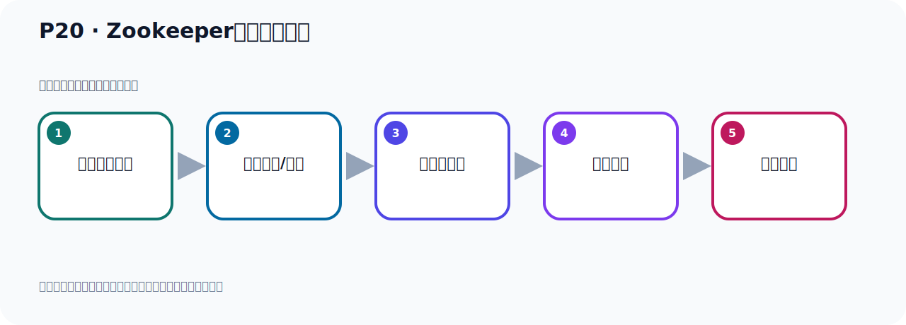

# P20：Zookeeper服务器的启动

> 笔记编号 20/156 · 时长 03:44 · [打开原视频 P20](https://www.bilibili.com/video/BV14J4m187jz?p=20)

[← P19: Zookeeper服务器的配置](../02-environment-deployment/p019-Zookeeper服务器的配置.md) · [返回本章](./README.md) · [P21: Zookeeper服务器与Tomcat端口冲突处理 →](../02-environment-deployment/p021-Zookeeper服务器与Tomcat端口冲突处理.md)

## 这节到底讲什么

**核心主题：Zookeeper服务器的启动。**

这是一节动手课。不要只记命令，要把前置条件、操作步骤、关键参数和成功信号连成一条验证链。
本节属于“环境准备与三种部署方式”这一章；放在全章里看，它的作用是：完成 JDK、Kafka、ZooKeeper、KRaft 与 Docker 环境的安装、启动和验证。

## 本节路线

## 老师的完整讲解顺序（ASR 辅助复核）

> 下面按时间顺序保留经过基础术语替换的 ASR，方便核对老师是否提到某个细节。
> 人名、命令、代码和英文参数仍可能识别错误；准确结论以本节白话说明、代码块和实操速查表为准。

### 1. 00:00–00:48

接下来我们就开始启动ZooKeeper，也就是我们在这里开始启动ZooKeeper，我们就是启动ZooKeeper，好，叫做ZooKeeper，这个我们放在这个位置，放这里，那启动ZooKeeper怎么启动呢？我们看一下怎么启动，好，我们回到ZooKeeper，我们到这个并幕下，好，升级到这个并幕下，对吧，那ZooKeeper启动它是通过这个脚本，这个系统脚本启动，好，就这个脚本，到时候我们通过这个脚本启动，启动ZooKeeper，好，怎么启动呢？那它的这个脚本你可以打开看一下，用Kat命令，打开一下这个脚本来件，打开，。

### 2. 00:48–01:38

打开之后，它最后告诉你，它说怎么用呢？然后就是你的命令，后面是跟上这些去启动，那就是这后面是跟这个配置文件，配置文件，这个是可选的，因为它是中国号，我们一般在启动的时候都不需要指定这个配置文件，然后后面就是start，相与它自动读那个Roo，ZOO.CFG的文件，好，我们直接就是点，然后start就启动了，然后这个相应是前台启动，这个是停止，然后包括版本号，重启等等，还有状态，还有打印等等，它有这么几个命令，那我们启动的话，怎么启动的就是ZK，ZKServer，然后点SH，好，控制一下启动的一个start就可以了，那这个是我们写个STAITStart，。

### 3. 01:39–02:29

好，那这样的话，它就启动好了，原来它显示这个已经start启动好了，好，所以它启动的时候，有这样启动，那就是说在它的后面加个STAIT，这就是启动，好，这是我们这个启动ZooKeeper，就通过这个命令启动就可以了，好，启动完之后你可以先是查一下，看看启动没有，我们先是查一下，ZOK，其实你可以不写完ZOK就可以查了，你看，对吧，当你写完这也可以，ZOK让EPER，ZooKeeper也可以，那么它这个名字比较长，因为它里面会好多价包，你拿这个价包，所以它导致这个过滤出来这个名字特别长，其实它的进程编号就是4065这个进程编号，这就是我们ZooKeeper，。

### 4. 02:29–03:26

那我们可以查看它占用的端口，4065，好，查看一下，NightSTAT，查网络端口，GunALPT，是吧，好，回车，回车的时候我们看一下，这个4065，对吧，我们刚刚看一下是不是4065，4065，它占几个端口，你可以在这里可以观察一下，这个4065，其实它占三个端口，你看这三个都是4065，是吧，那就是拿来的是三个端口的，都是4065嘛，因为这个进程号都是4065，4065那边就2181是一个，还有什么8080还有一个端口，还有一个45191，占了三个端口，好，那这里面你要注意一下，你看它占用这个端口无所谓，但是它占用个8080，所以啊，如果你当前这个Linux上，你如果有一个通风开道，正在使用8080，那你这个ZooKeeper启动，它也要使用8080，那可能会导致你端口冲突，所以呢，遇到这个问题怎么呢，。

### 5. 03:26–03:42

遇到这个问题，我们就需要修改一下ZooKeeper的配置元件，因为它使用8080端口，这样的话会和我们脱风开的端口冲突，我们建议你修改一下，这个2181就它本身启动的端口，这个不用修改，这个要修改一下，那么这个端口怎么修改呢？

## 关键术语

- **ZooKeeper：** 旧版 Kafka 用于集群元数据和控制器协调的外部服务。

## 完整原声逐段记录

[查看本节带时间戳的本地 ASR](./transcripts/p020-Zookeeper服务器的启动-ASR.md)。主笔记负责可读性和术语校正；ASR 页面负责完整性复核。

## 读完记住

- 本节主题是 **Zookeeper服务器的启动**，它服务于本章目标：完成 JDK、Kafka、ZooKeeper、KRaft 与 Docker 环境的安装、启动和验证。
- 理解顺序是：确认前置条件 → 执行安装/配置 → 启动或应用 → 观察输出 → 排查失败。
- 学习时要同时核对老师的解释、画面中的配置/代码，以及最终运行结果。

## 最容易踩的坑

只照抄命令而不核对当前目录、版本、端口和配置文件路径，最容易造成“命令没报错但服务不可用”。

## 自测

1. 不看笔记，用自己的话解释“Zookeeper服务器的启动”解决了什么问题。
2. 按顺序复述：确认前置条件、执行安装/配置、启动或应用、观察输出、排查失败。
3. 如果运行结果和老师不同，你会先检查哪三个输入或环境条件？

## 学完检查

- [ ] 我能不看视频复述本节完整思路
- [ ] 我能指出关键命令、配置、类或接口的作用
- [ ] 我能解释画面中的输入与输出为什么对应
- [ ] 我核对过完整 ASR，没有跳过老师的补充说明
- [ ] 我完成了本节自测或复现实验
