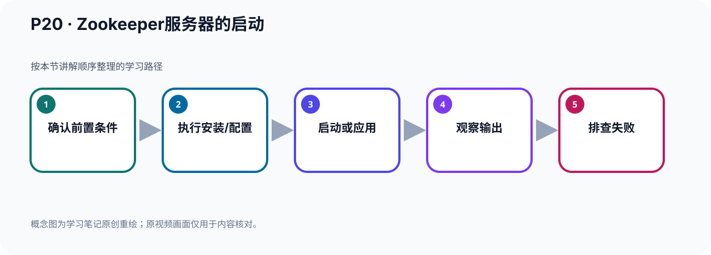

# P20：Zookeeper服务器的启动

> 笔记编号 20/156 · 时长 03:44 · [打开原视频 P20](https://www.bilibili.com/video/BV14J4m187jz?p=20)

[← P19: Zookeeper服务器的配置](../02-environment-deployment/p019-Zookeeper服务器的配置.md) · [返回本章](./README.md) · [P21: Zookeeper服务器与Tomcat端口冲突处理 →](../02-environment-deployment/p021-Zookeeper服务器与Tomcat端口冲突处理.md)

## 先看结论

> 这节通过“Zookeeper服务器的启动”完成一条可验证的操作链：先核对前置条件，再执行配置或命令，最后用日志和运行结果确认环境真正可用。它服务于本章目标：完成 JDK、Kafka、ZooKeeper、KRaft 与 Docker 环境的安装、启动和验证。

## 老师怎么一步步讲

1. 第 1 步，围绕“Zookeeper服务器的启动”完成确认前置条件。
2. 第 2 步，围绕“Zookeeper服务器的启动”完成执行安装/配置。
3. 第 3 步，围绕“Zookeeper服务器的启动”完成启动或应用。
4. 第 4 步，围绕“Zookeeper服务器的启动”完成观察输出。
5. 第 5 步，围绕“Zookeeper服务器的启动”完成排查失败。

## 老师的补充说明

下面按原声顺序整理老师的完整讲解脉络。保留原因、案例、对比、操作过程、边界条件和口头提醒；删除重复语气词，并把长口语拆成适合阅读的短段落。

> 技术术语已经过统一校正；仍无法确认的人名或口头英文会保留原意，并通过右侧时间范围返回视频核对。

### 先明确：Zookeeper服务器的启动要解决什么 · 00:00–00:58

接下来我们就开始启动ZooKeeper，也就是我们在这里开始启动ZooKeeper，我们就是启动ZooKeeper，好，叫做ZooKeeper，这个我们放在这个位置，放这里，那启动ZooKeeper怎么启动呢？我们看一下怎么启动，好，我们回到ZooKeeper，我们到这个并幕下，好，升级到这个并幕下，对吧，那ZooKeeper启动它是通过这个脚本，这个系统脚本启动，好，就这个脚本，到时候我们通过这个脚本启动，启动ZooKeeper，好，怎么启动呢？

那它的这个脚本你可以打开看一下，用Kat命令，打开一下这个脚本来件，打开，打开之后，它最后告诉你，它说怎么用呢？然后就是你的命令，后面是跟上这些去启动，那就是这后面是跟这个配置文件，。

### 跟着老师操作，并观察运行结果 · 00:58–02:05

配置文件，这个是可选的，因为它是中国号，我们一般在启动的时候都不需要指定这个配置文件，然后后面就是start，相与它自动读那个Roo，ZOO.CFG的文件，好，我们直接就是点，然后start就启动了，然后这个相应是前台启动，这个是停止，然后包括版本号，重启等等，还有状态，还有打印等等，它有这么几个命令，那我们启动的话，怎么启动的就是ZK，ZKServer，然后点SH，好，控制一下启动的一个start就可以了，那这个是我们写个STAITStart，好，那这样的话，它就启动好了，原来它显示这个已经start启动好了，好，所以它启动的时候，有这样启动，那就是说在它的后面加个STAIT，这就是启动，好，这是我们这个启动ZooKeeper，就通过这个命令启动就可以了，好，启动完之后你可以先是查一下，看看启动没有，

我们先是查一下，ZOK，。

### 最后验证结果，并收束本节结论 · 02:06–03:42

其实你可以不写完ZOK就可以查了，你看，对吧，当你写完这也可以，ZOK让EPER，ZooKeeper也可以，那么它这个名字比较长，因为它里面会好多JAR 包，你拿这个JAR 包，所以它导致这个过滤出来这个名字特别长，其实它的进程编号就是4065这个进程编号，这就是我们ZooKeeper，那我们可以查看它占用的端口，4065，好，查看一下，NightSTAT，查网络端口，GunALPT，是吧，好，回车，回车的时候我们看一下，这个4065，对吧，我们刚刚看一下是不是4065，4065，它占几个端口，你可以在这里可以观察一下，这个4065，其实它占三个端口，你看这三个都是4065，是吧，那就是拿来的是三个端口的，都是4065嘛，因为这个进程号都是4065，4065那边就2181是一个，还有什么8080还有一个端口，

还有一个45191，占了三个端口，好，那这里面你要注意一下，你看它占用这个端口无所谓，但是它占用个8080，所以啊，如果你当前这个Linux上，你如果有一个通风开道，正在使用8080，那你这个ZooKeeper启动，它也要使用8080，那可能会导致你端口冲突，所以呢，遇到这个问题怎么呢，遇到这个问题，我们就需要修改一下ZooKeeper的配置元件，因为它使用8080端口，这样的话会和我们脱风开的端口冲突，我们建议你修改一下，这个2181就它本身启动的端口，这个不用修改，这个要修改一下，那么这个端口怎么修改呢？

## 放进整套课

本节属于 **环境准备与三种部署方式**。这一章要解决的是：完成 JDK、Kafka、ZooKeeper、KRaft 与 Docker 环境的安装、启动和验证。

这是一节动手课。不要只记命令，要把前置条件、操作步骤、关键参数和成功信号连成一条验证链。

### 记忆路线

```mermaid
flowchart LR
    N0["确认前置条件"]
    N1["执行安装/配置"]
    N0 --> N1
    N2["启动或应用"]
    N1 --> N2
    N3["观察输出"]
    N2 --> N3
    N4["排查失败"]
    N3 --> N4
```

## 用在工作里

| 项目 | 内容 |
|---|---|
| 先回答 | 先确认版本、目录、端口和依赖服务是否满足本节前置条件。 |
| 立刻做 | 按老师的顺序复现安装或配置，并记录每条命令的输入与输出。 |
| 留下证据 | 留下一份包含成功信号和失败排查过程的实验记录。 |

## 关键术语

- **ZooKeeper：** 旧版 Kafka 用于集群元数据和控制器协调的外部服务。

## 最容易踩的坑

只照抄命令而不核对当前目录、版本、端口和配置文件路径，最容易造成“命令没报错但服务不可用”。

## 自测

1. 不看笔记，用自己的话解释“Zookeeper服务器的启动”解决了什么问题。
2. 按顺序复述：确认前置条件、执行安装/配置、启动或应用、观察输出、排查失败。
3. 如果运行结果和老师不同，你会先检查哪三个输入或环境条件？

## 学完检查

- [ ] 我能不看视频复述本节完整思路
- [ ] 我能指出关键命令、配置、类或接口的作用
- [ ] 我能解释画面中的输入与输出为什么对应
- [ ] 我读完了老师的详细讲解正文，没有只看路线图和要点
- [ ] 我完成了本节自测或复现实验

## 需要核对原话时

[查看本节带时间戳的完整 ASR](./transcripts/p020-Zookeeper服务器的启动-ASR.md)。主笔记负责理解与实践；ASR 页面负责逐句完整性复核。
