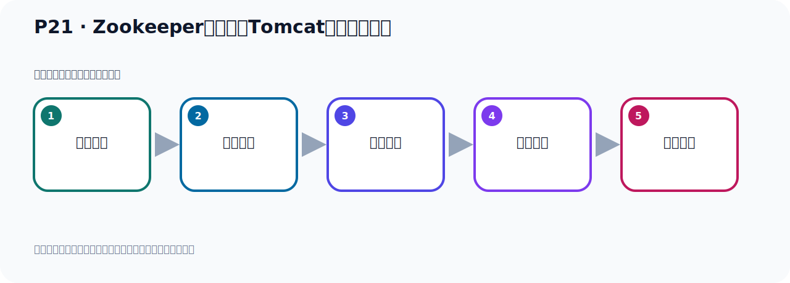

# P21：Zookeeper服务器与Tomcat端口冲突处理

> 笔记编号 21/156 · 时长 06:53 · [打开原视频 P21](https://www.bilibili.com/video/BV14J4m187jz?p=21)

[← P20: Zookeeper服务器的启动](../02-environment-deployment/p020-Zookeeper服务器的启动.md) · [返回本章](./README.md) · [P22: 使用独立的Zookeeper启动Kafka →](../02-environment-deployment/p022-使用独立的Zookeeper启动Kafka.md)

## 这节到底讲什么

**核心主题：Zookeeper服务器与Tomcat端口冲突处理。**

这节继续完善 Kafka 的完整知识链。请按老师的讲解顺序理解动机、做法和结果。
本节属于“环境准备与三种部署方式”这一章；放在全章里看，它的作用是：完成 JDK、Kafka、ZooKeeper、KRaft 与 Docker 环境的安装、启动和验证。

## 本节路线

## 老师的完整讲解顺序（ASR 辅助复核）

> 下面按时间顺序保留经过基础术语替换的 ASR，方便核对老师是否提到某个细节。
> 人名、命令、代码和英文参数仍可能识别错误；准确结论以本节白话说明、代码块和实操速查表为准。

### 1. 00:00–00:51

好，建议修改一下，你可以查一下，比如说你忘了它怎么修改，这个网上可以查一下，怎么查呢，就是ZOKEP、ZooKeeper，这是什么，邦尼、邦尼端孔的，这样你查了，来，这样就可以了，对吧，你再查一下，你看好多啊，你敢，对吧，好多啊，你随便找一个人，点一个，点一个，那就是它需要配置一下，你看啊。于是在ZooKeeper这个配置目录下，这个Roo.CVG这个违线里面，你要加一个这个配置项，它就是这个AutoV收获端口啊，它默认是8080，你把它改一下就可以了，是吧，好，那就是说你这个ZooKeeper端口啊，ZooKeeper启动，ZooKeeper启动，默认会占用这个80808080这个端口，修改，。

### 2. 00:52–01:50

再配置文件，所以配置文件怎么修改就这样，这样修改一下，是吧，就可以了，这就是修改它的配置文件啊，上面这个我就改去掉一下，那就在配置面中添加这个，添加这个就可以了，换个颜色，添加这一行就可以了，好，那现在我们就去添加一下这一行，那我们把端口改成比如说808098，这样的话呢，808089算了啊，9089吧，这个端口，改成这个端口，好，这样的话避免和我们托不开的8080冲突，那此时我们就去配置面中去修改一下，那这个是我们进到这个抗护工程下，VAM打开这个Roo.cfg这个文件，打开，打开之外我们在它最下面加一行这个就可以了，加一行，加一行这个东西，是吧，这个注释倒是无所谓，你可以放这里也可以去掉，好，那我们改成这个，。

### 3. 01:52–02:51

9089，是吧，我们刚刚是改成这个9089，好，这端口，让我们保存一下啊，好，这个现在已经卡中了，现在没法保存到可以，好，我干脆把这个窗口关掉，卡中了对吧，卡到我们重新在这边，这边操作，用了Nokka，Apache，ZooKeeper，抗护工下，好，我们看一下这个文件啊，VAM打开一下，我们iol-i看一下这里面有没有这个产生能死的文件，你看它刚才那个文件，它卡中了，它产生了个能死的文件，liol-i是o查询所有文件，iol-i显示所有文件，这样的话可以显出来啊，你直接liol看不到，liol-i才可以看到，对吧，好，这个我们把这个交换文件，它产生一个交换文件，三调一下，就是这个，点Zo这个，三调，好，这个时候iol-i，。

### 4. 02:52–03:44

A，你看，没有了，对吧，没有之后我们再把这个ZooKeeper这个文件，再打开看一下，好，看下我们看下它最后啊，最后看有没有了，没写上，没写上，我们现在把它加上就可以了，好，就是我们这一段这个配置，OddMe点Zo的Point，加到这里面来，好，加进来，好，加进来之后我们退出一下啊，那OddMe这个A给露掉了，OddMe，A，OddMe，Zo的Point，这样才对，好，这个时候我们保存一下，是吧，好，保存之后，那我们ZooKeeper就改完了，改完之后呢，我们这个时候呢，重新去启动ZooKeeper啊，好，重新启动ZooKeeper我们之前是启动着的，那现在怎么办呢，给它关一下，关一下怎么关呢，通过我们这个密立关吗，它不是有一个叫Storpe吗，那就是ZKSover，刚才看了是吧，它里面带一个Storpe就关了啊，STOPStorpe，好，这个时候回彩，。

### 5. 03:45–04:55

好，那Storpe这样就关了，关了的时候它提示我这个加弯贺姆，没有设置，我们看看，我们加弯，刚这个Vorsi，来，我们的加弯密立，似乎，我这个窗口啊，是很早很早就打开了，可能这个窗口它这个还不识别，我们重新打开一个窗口，就可以了，是吧，我们之前是这个GTK啊，不是你都配置完了吗，因为我这个窗口打开很长时间了，我一直没有关，是很早打开的，就是在我配置GTK之前，我就把这个窗口打开了，那么当前这个绘画呢，还不能识别我们这个环境辨量，所以我们开个新窗口，把这个关掉，开个新窗口，拧一下，拧一下，然后在这边，把这个之前关掉，这边你看一下加弯，是吧，刚Vorsi它是不是可以识别啊，可以识别的，没有问题，所以这是因为之前的窗口开得比较长，在配置GTK之前就打开的，好，我们进入APA机，让ZooKeeper在里面，好，进入并布一下，好，我们去关闭啊，首先们查一下，查一下ZooKeeper是不是开着的，应该是开着的，回补ZOK，查一下，再吧，再，。

### 6. 04:55–05:43

所以我们这里面怎么办呢，ZK，好，srv，好，点SH，SH，让10多步，停一下，这就是停止ZooKeeper，好，这就是停止ZooKeeper，好，PX我们查一下看一下，ZOK，现在没有了，没有了之后，我们接下来重新再启动ZooKeeper，那就是ZK这个srv，好，点SH，然后Start，好，这就是我们再启动，好，启动之后我们再PS查进程，PS查一下进程，先查一下，好，查，查了之后，这ZooKeeper是吧，ZooKeeper它进程号多少呢，是4240，好，4240，那我们看看，用NightSTAT，是吧，GoneLPT，好，通过的命令，查个端口，你看一下我们这个4240这个端口啊，4240，。

### 7. 05:43–06:31

那就是我们这个3颗吧，4240，4240进程了，这个是PAD嘛，PAD是吧，PAD4240，3颗，那么它分别占用了2181，然后9080，我们就改了个端口，它原来默认是8080，现在改成9089了，对吧，然后还有它本身这个ZooKeeper，它是2181，好，下面还有个端口，这个端口和上次不一样，它是随机申请的，好，那我们ZooKeeper的，这就是ZooKeeper的启动，包括ZooKeeper的关闭，我们刚才都已经演示了，好，所以它启动啊，就是这样启动，那么关闭的话呢，那就是在后面加一个十多谱就关闭了，这就加一个十多谱，有关闭，好，上面这个是启动，下面是关闭，启动是这样启动，关闭是这样关闭啊，。

### 8. 06:33–06:46

好，它默认占8080端口，那么修改配置本件，添加楼下配置，好，就可以了，好，这就是我们的ZooKeeper的一个一个启动，。

## 关键术语

- **ZooKeeper：** 旧版 Kafka 用于集群元数据和控制器协调的外部服务。

## 完整原声逐段记录

[查看本节带时间戳的本地 ASR](./transcripts/p021-Zookeeper服务器与Tomcat端口冲突处理-ASR.md)。主笔记负责可读性和术语校正；ASR 页面负责完整性复核。

## 读完记住

- 本节主题是 **Zookeeper服务器与Tomcat端口冲突处理**，它服务于本章目标：完成 JDK、Kafka、ZooKeeper、KRaft 与 Docker 环境的安装、启动和验证。
- 理解顺序是：问题背景 → 关键对象 → 处理过程 → 结果验证 → 应用边界。
- 学习时要同时核对老师的解释、画面中的配置/代码，以及最终运行结果。

## 最容易踩的坑

不要把孤立 API 或配置项当成完整能力；始终把它放回生产、存储、消费或集群链路中理解。

## 自测

1. 不看笔记，用自己的话解释“Zookeeper服务器与Tomcat端口冲突处理”解决了什么问题。
2. 按顺序复述：问题背景、关键对象、处理过程、结果验证、应用边界。
3. 如果运行结果和老师不同，你会先检查哪三个输入或环境条件？

## 学完检查

- [ ] 我能不看视频复述本节完整思路
- [ ] 我能指出关键命令、配置、类或接口的作用
- [ ] 我能解释画面中的输入与输出为什么对应
- [ ] 我核对过完整 ASR，没有跳过老师的补充说明
- [ ] 我完成了本节自测或复现实验
