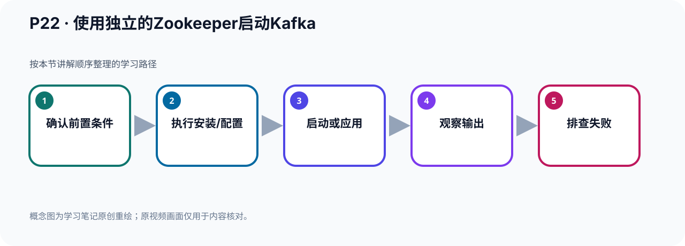

# P22：使用独立的Zookeeper启动Kafka

> 笔记编号 22/156 · 时长 04:47 · [打开原视频 P22](https://www.bilibili.com/video/BV14J4m187jz?p=22)

[← P21: Zookeeper服务器与Tomcat端口冲突处理](../02-environment-deployment/p021-Zookeeper服务器与Tomcat端口冲突处理.md) · [返回本章](./README.md) · [P23: Kafka启动使用KRaft生成Cluster UUID →](../02-environment-deployment/p023-Kafka启动使用KRaft生成Cluster-UUID.md)

## 先看结论

> 这节通过“使用独立的Zookeeper启动Kafka”完成一条可验证的操作链：先核对前置条件，再执行配置或命令，最后用日志和运行结果确认环境真正可用。它服务于本章目标：完成 JDK、Kafka、ZooKeeper、KRaft 与 Docker 环境的安装、启动和验证。

## 老师怎么一步步讲

1. 第 1 步，围绕“使用独立的Zookeeper启动Kafka”完成确认前置条件。
2. 第 2 步，围绕“使用独立的Zookeeper启动Kafka”完成执行安装/配置。
3. 第 3 步，围绕“使用独立的Zookeeper启动Kafka”完成启动或应用。
4. 第 4 步，围绕“使用独立的Zookeeper启动Kafka”完成观察输出。
5. 第 5 步，围绕“使用独立的Zookeeper启动Kafka”完成排查失败。

## 老师的补充说明

下面按原声顺序整理老师的完整讲解脉络。保留原因、案例、对比、操作过程、边界条件和口头提醒；删除重复语气词，并把长口语拆成适合阅读的短段落。

> 技术术语已经过统一校正；仍无法确认的人名或口头英文会保留原意，并通过右侧时间范围返回视频核对。

### 先明确：使用独立的Zookeeper启动Kafka要解决什么 · 00:00–00:53

我们现在独立的ZooKeeper，把它安装配置都OK了。接下来我们使用独立的ZooKeeper来启动我们的Kafka。那我们接着往下看一下，就是使用独立的ZooKeeper启动我们的Kafka。第一步就是你启动ZooKeeper，然后在第二步启动Kafka。这个顺序是不能颠倒的。如果你颠倒顺序的话，它是不行的，因为这个Kafka它需要ZooKeeper的支持。如果说我颠倒顺序，我们演示一下，比如说我们现在查一下，PS查一下，现在ZooKeeper有没有呢？

看一下ZoK查一下，好，ZooKeeper有，那我先把ZooKeeper关一下，那就是通过ZK Server，点SH，然后使Dock，这样把ZooKeeper关掉，好，这样关了，PS再查一下，没有了，对吧，。

### 跟着老师操作，并观察运行结果 · 00:53–01:52

那我们Kafka我们看一下，Kafka也没有了，对吧，都没有了，现在我就说我先启动Kafka，然后启动ZooKeeper，你看它行不行呢，这个时候是不行的，好，我们切换到Kafka目标下，那么由于ZooKeeper、Apache，不是Apache，是Kafka，好，B目录下，对吧，好，LVL看一下，那么Kafka的启动就是，执行Kafka Server，然后Start这个脚本，然后后面跟上配置为件，跟那个Kafka目录下，sort这个文件，对吧，好，你加语号就是后载启动，不加语号就是前载启动，我现在不加语号，我前载启动，我看一下它的认字，好，我直接回车，我前载启动，回车，好，那么这个时候你看，它运行的时候，你看它里面一直在报错呢，连接拒绝，连接拒绝，那么这个连接拒绝其实就是连ZooKeeper，

你看这边不是有ZooKeeper这个什么，驾包吗，是吧，这个内的这个包名，好，它连不上，所以Kafka启动之后，它需要连接ZooKeeper，。

### 跟着老师操作，并观察运行结果 · 01:52–03:11

你看这个时候呢，它已经超时了，超时没连上，报错了，没连上，就连ZooKeeper没连上，你看都是这个ZooKeeper相关的，超时，好，这个时候你偏是查一下我们Kafka来，必没有启动成功，Kafka，Kafka，没有启动，所以我们先要启动ZooKeeper，再启动Kafka，好，那这个时候就启动ZooKeeper，U着Norcore，Apache这个ZooKeeper，进入并布下，好，ZooKeeper启动CKSever，点SH，然后Start，好，再就是启动我们的ZooKeeper，那我们直接回车就可以了，回车，好，这就是ZooKeeper启动了，偏是查一下，Grid4ZOK，查一下，好，ZooKeeper启动好之后，下一步就是启动这个Kafka，好，接下来我们再启动Kafka，进入U着Norcore布下，

然后Kafka，好，进入到并布下，对吧，好，这里面我们是启动它那个Kafka这个系列脚本，那就是它的这个Sever，然后Start，然后后面Gamplay词明件，来康复一个布下，然后这个Sever，好，然后我直接后台启动，加个语号后台启动，好，这个是我们回车，好，开始运行，由于现在我这个ZooKeeper已经启动好了，。

### 最后验证结果，并收束本节结论 · 03:11–04:43

你看此时呢，这个Kafka就可以启动成功，那现在它已经启动完了，启动完之后我们回车就可以了，回车回到运行就行了，那此时我们偏是查一下这个Kafka，然后卡FUKA，好，这个是你看我们Kafka进程是有的，是有的，那左的原因就是呢，Kafka它的这个配置文件中你可以看一下，在康复个布下，这个Sever里面它需要零件ZooKeeper，我们可以打开这个Sever文件，Kafka配置文件，打开一下，先了解一下，好，我们看一下呢，我想走啊，这有一段呢，关于这个ZooKeeper的配置，那这哪里呢，我想走一下，好，在这一段啊，那它有个注释嘛，这里面就是与ZooKeeper相关的，就这一段，然后它有个连接的超时时间，是吧，然后有一个呢，来连接ZooKeeper，那我们ZooKeeper在本地，

所以是nogo hos的ZooKeeper端口是ZooKeeper，连我们本地的ZooKeeper，我们刚好这个v6里面有一个ZooKeeper，好，通过这个连接上去，好，那么以上就是我们，呃，生一个外部的啊，独立的ZooKeeper，这样来启动Kafka也是可以的，那么Kafka自己本身呢，他也帮你来把那个ZooKeeper放进来，你可以用他自己本身的那个脚本去启动，他自己本身也有个脚本去启动，我们前面已经演示过了，啊，用他内部的这个ZooKeeper也可以，然后你用一个独立的外部的ZooKeeper来也可以，好，以上就是采用ZooKeeper的方式，啊，启动我们的Kafka，。

## 放进整套课

本节属于 **环境准备与三种部署方式**。这一章要解决的是：完成 JDK、Kafka、ZooKeeper、KRaft 与 Docker 环境的安装、启动和验证。

这是一节动手课。不要只记命令，要把前置条件、操作步骤、关键参数和成功信号连成一条验证链。

### 记忆路线

```mermaid
flowchart LR
    N0["确认前置条件"]
    N1["执行安装/配置"]
    N0 --> N1
    N2["启动或应用"]
    N1 --> N2
    N3["观察输出"]
    N2 --> N3
    N4["排查失败"]
    N3 --> N4
```

## 用在工作里

| 项目 | 内容 |
|---|---|
| 先回答 | 先确认版本、目录、端口和依赖服务是否满足本节前置条件。 |
| 立刻做 | 按老师的顺序复现安装或配置，并记录每条命令的输入与输出。 |
| 留下证据 | 留下一份包含成功信号和失败排查过程的实验记录。 |

## 关键术语

- **Kafka：** Apache 开源的分布式事件流平台，常用于高吞吐消息传递、数据管道和流处理。
- **ZooKeeper：** 旧版 Kafka 用于集群元数据和控制器协调的外部服务。

## 最容易踩的坑

只照抄命令而不核对当前目录、版本、端口和配置文件路径，最容易造成“命令没报错但服务不可用”。

## 自测

1. 不看笔记，用自己的话解释“使用独立的Zookeeper启动Kafka”解决了什么问题。
2. 按顺序复述：确认前置条件、执行安装/配置、启动或应用、观察输出、排查失败。
3. 如果运行结果和老师不同，你会先检查哪三个输入或环境条件？

## 学完检查

- [ ] 我能不看视频复述本节完整思路
- [ ] 我能指出关键命令、配置、类或接口的作用
- [ ] 我能解释画面中的输入与输出为什么对应
- [ ] 我读完了老师的详细讲解正文，没有只看路线图和要点
- [ ] 我完成了本节自测或复现实验

## 需要核对原话时

[查看本节带时间戳的完整 ASR](./transcripts/p022-使用独立的Zookeeper启动Kafka-ASR.md)。主笔记负责理解与实践；ASR 页面负责逐句完整性复核。
