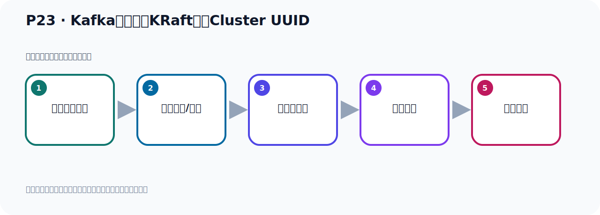

# P23：Kafka启动使用KRaft生成Cluster UUID

> 笔记编号 23/156 · 时长 05:20 · [打开原视频 P23](https://www.bilibili.com/video/BV14J4m187jz?p=23)

[← P22: 使用独立的Zookeeper启动Kafka](../02-environment-deployment/p022-使用独立的Zookeeper启动Kafka.md) · [返回本章](./README.md) · [P24: kafka-storage.sh脚本参数解读 →](../02-environment-deployment/p024-kafka-storage.sh脚本参数解读.md)

## 这节到底讲什么

**核心主题：Kafka启动使用KRaft生成Cluster UUID。**

这是一节动手课。不要只记命令，要把前置条件、操作步骤、关键参数和成功信号连成一条验证链。
本节属于“环境准备与三种部署方式”这一章；放在全章里看，它的作用是：完成 JDK、Kafka、ZooKeeper、KRaft 与 Docker 环境的安装、启动和验证。

## 本节路线

## 老师的完整讲解（按视频顺序校正）

> 下面保留老师的完整讲解顺序，并修正 Kafka、Java、ZooKeeper、
> Topic、Partition、Offset 等常见识别错误。它不是压缩摘要；原始 ASR 在后面单独保留。

### 1. 00:00–00:51

好，那我们前面，我们通过ZooKeeper的方式启动了Kafka，这是启动Kafka的第一种方式。那么这个ZooKeeper启动Kafka，我们介绍了两种方式，一种方式是用这个Kafka这个软件包里面它自带了一个ZooKeeper，这样去启动Kafka。另外一种就是我们自己独立安装一个ZooKeeper，然后启动Kafka。这两种方式我们都做了一个演示。好，那接下来我们看一下课件，我们接下来看一下我们用第二种方式启动Kafka，就是用这个Korunft这个方式启动Kafka。好，那我们看看这种方式，那我这个课件我给它整理一下，把它粘一个新的粘在我们115这个下边，粘这里。

### 2. 00:52–01:57

好，那我就把之前这个第一种方式这个我先给它删掉一下，好，那接下来我们介绍的是第二种方式，用Korunft的启动Kafka。那么它的这个步骤就是这么三步，这样三步，我把上面这个课件这地方也改一下，把之前的课件这地方删掉一下，上面第一种方式这样子。好，那我们回到我们这个位置，在这里。好，那我们看一下用Korunft启动，第一步就是我们生成一个KorunftUUD，那么Korunft这个单子来就是集群，集群就是你部署多个这个节点，多个Karmkha，这个叫集群，但是你部署一个Karmkha，所谓单机的Karmkha，不管你是单机的集群的，那么省了第一步，你都需要生成一个UUD，单机的也是一样，我们只启动一个Karmkha，但是也需要一个UUD，那么这个叫集群UUD。

### 3. 01:58–02:53

UUD大家都知道，它是一个不重复的一个自补串，搜索一下，UUD它是一个什么通用唯一识别码，就是一个自补串，在我们的简话中也有一个UUD。好，那么这个怎么生成呢，这个时候在我们Karmkha的安装部落下，这个并部落下，有一个Karmkha StorgySH这个卸药脚本，这个脚本后面跟一个参数叫RandomUUD，Random是随机的意思，它是一个UUD，生成一个不重复的随机的UUD，通过执行这个命令，然后生成一个UUD，好，那我们去看一下。首先我们这里面就是我们的Karmkha的安装部落，我们看一下，这是Karmkha安装部落，下面是安装本件，那我们到它到这个壁幕下，好，LOL看一下，那么它里面有一个叫Karmkha StorgySH这个脚本，这个卸药脚本。

### 4. 02:54–04:03

这个卸药脚本我们就去执行，我们先看一下帮助啊，它怎么执行呢，就是Karmkha StorgySH，好，你可以后面加个Gang H，H是帮助，Gang H，然后我们看看这个脚本它怎么使用，回车一下。好，回车一下之后你发现这个脚本的使用就这样使用的，我们可以把这一块在我们这边做一个整理，大家以后方便大家去查看，那就是我把这一块在这里给它截取出来，给它帮助，帮助我们截取一下。好，我们站在我们这个位置，这样我们以后知道它怎么用，你加个H就可以做一个帮助，帮助完之后我们看它怎么用的，它用法就是Karmkha StorgyGang H，就是帮助其实，它是可选的嘛，它是帮助，然后它后面可以跟info，什么format，还可以跟randomuid，对吧，。

### 5. 04:04–04:52

那现在我们就是跟一个randomuid的，跟这个参数，它还可以跟info参数，还有format参数等等，那我现在是跟一个这个参数，那我们现在这里就跟一个random这个参数，对吧。好，那么跟一个random参数什么意思，它下面有解释了你看，randomuid这什么意思，它就是打印一个randomuid，就打印出一个随机的一个不重复的字幕串，就这个意思。好，这就是我们第一步，第一步。那就是你看我们执行一下，那就是Karmkha StorgyGang H，对吧，然后后面加什么呢，加个random，加个这个可选参数，这个参数，加个random，对吧，好，然后你回车，回车之后它就打印出一个不重复的这个uid，好，这是你看我们回车。

### 6. 04:53–05:19

回车之后你看，它就生成了这样一个uuid，它没有，这个uuid，好，这个串是不重复的，如果说你再执行一遍，你看我们把这个东西再执行一遍，再执行一遍。那么它又生了一个新的，你看下面这个和上面这个串是不相同的，不重复的，还可以再执行一点，那么又生了一个新的，这个串又不一样，你再执行，它串来又不一样，好，这就是生成一个uuid，好的，第一步。

## 关键术语

- **Kafka：** Apache 开源的分布式事件流平台，常用于高吞吐消息传递、数据管道和流处理。
- **ZooKeeper：** 旧版 Kafka 用于集群元数据和控制器协调的外部服务。
- **KRaft：** Kafka 自带的 Raft 元数据仲裁模式，可在新架构中摆脱 ZooKeeper。

## 完整原声逐段记录

[查看本节带时间戳的本地 ASR](./transcripts/p023-Kafka启动使用KRaft生成Cluster-UUID-ASR.md)。主笔记负责可读性和术语校正；ASR 页面负责完整性复核。

## 读完记住

- 本节主题是 **Kafka启动使用KRaft生成Cluster UUID**，它服务于本章目标：完成 JDK、Kafka、ZooKeeper、KRaft 与 Docker 环境的安装、启动和验证。
- 理解顺序是：确认前置条件 → 执行安装/配置 → 启动或应用 → 观察输出 → 排查失败。
- 学习时要同时核对老师的解释、画面中的配置/代码，以及最终运行结果。

## 最容易踩的坑

只照抄命令而不核对当前目录、版本、端口和配置文件路径，最容易造成“命令没报错但服务不可用”。

## 自测

1. 不看笔记，用自己的话解释“Kafka启动使用KRaft生成Cluster UUID”解决了什么问题。
2. 按顺序复述：确认前置条件、执行安装/配置、启动或应用、观察输出、排查失败。
3. 如果运行结果和老师不同，你会先检查哪三个输入或环境条件？

## 学完检查

- [ ] 我能不看视频复述本节完整思路
- [ ] 我能指出关键命令、配置、类或接口的作用
- [ ] 我能解释画面中的输入与输出为什么对应
- [ ] 我核对过完整 ASR，没有跳过老师的补充说明
- [ ] 我完成了本节自测或复现实验
