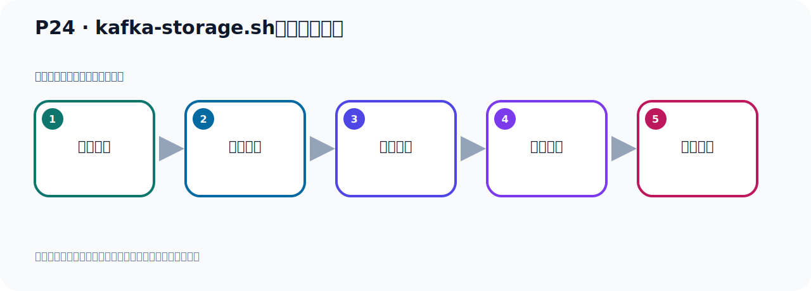
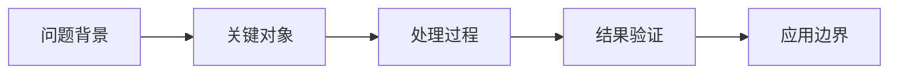

# P24：kafka-storage.sh脚本参数解读

> 笔记编号 24/156 · 时长 05:54 · [打开原视频 P24](https://www.bilibili.com/video/BV14J4m187jz?p=24)

[← P23: Kafka启动使用KRaft生成Cluster UUID](../02-environment-deployment/p023-Kafka启动使用KRaft生成Cluster-UUID.md) · [返回本章](./README.md) · [P25: Kafka启动使用KRaft →](../02-environment-deployment/p025-Kafka启动使用KRaft.md)

## 这节到底讲什么

**核心主题：kafka-storage.sh脚本参数解读。**

这节继续完善 Kafka 的完整知识链。请按老师的讲解顺序理解动机、做法和结果。
本节属于“环境准备与三种部署方式”这一章；放在全章里看，它的作用是：完成 JDK、Kafka、ZooKeeper、KRaft 与 Docker 环境的安装、启动和验证。

## 本节路线

## 老师的完整讲解（按视频顺序校正）

> 下面保留老师的完整讲解顺序，并修正 Kafka、Java、ZooKeeper、
> Topic、Partition、Offset 等常见识别错误。它不是压缩摘要；原始 ASR 在后面单独保留。

### 1. 00:00–00:49

那順便我们把另外几个参数也给大家看一下。好，那这个GunHU是帮助，好，那我们看info，info怎么用呢？好，这个info你看，它info什么意思啊？就是得到这个信息关于Kafka这个日志目录，在这个节点上那个日志目录。Kafka那个数据存储日志目录，通过info可以来输出一下。好，那我们看看这个参数怎么用，那这个是你看一下啊。你怎么用呢？那就是Kafka是Dorigy，是吧？然后呢你就写个这个info，好info然后你不知道后面要给什么东西是吧？那你可以直接加个GunHU啊，可以对这个命令做个帮助，对这个命令做个帮助，参数做个帮助，GunHU查看一下。

### 2. 00:49–01:38

好，你加个GunHU之后它又告诉你它该怎么用啊，它该怎么用啊？你看这个说呢，它告诉你就是，这个info的这个参数用法就是Dorigy，是吧？info，好，这个HU就是帮助了，好，这个是可选是吧？代表是帮助吗？对这个info参数的帮助，那后面它要加个什么GunGunConfig跟上你的配置文件，是这样的。好，你说这个HU就是帮助呢，显示这个帮助信息，是吧？然后这个GunGunConfig后面跟一个配置文件，或者是你用这个Gun写那个小写C也可以，后面跟配置文件，那么这个是Kafka配置文件，使用哪个Kafka配置文件。所以我们要用info这个命令的话，那你就这样用啊，就是Kafka是Dorigy，。

### 3. 01:39–02:18

然后这个info，是吧？然后Gun什么，你看，要么是config，啊，GunGunConfig，要么是GunC，那就是我们GunC，好，跟配置文件，配置文件在哪里来，在上个层部下一个config，然后呢，这个srb这个文件。哎，这样我们回车就可以了。好，那么这样的话，它就查看，啊，你这个日志的这个存储目录啊，是在这个零时目录下，然后在这个目录下，啊，然后还找到它的这个元素，这个信息，是这个一个信息。好，这是我们info的一个命令的一个使用。好，那既然我们再看一下，它还有些命令，啊，那我们再看一下，就是我们再看一下这个命令的这个GunH帮助。

### 4. 02:19–03:26

好，帮助之后，那么info，我们就看完了，是吧？这个Random，我刚才有用过了，这是uod看完了，在这info是打印这个信息的，好，然后那个format这个参数，对吧？那么format怎么用呢？那一样的你可以通过帮助，首先是一个format，format让GunH先帮助一下。好，看看format它怎么用的。啊，format它本身的意思就是格式化这个config日志目录，在这个节点上，就是格式化它的日志目录，对吧？对它的日志的这个格式化format，好，它怎么用的，你可以后面叫GunH，看看这个参数怎么用。好，那么它的用法就是，卡木卡是多一集，然后format后面可以加个GunH表示帮助，好，然后后面跟一个配置文件，GunG，这个config跟配置文件，是吧？好，后面就是跟上一个什么集群ad，classad，那就是你生成那个，那个上面生成一个ad嘛，我们生成那个集群ad就是第一步，第一步你生成那个集群ad，那就Randomuad，这边ad就是我们集群的uad。好，再跟上这个集群ad。

### 5. 03:27–04:26

好，后面还有个可选配置，你可以加上这个参数，也可以再加上这个参数，这个中号表示可选的，好，后面这个中号也是可选的，这几个也可以加这个参数。好，每个参数什么意思，它下面都有解释，比如说，你比如说你这地方这个这个可选参数GunH，那么这个是帮助，是吧？显示这个帮助信息。好，那你这地方这个GunG，config我们知道，那这个它也可以用GunC，然后跟配置文件，那么它这个是指的那个配置文件。对吧，好，然后下面这个GunGun这个classad，那么这是集群ad，那就是这个集群ad，去用哪个集群ad，是吧？那么这个GunGunclassad，它也可以用这个小写的这个t去表示，小写t比表示，表示使用哪个集群ad。对吧，好，后面还有这个可选参数，它可以用大写s去表示，Gun大写s去表示。好，什么意思，它下面有这个一个解释和说明。对吧？

### 6. 04:27–05:23

好，包括下面这个也可以用小写的g去表示，就是前面这个参数，你可以用小写g去表示，还有这个这个参数，那么它也可以用小写r去表示。后面给上这个版本号，给上这个版本号，它的意思就是什么，就是什么版本。好，这个参数的一个使用。好，那关于这个十多亿的密定啊，这个参数怎么使用呢？我相信大家应该搞清楚了，对吧？它如果它自己本身这个怎么用，也就直接的十多亿，然后GunH，这样的话就可以打印出它本身可以带哪些参数。然后你想对每个参数怎么用呢？那你就是把那个参数跟上来，比如说我们这个Random，这个参数怎么用？好，那就是这个我们前面还没有去演示，那我们再演示一下这个Random怎么用，那在它后面再加个GunH，对这个参数的一个帮助。

### 7. 05:24–05:53

好，它就告诉你怎么用，你看这个它是吧，然后加上Random就可以了，后面没有别的参数了。再加别的参数就是加一个可选参数帮助，加个帮助，所以它后面没有别的参数啊。所以我们就直接通过它加RandomUID就可以收出UID。好，这就是我们第一步，收出打印出一个集群ID，通过这个密定收出集群ID。我们现在就先把这个集群ID收出，然后再加一个GunH，。

## 关键术语

- **Kafka：** Apache 开源的分布式事件流平台，常用于高吞吐消息传递、数据管道和流处理。

## 完整原声逐段记录

[查看本节带时间戳的本地 ASR](./transcripts/p024-kafka-storage.sh脚本参数解读-ASR.md)。主笔记负责可读性和术语校正；ASR 页面负责完整性复核。

## 读完记住

- 本节主题是 **kafka-storage.sh脚本参数解读**，它服务于本章目标：完成 JDK、Kafka、ZooKeeper、KRaft 与 Docker 环境的安装、启动和验证。
- 理解顺序是：问题背景 → 关键对象 → 处理过程 → 结果验证 → 应用边界。
- 学习时要同时核对老师的解释、画面中的配置/代码，以及最终运行结果。

## 最容易踩的坑

不要把孤立 API 或配置项当成完整能力；始终把它放回生产、存储、消费或集群链路中理解。

## 自测

1. 不看笔记，用自己的话解释“kafka-storage.sh脚本参数解读”解决了什么问题。
2. 按顺序复述：问题背景、关键对象、处理过程、结果验证、应用边界。
3. 如果运行结果和老师不同，你会先检查哪三个输入或环境条件？

## 学完检查

- [ ] 我能不看视频复述本节完整思路
- [ ] 我能指出关键命令、配置、类或接口的作用
- [ ] 我能解释画面中的输入与输出为什么对应
- [ ] 我核对过完整 ASR，没有跳过老师的补充说明
- [ ] 我完成了本节自测或复现实验
