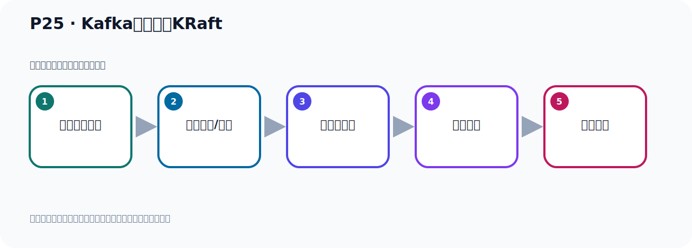

# P25：Kafka启动使用KRaft

> 笔记编号 25/156 · 时长 08:31 · [打开原视频 P25](https://www.bilibili.com/video/BV14J4m187jz?p=25)

[← P24: kafka-storage.sh脚本参数解读](../02-environment-deployment/p024-kafka-storage.sh脚本参数解读.md) · [返回本章](./README.md) · [P26: 自定义Cluster UUID启动Kafka →](../02-environment-deployment/p026-自定义Cluster-UUID启动Kafka.md)

## 这节到底讲什么

**核心主题：Kafka启动使用KRaft。**

这是一节动手课。不要只记命令，要把前置条件、操作步骤、关键参数和成功信号连成一条验证链。
本节属于“环境准备与三种部署方式”这一章；放在全章里看，它的作用是：完成 JDK、Kafka、ZooKeeper、KRaft 与 Docker 环境的安装、启动和验证。

## 本节路线

## 老师的完整讲解（按视频顺序校正）

> 下面保留老师的完整讲解顺序，并修正 Kafka、Java、ZooKeeper、
> Topic、Partition、Offset 等常见识别错误。它不是压缩摘要；原始 ASR 在后面单独保留。

### 1. 00:00–00:56

前面的第一步，生成一个集群UID，就生成完了。生成完之后，接下来我们开始第二步，执行第二步。第二步是用KafkaSnoilG，然后加个Format。Format是什么意思？就是格式化一下Kafka日志目录，在我们当前服务器节点，把Kafka日志目录做一个格式化。这是Format。好，我们现在去执行，在我们这里打开。打开之后，我们用Format去筹划，那就是这个Format参数，那就是我们Kafka。Kafka是多瑞集，首先加个Format，然后加个帮助，Gang也许，我们先看看这个Format的帮助打开。打开之后，那么在帮助，帮助里面我们看一下，我们要执行的筹划是什么呢？

### 2. 00:56–01:43

就是Format的后面叫GangT，GangT后面给我们这个集群UID。好，这个GangT是什么意思？那我们看一下帮助，GangT其实就是根基于KafkaSnoilG的ID。KafkaSnoilG的ID，它可以用这个Gang小写T去代表KafkaSnoilG的ID。如果你写完整的话，应该是GangGangKafkaSnoilG的ID，然后后面给你那个集群的UID。但是你可以用这个小写的GangT去表示，表示前面长的参数。好，那这样的话我们就表示什么呢？就是它GangT，然后后面给上一个集群ID。那么的集群ID就是我们前面所生成的集群ID，那现在这个集群ID我们看还能不能看到啊，。

### 3. 01:43–02:32

我们最后生成的集群ID是多少？最后生成那个是这个，在我们前面生成的。好，我们用最后生成这个集群的UID，那就是这样一个字物串，然后复制一下。复制一下之后，然后再在我们这个参数的后边，再在这里，再跟上这个集群的UID。好，然后再往后，然后再往后里面有一个GangC，GangC后面跟上我们这个克Rumpt的配置文件。好，那你看一下GangC，你看它这里也有，GangC什么意思呢？GangC这个小写C，就是GangGangConfig的一个缩写，就代表GangGangConfig，所以这个参数你要么用GangGangConfig，要么就用GangC，我们用缩写来比GangC，GangC后面跟配置文件，。

### 4. 02:32–03:18

配置文件在哪里呢？目前我们在B目录下，那就是在它上一层目录，上层目录下有个Config这个目录，然后下面有个Karabt这个目录，正目录下有个Server这个配置文件，不是这个Config下直接那个配置文件，而是在Config下有个Karabt下有个这个文件，我们在这边开一个新窗口去看一下这个文件，那这个是我们进入的用的楼可Kafka目录下，好看一下，然后首先进入到Config目录下，Config下我们之前是用这个Server去启动我们的服务器，现在它在这里面，我们用Karabt的方式启动，所以这个是我们进入到Karabt这个方式，好这里面进来CD，好那这里面就有一个Server.Property文件，。

### 5. 03:18–04:09

对吧，好那这个文件我们可以比如说打开看一眼，打开撩一眼，好打开，打开之后你发现这里面，它有很多这个配置项，我来往下走一下，是吧，有一些这个配置项，好这是我们这个配置名项，那现在我们把这个文件推出一下，好那就是我们这个格式化是后面是根这样一个配置文件，是吧，好现在我们就回车就可以了，回车，好回车之后呢，那么它有这样一个提示，它其实就已经做了个格式化，就是把我们这个目录下的这个日志，Kafka日志的目录进行的格式化，好这是我们的第二步，就格式化完了，好格式化完以后，我们接下来就是第三步了，第三步就可以启动我们的Kafka了，好启动Kafka，那么这个时候呢和我们之前差不多，。

### 6. 04:09–04:58

就是Kafka稍微是大的sh这个脚本，后面跟配置文件，只不过这个配置文件你要跟corrupt这个目录下的这个稍微文件，我们之前是直接跟这个config下的那个稍微文件，现在是跟这个corrupt这个目录下的稍微文件，好那么这样就完成了我们Kafka启动，那么正的方式启动Kafka，它是不依带rookip的，直接用corrupt的启动的，我们不需要启动rookip，好现在我们启动一下这个Kafka，我们首先来启动之前，我们先检查一下我们之前有没有把Kafka启动过，各位母章Kafka，好我们发现我们之前是没有启动Kafka，好我们之前rookip有没有启动，没有，我们没有启动rookip，好现在我们可以放心大胆去启动我们的Kafka了，。

### 7. 04:58–05:49

而且是用corrupt的方式启动，好那这个时候就是这个Kafka，server，start，好然后跟上配置文件，跟配置文件就跟上corrupt的配置文件，所以就是点点上层目的下一个config这个目录，然后一个corrupt的这个目录，那个server这个文件，好这我们回测，好又启动了，好那我这个启动，我是前台启动，我没有加语号，加语号吧，这样我们就后台启动了，对不对，加语号，好加语号我现在没加语号，他现在是前台启动，那么启动的时候他里面会打一些信息，这个信息你看他往后退了几格，但是这个不是一层，你看一下，不是一层，你看，往上走，看一下，。

### 8. 05:50–06:50

比较多啊，你看他其实是一些配置值，config values，这个不是一层，不是一层，对吧，那我们这个日志你看是正常的启动，在这里开始打对吧，好启动完了，结果完之后你看我们在这边可以ps查一下，ps-ef，然后grib，然后Kafka，这个时候我们可以看到这个进程，对吧，好这个进程他占用哪些端球的我们可以看一下，看一下，nite spit，这是查看网络端口，然后gamblinlpt，加个这个参数，查一下网络端口，这个是lidcos mini，回车，好，那么你可以看到我们刚才这个进程编号是多少，我们看一下，这个进程编号是9599，9599这个进程编号，你看他占用哪些端球，9599啊，9599那就是这三个，这三个，这三个是9596端球，他们就是加化进程，然后他的端球就是9599，。

### 9. 06:51–07:14

9092和9093，然后还有一个这个端口啊，这个端口往往啊，你每次启动他这个端口不一样，是个临时的随机这个端口，下面两个端口是固定的，9092，9093，好，那这样的话我们就把这个Kafka通过corrupt的方式，把它启动，启动完整的，好，那现在这个启动了，我按一个回车，那个回车之后，他没有动，那我按一个空确C看一下，按一个空确C他就退出了，对吧，退出了你看这个时候你看在这边你偏是查一下，是不是就没有进程了，偏是查一下，就没有了，因为我们是前腾启动，是个前腾启动啊，现在你看没有进程了，所以你启动的时候最好后面加个羽号，后台启动，那我们通过后台启动，执行一下，在这边后台启动，好，那时候这个命令后面加个羽号，加个羽号，好，那时候这个命令后面加个羽号，加个羽号，好，那时候这个命令后面加个羽号，那时候这个命令后面加个羽号，那时候这个命令后面加。

### 10. 07:43–08:27

好，回车，好，执行，好，执行，那么现在应该是执行完了，按一个回车，回车之后你看我们这个时候，这个时候PKS都有查一下，你看Kafka还在，你看还在对吧，还在啊，好，所以我们可以通过后台启动加个羽号，好，那么这次呢我们就通过Kafka的方式，把一个Kafka启动完启动，那么这个方式他不一定是主P保，是Kafka自己写了一套这个协调机制，用来代替主P保，所以我们这样的话呢，我们Kafka可以独立运行，不需要依赖主P保，好，这是我们第二种启动方式。

## 关键术语

- **Kafka：** Apache 开源的分布式事件流平台，常用于高吞吐消息传递、数据管道和流处理。
- **KRaft：** Kafka 自带的 Raft 元数据仲裁模式，可在新架构中摆脱 ZooKeeper。

## 完整原声逐段记录

[查看本节带时间戳的本地 ASR](./transcripts/p025-Kafka启动使用KRaft-ASR.md)。主笔记负责可读性和术语校正；ASR 页面负责完整性复核。

## 读完记住

- 本节主题是 **Kafka启动使用KRaft**，它服务于本章目标：完成 JDK、Kafka、ZooKeeper、KRaft 与 Docker 环境的安装、启动和验证。
- 理解顺序是：确认前置条件 → 执行安装/配置 → 启动或应用 → 观察输出 → 排查失败。
- 学习时要同时核对老师的解释、画面中的配置/代码，以及最终运行结果。

## 最容易踩的坑

只照抄命令而不核对当前目录、版本、端口和配置文件路径，最容易造成“命令没报错但服务不可用”。

## 自测

1. 不看笔记，用自己的话解释“Kafka启动使用KRaft”解决了什么问题。
2. 按顺序复述：确认前置条件、执行安装/配置、启动或应用、观察输出、排查失败。
3. 如果运行结果和老师不同，你会先检查哪三个输入或环境条件？

## 学完检查

- [ ] 我能不看视频复述本节完整思路
- [ ] 我能指出关键命令、配置、类或接口的作用
- [ ] 我能解释画面中的输入与输出为什么对应
- [ ] 我核对过完整 ASR，没有跳过老师的补充说明
- [ ] 我完成了本节自测或复现实验
