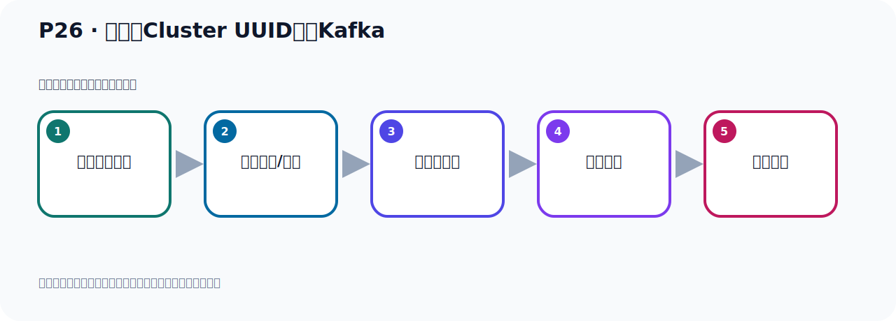

# P26：自定义Cluster UUID启动Kafka

> 笔记编号 26/156 · 时长 08:04 · [打开原视频 P26](https://www.bilibili.com/video/BV14J4m187jz?p=26)

[← P25: Kafka启动使用KRaft](../02-environment-deployment/p025-Kafka启动使用KRaft.md) · [返回本章](./README.md) · [P27: Docker的卸载和安装 →](../02-environment-deployment/p027-Docker的卸载和安装.md)

## 这节到底讲什么

**核心主题：自定义Cluster UUID启动Kafka。**

这是一节动手课。不要只记命令，要把前置条件、操作步骤、关键参数和成功信号连成一条验证链。
本节属于“环境准备与三种部署方式”这一章；放在全章里看，它的作用是：完成 JDK、Kafka、ZooKeeper、KRaft 与 Docker 环境的安装、启动和验证。

## 本节路线

## 老师的完整讲解顺序（ASR 辅助复核）

> 下面按时间顺序保留经过基础术语替换的 ASR，方便核对老师是否提到某个细节。
> 人名、命令、代码和英文参数仍可能识别错误；准确结论以本节白话说明、代码块和实操速查表为准。

### 1. 00:00–00:52

前面是通过KRaft的方式啟动了Kafka，它啟动了三步。有同样的问题，我们生成UID，我能不能随便自己写一个？我不用它这个命令，我自己随便写一个。第一步我不用它去生成UID，我自己第二步在格式化的时候，我直接在这里面我自己指定一个UID的值，行不行？好，那下面我们去动手实验一下，看它行不行，实验一下。好，那这个时候我们在这边看一下，左岸PS看下来我们之前这个Kafka还在不在，之前我们已经把Kafka启动起来了，那下面我们需要把这个Kafka给关一下，关一下的话，用它关闭脚本，那就是KafkaSeverStorpe这个脚本，对吧？

### 2. 00:53–01:56

这个脚本它怎么关的呢？我们这里给它补充一个课件，那就是Kafka关闭，那就是关闭Kafka，好，那其实就是什么？也是这样一个命令，那就是子墨把这里面改成这个Storpe，Storpe，然后后面不用加这个语号，Storpe，然后后面也是跟上这个配置文件，好，再去关闭，好，那这就是我们这个关闭，这里，好，那我把这个稍微整理一下，这个，这个排没排整齐，我们重新给它排一下，好，这是关闭，那我们去把这个去执行一下，那么这样就把Kafka关了，这里，好，这个回车，好，回到周人，那么现在它就把Kafka就关了，关了之后我们这个时候就再按个回车，。

### 3. 01:56–02:49

回车，好，就回到密定行了，密定行之后我们这个是查一下Kafka，这个Kafka，好，已经没有Kafka进程了，已经没有了，好，没有之后我们去接下来去演示一下，随便搞一个这个UUD它行不行，那就是我们执行这个格式化，执行格式化，执行格式化那就是执行这个命令，那么中间这个UUD我们随便指定一个，假设我们写一个叫IPC123，IPC123也是一个制服算嘛，是吧，制服算，好，后面这些参数一样，好，这就是我们就回车执行，好，回车执行，那么它这里报了个异常，一个塞布林异常，运行时异常，不合法的集群AD，他说在这个目录下，这个meta.pobl这个文件里面，。

### 4. 02:49–03:39

这个是你是个不合法的这个集群AD，你读的是相对于你是这个ES3是吧，你是IPCES3，但是他读的时候他读的是我们这样一个串，那就说在这个文件中他已经写入了一个集群AD，我们看一下这个文件，Pobl这个文件嘛，打开cat这个文件，回车，回到这问题，发现他确实，这里面有个集群AD，集群AD就是我们上次启动的时候所使用的那个AD，好，那就是现在你这样格式化现在是不行的，不行的话我们可以这样，就是他这个启动之后他不是产生了一些数据嘛，那么数据的其实就在这个目楼下，对吧，那我把这个目录下的文件给删了，是不是可以的，那这个是我们在这边，。

### 5. 03:39–04:34

切换的，首先我们切了他的那个目录下，哪个目录下就是这个目录下呢，这个tmp，cloft，这个nogos目录下，好，我们切成这个目录下，进来看一下，这里面有这么多信息，我们把这些信息全部删了，干衣服，整个这个不删掉，好，现在里面都没有东西了，没有东西以后了，我们再去执行一下我们这个格式化干什么，我们用的是abc夜山格式化，好，再说回车，回车之后你发现是可以的，那就是我们自己指定一个集群AD也是没有问题的，也是可以的，可以之后的他特别是不是产生一些文件呢，确实产生个文件，那就是把我们这个abc夜山到时候写这边来的，我们看一下的这个meta1，这个确实集群AD现在就是abc夜山，对吧，。

### 6. 04:34–05:19

就写了这个里面去了，前面去了，好，那我们这个格式化就完了，完了之后下一步就是什么，下一步启动，那启动就是用这个脚本命令去启动，好，请问一下，好，那就是我们去执行，好，来启动，对吧，好，这个地方不是一层，这个地方它是什么呢，它是它一些配置信息，配置值你把它走一下，这个不是一层，它是这个Kafkaconfig value配置值，好，那么这样的话我们Kafka启动完了，你可以看一下这个日志的最后，它其实有一个比如Kafkaserver-start，就启动了，可以看这个信息它行了，好，我们刚刚是后台启动加个语号，所以我们批点回车，回到密定行，。

### 7. 05:19–06:06

那么这个时候Kafka其实已经启动好了，Gorib，然后Kafka，对吧，Kafka正常的，然后看看它端口，nite，stit，gong，nglpt，看一下，那么端口你看，它也是一样，我们的Kafka进程是哪个呢，进程号看一下，是14814，14814，好，那这边看一下，14814，那你这边看一下，14824那三个，那就是这三个进程，就是我们Kafka的进程，14814对吧，好，那么端口是9092和9093，另外有一个随机的端口，示范，示范多一个随机端口，好，说明我们Kafka，通过自己指定一个极确的地也可以启动，没有问题，是可以的，好，那此时你可以通过这个使多余级密立，你也可以看一下，。

### 8. 06:06–06:53

我们前面不是介绍过一个使多余级这个密立吗，这个密立我们可以看一下，它想象征处了这个密立，这个密立我们Gong help帮助，帮助之后我们看一下，看了这个info信息，info信息，那就是它，然后到时候在info，info-h我们再看一下帮助，info后面h帮助一下，好，那么这个info后面gong help帮助就是它后面gong一个配置文件，这个配置文件可以缩显的一个小写C，跟一个GongGongconfig，好，那我们写个小写C说，小写C就GongC，配置文件那就是在这个config目录下，是吧，然后我们这个corrupt这个目录下，。

### 9. 06:53–07:33

我们因为是用corrupt的方式启动的，不是Kafka，不是ZooKeeper方式，是通过corrupt的方式启动，所以我们要查看配置文件，那么配置文件是跟corrupt的目录下的那个server文件，你不要用这个Kafka，你不要用那个ZooKeeper的方式的那个配置文件，ZooKeeper的方式的那个配置文件，它在config下一个server文件，我们现在是corrupt的方式了，所以你要进到corrupt的方式下的这个文件，好，这我们看这个信息，存主信息，好，这种信息你可以看到，其实它这个GQID已经变成我们自己的那个abc，也是那个GQID的，这是它的原数据，它的原数据metandate这个数据，。

### 10. 07:33–07:58

GQID是这个，所以这个GQID也可以来我们自己指定一个ID，指定ID，或者是用它生成一个ID，也可以我们自己指定ID，都是可以的，这样后来我们也把这个Kafka启动完成了，好，以上就是我们做了一个实验，就是我们这个GQID是否可以自己去定义一个，自己去指定一个，那么通过我们测试了它是可以的。

## 关键术语

- **Kafka：** Apache 开源的分布式事件流平台，常用于高吞吐消息传递、数据管道和流处理。
- **ZooKeeper：** 旧版 Kafka 用于集群元数据和控制器协调的外部服务。
- **KRaft：** Kafka 自带的 Raft 元数据仲裁模式，可在新架构中摆脱 ZooKeeper。

## 完整原声逐段记录

[查看本节带时间戳的本地 ASR](./transcripts/p026-自定义Cluster-UUID启动Kafka-ASR.md)。主笔记负责可读性和术语校正；ASR 页面负责完整性复核。

## 读完记住

- 本节主题是 **自定义Cluster UUID启动Kafka**，它服务于本章目标：完成 JDK、Kafka、ZooKeeper、KRaft 与 Docker 环境的安装、启动和验证。
- 理解顺序是：确认前置条件 → 执行安装/配置 → 启动或应用 → 观察输出 → 排查失败。
- 学习时要同时核对老师的解释、画面中的配置/代码，以及最终运行结果。

## 最容易踩的坑

只照抄命令而不核对当前目录、版本、端口和配置文件路径，最容易造成“命令没报错但服务不可用”。

## 自测

1. 不看笔记，用自己的话解释“自定义Cluster UUID启动Kafka”解决了什么问题。
2. 按顺序复述：确认前置条件、执行安装/配置、启动或应用、观察输出、排查失败。
3. 如果运行结果和老师不同，你会先检查哪三个输入或环境条件？

## 学完检查

- [ ] 我能不看视频复述本节完整思路
- [ ] 我能指出关键命令、配置、类或接口的作用
- [ ] 我能解释画面中的输入与输出为什么对应
- [ ] 我核对过完整 ASR，没有跳过老师的补充说明
- [ ] 我完成了本节自测或复现实验
