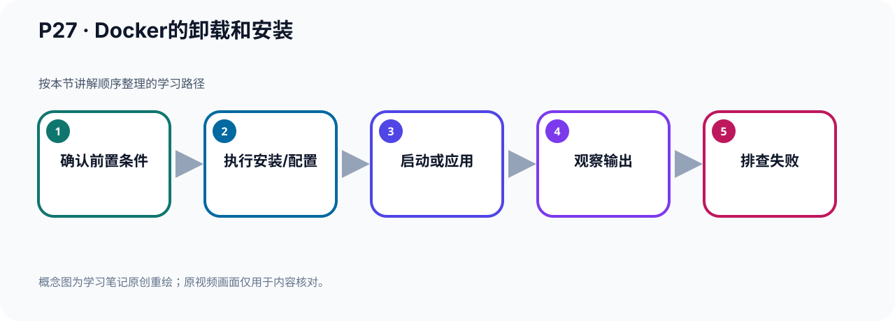

# P27：Docker的卸载和安装

> 笔记编号 27/156 · 时长 04:50 · [打开原视频 P27](https://www.bilibili.com/video/BV14J4m187jz?p=27)

[← P26: 自定义Cluster UUID启动Kafka](../02-environment-deployment/p026-自定义Cluster-UUID启动Kafka.md) · [返回本章](./README.md) · [P28: Docker的卸载和安装 →](../02-environment-deployment/p028-Docker的卸载和安装.md)

## 先看结论

> 这节通过“Docker的卸载和安装”完成一条可验证的操作链：先核对前置条件，再执行配置或命令，最后用日志和运行结果确认环境真正可用。它服务于本章目标：完成 JDK、Kafka、ZooKeeper、KRaft 与 Docker 环境的安装、启动和验证。

## 老师怎么一步步讲

1. 第 1 步，围绕“Docker的卸载和安装”完成确认前置条件。
2. 第 2 步，围绕“Docker的卸载和安装”完成执行安装/配置。
3. 第 3 步，围绕“Docker的卸载和安装”完成启动或应用。
4. 第 4 步，围绕“Docker的卸载和安装”完成观察输出。
5. 第 5 步，围绕“Docker的卸载和安装”完成排查失败。

## 老师的补充说明

下面按原声顺序整理老师的完整讲解脉络。保留原因、案例、对比、操作过程、边界条件和口头提醒；删除重复语气词，并把长口语拆成适合阅读的短段落。

> 技术术语已经过统一校正；仍无法确认的人名或口头英文会保留原意，并通过右侧时间范围返回视频核对。

### 先明确：Docker的卸载和安装要解决什么 · 00:00–00:53

那接下来我们继续来看一下Kafka 。它的这个通过Docker方式启动这个Kafka。那这里呢我们带大家快速复习一下这个Docker。也有可能很多同学之前学到这个Docker，现在已经忘了我们快速复习一下。那第一步呢就是在我们这个Linux里面把这个Docker安装一下。如果说你那边还没有这个环境的话，那么根据这个类似的快速把它安装一下。那安装我们第一步是检查我们这个系统中，就是Linux这个系统中以前有没有装过Docker。我们通过这个压幕呢，格列补去查一下，通过这个命令。

查看一下我们Linux有没有装过Docker。那这边我们打开Linux。那我们就通过这个命令，来查一下。查一下之后我们发现我们之前它是装过这个Docker的。

### 继续拆解执行安装/配置 · 00:53–01:53

装过的。装过的话我们又需要把这个Docker给它卸载掉。我们带大家去装一下，这个过程演示一下，那我把之前这个我们卸载一下。那么这个命令大家应该知道什么意思吧，就是压幕List用压幕列出，以安装了这个软件，List的E Store的，以及安装的，把以安装的软件里面通过Gorib，通过关键字查取这个Docker，看看Docker那些软件把它找出来。找出来之后我们把这些软件给它卸了掉。那么现在我们通过这个压幕Remove，然后根据这个软件包的名字去卸载。

后面这个Gangoy，这个Gangoy它是一个自动确认，是个YES这个意思。就是你那些协议啊，你是不是要删除啊，是不是要卸载啊，我们都是选择是，就是自动默认，选择YES，选择是，那是Gangoy。那么第三，那么这个名字的这个软件包的名字，。

### 老师用例子进一步解释 · 01:53–02:55

你要根据你查取出来这个名字来决定啊，来决定。所以我们就应该这样写啊，让安装的Remove。Remove，好，后面要跟这个软件包的名字，那就是比如说，哎，这是一个软件包吧，那这个，好，它也属于Docker嘛，那把它，然后复制粘过来，然后Gangoy，后面叫Gangoy，好，把它先移除掉。我们移除一下啊，移除一下。当然你在移除某个包的时候，它可能会把它的衣带包也移除掉。

所以我们移除一个之后啊，可能就会一下子会少几个啊，那这个是我们再查看一下，看看，在这个list，然后Garry Boo加多个再查一下，哎，这个时候只剩三个了啊，比之前少一些，那现在我们再移除一下这三个，要么Remove。Remove，好，那我把这个移除一下，来，复制一下它，然后呢，在这里，然后后面叫Gangoy，自动的确认，啊，YES。移除掉了，然后我们再查一下，然后再查，好，查到时候剩一个了啊，那我们这个时候再yamlremove，。

### 最后验证结果，并收束本节结论 · 02:55–04:42

再把这个软铃包给它卸来一下，暂停，好，后面叫Gangoy，好，把它也卸掉了，那么现在再查一下，就没有了，好，多好就没有了，那么制止了我们就完成了这个多好的一个呢，这个卸载，啊，这个名字你要根据你查取出的名字来决定啊，我这课件中的名字呢，是某个机器上的名字，但是你那边查名字可能不一样，不一样，你按照我这个操作，就是你要查取出什么名字，你就删除什么名字啊，卸载什么名字，名字不能写错，好，那么现在完之后，尽量有些安装，对吧，好，安装我们可以通过yamlremove意思多的多可Gangoy，Gangoy是自动确认，是YES的意思，好，那么这里把多个装了，只不过这个方式装了手的这个多可，它版本比较旧啊，我们先通过的方式给大家看一下，它通过它来安装多可，通过yamlremove意思多啊，多可直接装啊，好，

我们操作一下看一下，好，我执意文执意进去之后它开始下载了啊，好，它装文以后我们看一下它的版本啊，你看它装文啊，装文之后来我们看它版本比较旧啊，就是说这个是查看它的版本怎么办呢，用多可Gangoy就可以查看版本，多可Gangoy，好，这个是我们写的多可Gangoy，好，那么它这个版本其实是1.13.1啊，这个版本比较旧对吧，比较老，所以我们希望安装一个比较新的一个版本，那我们要换一整安装方式，这个方式也是可以的，但是它的版本是1.13.1啊，比较旧的版本，好，那接下来我们看一下来，我们如何去安装个新版本啊，好，这是我们这个多可的一个快速复习，多可的卸载和安装，。

## 放进整套课

本节属于 **环境准备与三种部署方式**。这一章要解决的是：完成 JDK、Kafka、ZooKeeper、KRaft 与 Docker 环境的安装、启动和验证。

这是一节动手课。不要只记命令，要把前置条件、操作步骤、关键参数和成功信号连成一条验证链。

### 记忆路线

```mermaid
flowchart LR
    N0["确认前置条件"]
    N1["执行安装/配置"]
    N0 --> N1
    N2["启动或应用"]
    N1 --> N2
    N3["观察输出"]
    N2 --> N3
    N4["排查失败"]
    N3 --> N4
```

## 用在工作里

| 项目 | 内容 |
|---|---|
| 先回答 | 先确认版本、目录、端口和依赖服务是否满足本节前置条件。 |
| 立刻做 | 按老师的顺序复现安装或配置，并记录每条命令的输入与输出。 |
| 留下证据 | 留下一份包含成功信号和失败排查过程的实验记录。 |

## 关键术语

- **Kafka：** Apache 开源的分布式事件流平台，常用于高吞吐消息传递、数据管道和流处理。

## 最容易踩的坑

只照抄命令而不核对当前目录、版本、端口和配置文件路径，最容易造成“命令没报错但服务不可用”。

## 自测

1. 不看笔记，用自己的话解释“Docker的卸载和安装”解决了什么问题。
2. 按顺序复述：确认前置条件、执行安装/配置、启动或应用、观察输出、排查失败。
3. 如果运行结果和老师不同，你会先检查哪三个输入或环境条件？

## 学完检查

- [ ] 我能不看视频复述本节完整思路
- [ ] 我能指出关键命令、配置、类或接口的作用
- [ ] 我能解释画面中的输入与输出为什么对应
- [ ] 我读完了老师的详细讲解正文，没有只看路线图和要点
- [ ] 我完成了本节自测或复现实验

## 需要核对原话时

[查看本节带时间戳的完整 ASR](./transcripts/p027-Docker的卸载和安装-ASR.md)。主笔记负责理解与实践；ASR 页面负责逐句完整性复核。
