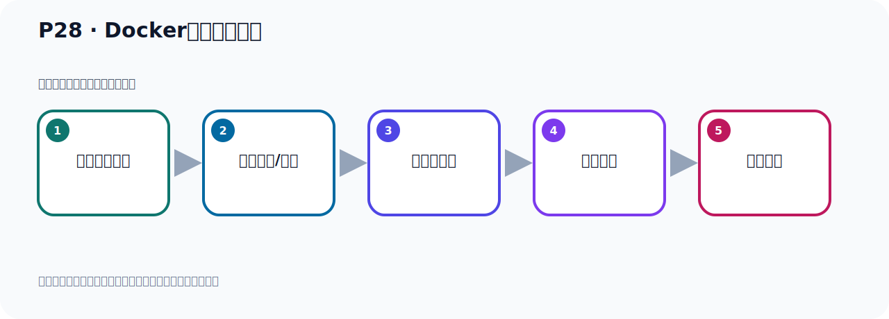

# P28：Docker的卸载和安装

> 笔记编号 28/156 · 时长 06:44 · [打开原视频 P28](https://www.bilibili.com/video/BV14J4m187jz?p=28)

[← P27: Docker的卸载和安装](../02-environment-deployment/p027-Docker的卸载和安装.md) · [返回本章](./README.md) · [P29: Docker引擎启动与关闭 →](../02-environment-deployment/p029-Docker引擎启动与关闭.md)

## 这节到底讲什么

**核心主题：Docker的卸载和安装。**

这是一节动手课。不要只记命令，要把前置条件、操作步骤、关键参数和成功信号连成一条验证链。
本节属于“环境准备与三种部署方式”这一章；放在全章里看，它的作用是：完成 JDK、Kafka、ZooKeeper、KRaft 与 Docker 环境的安装、启动和验证。

## 本节路线

## 老师的完整讲解顺序（ASR 辅助复核）

> 下面按时间顺序保留经过基础术语替换的 ASR，方便核对老师是否提到某个细节。
> 人名、命令、代码和英文参数仍可能识别错误；准确结论以本节白话说明、代码块和实操速查表为准。

### 1. 00:00–01:13

刚才我们通过这个样子一直多Kaka、Kaka，这样安装多Kaka，它的版本比较旧，我们看到的是1.13，这样一个版本。接下来我们继续往下看一下，下面我们安装一个比较新的版本，如果说我们安装新版本多Kaka，那么它的筹读方式是这样的三步。当初我们在安装新版本之前，我们应该把那个老版本给它卸掉，对不对？老版本给它卸掉，所以这个时候我们在安装之前先把我们卸掉，那卸掉的话还是这样，首先第一步我们查询以及安装这个多Kaka，先查一下，查一下之后把它卸掉，把老版本卸掉，这是我们老版本，对吧？老版本卸掉那接下来就是什么？就是YAM ZMU，YAM ZMU，好，那么第一个软件包就是它把它复制一下，YAM ZMU，这样卸掉，好，然后我们再查一下，还有两个，我们YAM ZMU，然后加上这个软件包，。

### 2. 01:13–02:12

好，粘贴，然后加上GAM Y，好，把这个卸掉，好，再查一下，还有这个包，那我们YAM ZMU，然后加上这个软件包，好，然后GAM Y，好，卸掉了，卸掉完之后这个是我们查一下，好，那现在都没有了，那我们就把这个之前这个老版本多Kaka就卸掉干净了，卸掉干净之后，接下来我们通过这个，下面这个三个步骤安装我们这个新版本的多Kaka，好，那么第一步呢就是我们要安装一个工具YAM UTFS，后面是GAM Y，表示确认，YES，自动确认，好，YAM INSIDO安装这个YAM UTFS这个工具，好，第一步，执行这个命令，那在这里我们就执行这个命令，好，这个安装了，安装了，那我这里提设是NASI PUDU，那是什么原因呢？

### 3. 02:12–03:11

是因为我之前我这个NASI PUDU里面已经装过这个工具，所以它就提示一个NASI PUDU，如果你那边之前没有装过这个工具的话，它应该会提示一个下载，然后开始去安装，当然我也可以给大家把那个卸带掉，REMU，是吧，REMU呢，然后把这个工具比如说我给它卸带掉，现在之后我给你再安一下，给大家演示一下，好，叫GAM Y，YAM REMU，然后这个工具转连包的名字，让GAM Y，自动确认，对吧，那这样的话，就把这个工具就卸掉了，好，那我们就把这个工具转连包的名字，让GAM Y，自动确认，对吧，那这样的话，就把这个工具卸在哪里，这样就卸在哪里，卸在完之后，我们再执行这个命令的时候，它就可以把它的工具再装一遍，再装一遍，好，你看这个手不再装一遍，那也扎进来，你看，这个时候它就开始下载，好，下载完之后，把工具就装完了，好，这是安装我们的这个工具啊，好，接下来我们用这个YAM CONFIDENT MULITAR，然后添加一个什么，这个多颗的这个仓库，那个迹象源，那个仓库，那个仓库，下载它那个仓库，。

### 4. 03:12–04:11

好，那执行一下，你直接执行这个命令就行了，把它仓库下一下，从哪个地方去下载这个多颗，把那个仓库源啊，源头这个迹象源也下下来，好，执行这个命令，那这怎么回车，好，回到之后来那么就把这个，它这个多颗的仓库啊，这个东西呢，就下载到我们的ETC，然后YAM RISP BONZEDOR RISP，点D这个目录下的，你可以在这个目录下去看一下，到时候会有一个多颗C1这个，这个文件啊，这个仓库文件，我们清一下这个步向你看，是吧，这个步向你看一下，LL看一下，你看它是不是把我们下了一个这个文件，对吧，下了一个这个文件啊，这个文件，这个文件你看，它里面就是到时候啊，我们从哪个位置下的这个多颗，看一下，它里面会有这个多颗的这个路径，多颗的这个仓库位置，从哪里去下的这个多颗啊，这个意思，好，那这个仓库源啊，这个路径就有了，。

### 5. 04:11–05:10

有了之后接下第三步，第三步就是安装，YAM RISP BONZEDOR，安装的时候呢，它后面有一大堆东西，什么C1啊，C1，CAL啊，等等等等等等啊，这些包一都要安装，啊，然后后面是GUN Y，自动确认，好，那么这三个步骤的这个秘类是怎么来的呢，来自于官网，啊，如果你要看官网的话，那么这个官网的文章里面啊，写来清清楚楚的，我只是提前从官网中把它考过来的，啊，这个我们是参考官网去做的，好，那我们就直接直接直接，直接执行第三步啊，这个的秘类都来自于官网，啊，并不是我们自己这个，随便写的，官网每一张都有，好，第三步就执行这些，这个秘类开始安装，那此说明就执行这个秘类啊，好，这个说明安装一下多颗，那么它就会下载这个多颗，然后进行安装，好，那么这个你稍微等一小会，它就安装完了，安装完了之后啊，我们就去查看它的版本，看看我们多颗的版本是多少，。

### 6. 05:12–06:09

好，我们等它安装一下，那如果大家想查看这个安装这个文档的话，那么技术多颗的这个官网，多颗的官网，3w多颗点com这个网站，这个网站有的时候好像打不开，今天可以打开，对吧，可以打开然后都是去找文档啊，看文档，在它那个，他们一个菜单，那么文档的话应该在这里吧，多，多颗的文档，它这几个菜单，对吧，看这个文档，那我这边呢，也是从它这个，它这个地方找过的啊，它有指导啊，有手册啊，有这个相互的手参考文档啊，等等对吧，这个文档，好，我这个呢，已经考外了，我现在就不去找那个，具体那个我就不找了，那下面我们就开始看一下，它有没有装完啊，好，它已经装完了对吧，好，装完了以后呢，那现在我们就开始看，。

### 7. 06:10–06:43

我们就开始看一下它的版本啊，那么查看版本，刚才用的是多颗更v，它其实也可以用多颗更v模型，也可以用多颗这个v模型都可以啊，都可以查看版本，那这个是我们用个简单的多颗更v，打开一下，好，这个是你看它的版本是25啊，25点，0.4啊，之前是1.13啊，是比较老的对吧，我们通过这个方式安装的这个多颗就比较新啊，比较新，好，那么以上呢，我们把多颗就安装好了，这是多颗的一个安装，安装最新版本的多颗，好，我们就开始看，好，我们就。

## 完整原声逐段记录

[查看本节带时间戳的本地 ASR](./transcripts/p028-Docker的卸载和安装-ASR.md)。主笔记负责可读性和术语校正；ASR 页面负责完整性复核。

## 读完记住

- 本节主题是 **Docker的卸载和安装**，它服务于本章目标：完成 JDK、Kafka、ZooKeeper、KRaft 与 Docker 环境的安装、启动和验证。
- 理解顺序是：确认前置条件 → 执行安装/配置 → 启动或应用 → 观察输出 → 排查失败。
- 学习时要同时核对老师的解释、画面中的配置/代码，以及最终运行结果。

## 最容易踩的坑

只照抄命令而不核对当前目录、版本、端口和配置文件路径，最容易造成“命令没报错但服务不可用”。

## 自测

1. 不看笔记，用自己的话解释“Docker的卸载和安装”解决了什么问题。
2. 按顺序复述：确认前置条件、执行安装/配置、启动或应用、观察输出、排查失败。
3. 如果运行结果和老师不同，你会先检查哪三个输入或环境条件？

## 学完检查

- [ ] 我能不看视频复述本节完整思路
- [ ] 我能指出关键命令、配置、类或接口的作用
- [ ] 我能解释画面中的输入与输出为什么对应
- [ ] 我核对过完整 ASR，没有跳过老师的补充说明
- [ ] 我完成了本节自测或复现实验
