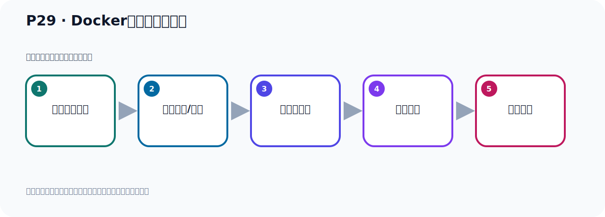

# P29：Docker引擎启动与关闭

> 笔记编号 29/156 · 时长 07:06 · [打开原视频 P29](https://www.bilibili.com/video/BV14J4m187jz?p=29)

[← P28: Docker的卸载和安装](../02-environment-deployment/p028-Docker的卸载和安装.md) · [返回本章](./README.md) · [P30: 拉取Kafka的Docker镜像 →](../02-environment-deployment/p030-拉取Kafka的Docker镜像.md)

## 这节到底讲什么

**核心主题：Docker引擎启动与关闭。**

这是一节动手课。不要只记命令，要把前置条件、操作步骤、关键参数和成功信号连成一条验证链。
本节属于“环境准备与三种部署方式”这一章；放在全章里看，它的作用是：完成 JDK、Kafka、ZooKeeper、KRaft 与 Docker 环境的安装、启动和验证。

## 本节路线

## 老师的完整讲解顺序（ASR 辅助复核）

> 下面按时间顺序保留经过基础术语替换的 ASR，方便核对老师是否提到某个细节。
> 人名、命令、代码和英文参数仍可能识别错误；准确结论以本节白话说明、代码块和实操速查表为准。

### 1. 00:00–00:49

好，我们刚才就把新版本的Docker安装好了。安装三个步骤的命令是来自于官网。我还是给大家看一下官网。那么找到它我们反问的首页吧。反问首页的话，应该是在手册里面，我们点进来看一下。点下来看，因为它手册里面不是有个音室度吗？安装对吧？有个音室度，应该在这个文章里面点进来。点下来我们是这个Docker引擎，应该找这个地方展开一下。Docker引擎，安装Docker引擎，那这个音室多了，你的安装呢？安装，安装它有不同的Lilgoth版本，那我们现在我的Lilgoth是一个什么呢？是一个SendOS，SendOS这个Lilgoth，好，你要找对的版本，那我这个SendOS，。

### 2. 00:49–01:31

那就点这个地方，可能有的同学，他是U帮Tool什么的，那你去找U帮Tool的这个分导，好，我SendOS，那么点这里，SendOS。点下之后呢，那么他支持，SendOS 789都支持，对吧？好，那我们进来之后啊，首先他说你要卸载脑版本的这个Docker，对吧？把脑版本卸载掉，那之前我们给大家演示了怎么去卸载，先查一下，然后把脑版本卸了掉，好，卸了之后，它接下来可以按下安装方法呢？它告诉我们了，好，你看，它步骤了，第一步你看就是安装这个工具嘛，YAMU優跳工具，第二步你看它是添加一个那个进向源，那个下载的那个进向源，对吧？在第二步，。

### 3. 01:31–02:18

然后第三步才正式安装，安装到是你看，YAMU一时多安装了这一大的东西，是吧？安装这些工具，我们在后面加个GangWi，表示自动确认，所以就这三步，都是在这一关网，我只是给大家整理一下，把他整理一下，好，这里是我们三步安装，那安装完以后那么多颗我们可以再启动，那今天我们看一下呢，下个课件看一下，那就是多颗启动，那多颗怎么启动呢？实际上它的官网也有啊，你看，这个文档这里马上就有这个启动多颗，你看，Saturn CTL StartDock，这样就启动多颗了，对不对？好，那我这边也给大家总结一下啊，启动你看，Saturn CTL StartDock，这是一种方式，你也可以通过这个ServiceDockStart，这样也可以，。

### 4. 02:18–03:07

这样都可以启动，好，那现在我们去启动一下多颗，那我们执行这个命令，去启动多颗，或者是后面这个命令都可以，那我们这里，启动多颗，那我们就执行这个命令，好，这是挥车，好，挥车之后啊，它就启动了，启动了，启动之后你怎么去检查有没有启动呢？你看，你查看这个多颗的这个运行状态，你可以通过State让多颗，让你查看一下，对吧？查看状态啊，通过它查看多颗状态，我们执行这个命令，执行一下，这些都是一些命令，不记得也没关系，你可以来直接看门道也可以，好，那这个是你看我们就多颗在Rom，在Rom，在运行的多颗，当然我们也可以来通过来Service，这个State这样可以，这样也可以查状态，我们看一下，。

### 5. 03:07–03:57

执行这个命令，也是一样，你看，Service多颗是State，也可以看这个状态，是吧？好，然后呢，你也可以通过什么，通过PS查看多颗有没有在运行，有没有这个进程，通过PSGridle，就和我们普通的竞诊查法，查看一样的，这个时候你可以看到有这个进程，这个进程就多颗进程，它的进程编号就是16996，这就是我们的进程编号，对吧？好，这是一些一些操作啊，好，那我们还可以通过查看这个多颗系统信息，通过多颗E4，查看系统信息，我们看一下多颗，好，这个执行E4之后，你看它多颗信息，通过这个可以看到，很多这个多颗信息，我们执行多颗E4命令，看到多颗信息，它也板不一样，等于这个信息都可以看到，。

### 6. 03:57–04:41

好，然后这个多颗的帮助，它的帮助信息你可以通过多颗GangGangHelp去帮助，就是多颗命令怎么操作，你可以通过GangHelp回车帮助，那帮助的话就是多颗命令啊，它里面带来各种参数，那么这里都帮你列出来了，那后续我们在操作多步的时候，其实就是用到它里面的一些命令，什么Zone啊，EsE，Ci，PiS啊这些，大家如果学过多的话，是不是对这些这些命令都是比较熟悉的，对不对？它里面提供了很多这个命令的参数啊，多颗后面可以给这些参数啊，给这些参数，好，那如果说你想对某一个具体命令，看它的帮助信息，那就是多颗加这个命令，后面加上你的GangGangHelp，。

### 7. 04:41–05:27

比如说我们要查看这个镜像，对吧，查看镜像我们是多颗，是吧，都一倍几呢，一倍几是，然后再查看镜像，好，现在我这个这个Vlogs里面，只起来我已经下载过一些镜像，这里面有一些镜像，下载过了对吧，有很多镜像，那么这是查看镜像的这个命令，那么你要看这个命令的帮助手册，那就是它GangGangHelp帮助，这的话就可以看一下我们多颗一倍几，这个命令它怎么怎么使用啊，怎么使用，后面还可以带什么参数，你看它后面还有些可选项参数，你可以带上带上这个可选项的参数，好，再说我们这个多颗的一个命令的一个操作啊，那么多颗呢，刚才是通过这个方式启动啊，那有的时候我们需要把多颗关掉，。

### 8. 05:27–06:13

或者说把多颗重启，好，那我们这里也提供了这个怎么关闭啊，怎么重启这个这个操作，那关闭的话就通过了它呢，stop关闭，或者是通过这个也可以，好，我们操作一下就通过它去关闭多颗，那此时把这个命令执行一下，执行，好，执行之后呢，那我们多颗就关闭了，对吧，关闭了，好，关闭之后呢，这个是我们查看一下多颗还有没有呢，你可以直接PS吧，group也可以，group多颗，好，那这个时候你看就没有这个进程了，或者说你查看这个状态，你通过它这个什么，查看状态的方式去查看，那么多颗呢，它也关了啊，这个时候你看执行，是吧，它提示这方已经没有在运行的啊，带的，带的就是关闭的啊，带的本来的意思是死亡的啊，。

### 9. 06:13–07:02

死亡的啊，这个意思，好，已经关了，好，这是关闭啊，好，那么关闭之后我们接下来，我们能不能直接执行这个重启啊，我们可以操作一下，现在是处于关闭状态，你能不能给它进行重启呢，这是我们执行这个命令试一下，试完之后我们这个是查状态，看它开的没有，它是开了的，对吧，你通过直接通过一个重启命令啊，也可以把这个多颗给起起来，它原来如果是启动状态，那么相应把它重启一下，如果它原来是关闭状态，相应把这个多颗给它起起来，好，那以上呢，就是我们多颗了一些启动关闭啊，以及它的命令的一些帮助手册啊，怎么查看啊，一些基础的一些操作，好，有了这些操作之后呢，我们接下来，就多颗来启动我们这个Kafka，。

## 关键术语

- **Kafka：** Apache 开源的分布式事件流平台，常用于高吞吐消息传递、数据管道和流处理。

## 完整原声逐段记录

[查看本节带时间戳的本地 ASR](./transcripts/p029-Docker引擎启动与关闭-ASR.md)。主笔记负责可读性和术语校正；ASR 页面负责完整性复核。

## 读完记住

- 本节主题是 **Docker引擎启动与关闭**，它服务于本章目标：完成 JDK、Kafka、ZooKeeper、KRaft 与 Docker 环境的安装、启动和验证。
- 理解顺序是：确认前置条件 → 执行安装/配置 → 启动或应用 → 观察输出 → 排查失败。
- 学习时要同时核对老师的解释、画面中的配置/代码，以及最终运行结果。

## 最容易踩的坑

只照抄命令而不核对当前目录、版本、端口和配置文件路径，最容易造成“命令没报错但服务不可用”。

## 自测

1. 不看笔记，用自己的话解释“Docker引擎启动与关闭”解决了什么问题。
2. 按顺序复述：确认前置条件、执行安装/配置、启动或应用、观察输出、排查失败。
3. 如果运行结果和老师不同，你会先检查哪三个输入或环境条件？

## 学完检查

- [ ] 我能不看视频复述本节完整思路
- [ ] 我能指出关键命令、配置、类或接口的作用
- [ ] 我能解释画面中的输入与输出为什么对应
- [ ] 我核对过完整 ASR，没有跳过老师的补充说明
- [ ] 我完成了本节自测或复现实验
