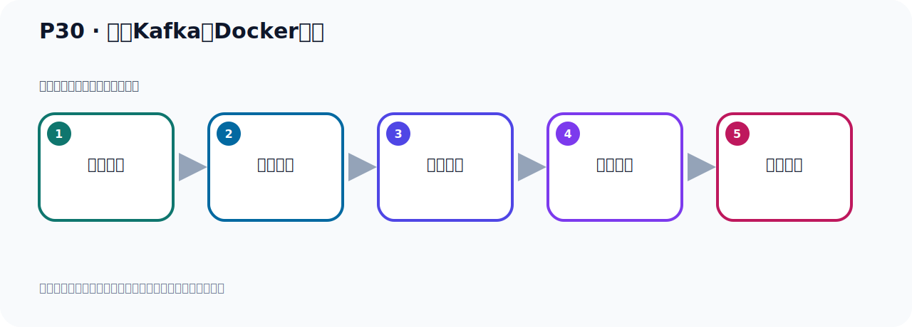
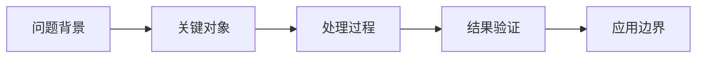

# P30：拉取Kafka的Docker镜像

> 笔记编号 30/156 · 时长 05:16 · [打开原视频 P30](https://www.bilibili.com/video/BV14J4m187jz?p=30)

[← P29: Docker引擎启动与关闭](../02-environment-deployment/p029-Docker引擎启动与关闭.md) · [返回本章](./README.md) · [P31: 启动Kafka的Docker容器 →](../02-environment-deployment/p031-启动Kafka的Docker容器.md)

## 这节到底讲什么

**核心主题：拉取Kafka的Docker镜像。**

这节继续完善 Kafka 的完整知识链。请按老师的讲解顺序理解动机、做法和结果。
本节属于“环境准备与三种部署方式”这一章；放在全章里看，它的作用是：完成 JDK、Kafka、ZooKeeper、KRaft 与 Docker 环境的安装、启动和验证。

## 本节路线

## 老师的完整讲解（按视频顺序校正）

> 下面保留老师的完整讲解顺序，并修正 Kafka、Java、ZooKeeper、
> Topic、Partition、Offset 等常见识别错误。它不是压缩摘要；原始 ASR 在后面单独保留。

### 1. 00:00–01:07

前面我们把Docker的环境准备好了并且把它启动起来了。接下来我们继续往下看一下。下面我们就是用Docker进向来启动Kafka。第一步我们要拿取Kafka的进向，把Kafka进向给它拿取下来。好，我们操作一下。这里是Leader，目前我们看一下我们的Docker，这个进程是有的，它是在运行的。第一步拿取进向，拿取进向的话我们可以通过Docker，然后设讯一下，设讯，然后搜索一下Kafka这个进向。这是搜索，这个迷你。那么搜索中它会搜索到这么多这个进向。那么这个进向呢，它后面有个叫官方，这个官方你发现它没找到，它这里没有官方的，你看。

### 2. 01:07–02:05

官方的话它下面有个标记的，你看这些都不是官方的，所以这些都是一些作者，一些其他人，不是他官方的，别人提供的这个进向。好，那我们想找官方的怎么办呢，它这里没有啊，没有看见有官方的，没列出来，那这个时候我就看一下它的官方文档，就看一下这个Kafka的官方文档。好，那我们这里打开一下Kafka这个阿富汗，看它官方文档，在这边看一下。那么它里面有一个这个文档，看这个介绍，然后快速开始吧，你看这里，快速开始。快速开始里面它应该有这个它的安中啊，然后通过多颗的方式下载，在这里啊，用多个方式在这里。用多个方式，那么它就是多个铺，就拿去，拿去什么，叫阿富汗什么什么，这个Kafka。

### 3. 02:05–02:54

是吧，这是我们这个铭子，后面是它的版本，3.720，那我们就执行这个命令去拿取就可以了。那么这个命令呢，就是我课件里面，准备这个命令，因为目前通过这个搜索的时候，发现它没收到，没有收到官方档，那我们这样去执行它就可以了。好，这是我们拿取这个进向啊，好，那这个时候让我们去拿取一下，那我们就执行这个命令，好，回车，拿取这个进向。好，拿取的时候呢，它这里提示啊，相遇这个东西我们之前已经拿取过了，它并没有帮我们去下载，应该是我这个命令是之前已经下载过，已经拿取过的。我们可以通过多颗的这个一卖几是吧，一卖几是，看一下，你看我这里面已经有好多进向了，好多进向了。

### 4. 02:54–04:00

那我可以把之前这个Kafka就这个Kafka，我给它移除一下，把这个进向移除一下，移除一下，给它演示一下，那就是什么呢，那就是多颗。然后移除的话就是RMI，就Remove一卖几，是吧，然后跟着你这个名字，这就把你这个进向给它移除掉，好，回车。它提示，我看看，没有如此的，没有如此的进向，啊，我这要加个版本号，因为它默认是NAS的这个版本号，我这里是3.7.0这个版本号，所以我需要加个版本号，那是在这个后面加个帽号，帽号3.7.0，不然的话它默认是删除那个NATIS的，NATIS的，这个版本，好，我们这个时候再移除一下，好，这个时候它就移除掉了，啊，这个移除，好，移除之后我们把它呢，这个复制一下啊，移除，我们先放这里，好，移除之后这个时候你看多颗，然后一卖几是，然后MMA，然后它就移除掉了，好，这个时候它就移除掉了，。

### 5. 04:00–04:30

OurOurOur。

### 6. 04:30–05:13

就把卡福卡这个镜像就下下来了下下来之后我们倒是通过这个镜像来我们去启动卡福卡这个容器所以他的启动分两步第一步拿取这个镜像好那我们给他拿取一下好那现在就拿取完了对吧拿取完之后我们通过多颗一倍几次查看一下好这个时候有个卡福卡版本这帮他他感觉他版本啊3.7的内容这我们卡福卡这个镜像就拿取下来了这是第一步。

## 关键术语

- **Kafka：** Apache 开源的分布式事件流平台，常用于高吞吐消息传递、数据管道和流处理。

## 完整原声逐段记录

[查看本节带时间戳的本地 ASR](./transcripts/p030-拉取Kafka的Docker镜像-ASR.md)。主笔记负责可读性和术语校正；ASR 页面负责完整性复核。

## 读完记住

- 本节主题是 **拉取Kafka的Docker镜像**，它服务于本章目标：完成 JDK、Kafka、ZooKeeper、KRaft 与 Docker 环境的安装、启动和验证。
- 理解顺序是：问题背景 → 关键对象 → 处理过程 → 结果验证 → 应用边界。
- 学习时要同时核对老师的解释、画面中的配置/代码，以及最终运行结果。

## 最容易踩的坑

不要把孤立 API 或配置项当成完整能力；始终把它放回生产、存储、消费或集群链路中理解。

## 自测

1. 不看笔记，用自己的话解释“拉取Kafka的Docker镜像”解决了什么问题。
2. 按顺序复述：问题背景、关键对象、处理过程、结果验证、应用边界。
3. 如果运行结果和老师不同，你会先检查哪三个输入或环境条件？

## 学完检查

- [ ] 我能不看视频复述本节完整思路
- [ ] 我能指出关键命令、配置、类或接口的作用
- [ ] 我能解释画面中的输入与输出为什么对应
- [ ] 我核对过完整 ASR，没有跳过老师的补充说明
- [ ] 我完成了本节自测或复现实验
