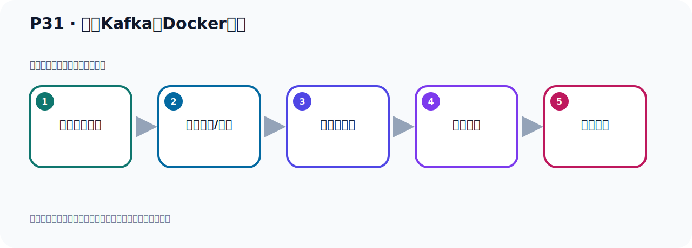

# P31：启动Kafka的Docker容器

> 笔记编号 31/156 · 时长 03:48 · [打开原视频 P31](https://www.bilibili.com/video/BV14J4m187jz?p=31)

[← P30: 拉取Kafka的Docker镜像](../02-environment-deployment/p030-拉取Kafka的Docker镜像.md) · [返回本章](./README.md) · [P32: Kafka的主题Topic和事件Event →](../03-topic-event-cli/p032-Kafka的主题Topic和事件Event.md)

## 这节到底讲什么

**核心主题：启动Kafka的Docker容器。**

这是一节动手课。不要只记命令，要把前置条件、操作步骤、关键参数和成功信号连成一条验证链。
本节属于“环境准备与三种部署方式”这一章；放在全章里看，它的作用是：完成 JDK、Kafka、ZooKeeper、KRaft 与 Docker 环境的安装、启动和验证。

## 本节路线

## 老师的完整讲解（按视频顺序校正）

> 下面保留老师的完整讲解顺序，并修正 Kafka、Java、ZooKeeper、
> Topic、Partition、Offset 等常见识别错误。它不是压缩摘要；原始 ASR 在后面单独保留。

### 1. 00:00–00:54

好，我们刚才把Kafka这个镜像已经拿取下来了。接下来我们就通过镜像启动容器。那么启动容器就通过执行这个命令。那么这个在它官方文档里面也有你看。通过它Round，当然这一块你需要学习过这个Docker就知道了。Round，执行Round这个指类，然后钢P，钢P是硬射端口，把我们这个虚拟机里面这个端口和容器端口做个硬射。那么Kafka它运行之后它里面会有一个端口叫9992，把这个端口做个硬射。硬射完之后后面是跟上我们这个镜像的名字，后面的帽号是版本号。好，这样的话我们就把我们的这个Kafka就给它启动下来了。对吧，好，那这个是我们通过这样去执行一下。

### 2. 00:55–01:43

执行一下之前我们看看我们当前这个电脑上网这个风气上有没有Kafka，我们把之前这个Kafka给它这个停一下，如果不停会有什么问题的，那么应该是端口会冲突的，因为我们之前这个Kafka它也占了992嘛，我们现在要把这个9092和它做一个硬射，和这个9092是我们虚拟机的9092，这个9092是我们容器里面那个Kafka容器的9092，是吧，好，你现在我们如果这个直接执行一下，我们把这个执行一下，看一下它会报错，这个其实它会报错的，它提出什么，这个地址已经在使用，地址在使用其实就是9092在使用，9092在使用是因为我们当前这个圣诚O2室里面有一个人嘛，。

### 3. 01:43–02:28

有一个Kafka，它启动好了，它启动之后它已经占了这个9092了，然后你又想用这个9092和容器的9092做硬射，那么这个9092已经被人占用了，所以你现在用不了了，所以我们通过这样执行它就爆了个错，爆了错，地址冲突的，那现在我们把我们当前这个电脑里面，我们这个虚拟机里面这个Kafka先给关一下，关一下之后我们再去启动容器，好，那我们进到U的Nok，这个Kafka这个部下，并部下，并部下，那么关闭的话，通过这个Stub，关闭，好，那就是Kafka，Stub和Stub，好，跟上配置本件，那config，然后我们是通过corruptor启动的，。

### 4. 02:28–03:20

所以我们跟上它里面那个配置本件，因为我们之前这个Kafka是通过corruptor的方式启动的，好，所以我们跟这个配置本件回车，这样我们就把这个Kafka给关掉，好，回车，那么此时帖子查一下，看看Kafka还在不在，好，现在没有了，没有了以后我们这个时候，就可以执行这个命令来运行这个多可容器了，好，这个时候我们执行一下，回车，好，点它执行，好，那现在我们就给它执行，Kafka它提示Kafka已经启动了，好，其实我们之后我们经常可以在这边查看一下，比如说这个ps，是吧，Grip，你看Kafka它有这个进程，对吧，或者说你通过多可这个查一下，。

### 5. 03:20–03:43

多个ps查一下，你看可以看到我们这个容器，是吧，运行这个容器，好，那么这时我们就通过这个多可的方式，启动一个容器版本的这个Kafka，这样就把容器版本的Kafka就原来启动好了，好，这是通过容器方式运行启动Kafka，。

## 关键术语

- **Kafka：** Apache 开源的分布式事件流平台，常用于高吞吐消息传递、数据管道和流处理。

## 完整原声逐段记录

[查看本节带时间戳的本地 ASR](./transcripts/p031-启动Kafka的Docker容器-ASR.md)。主笔记负责可读性和术语校正；ASR 页面负责完整性复核。

## 读完记住

- 本节主题是 **启动Kafka的Docker容器**，它服务于本章目标：完成 JDK、Kafka、ZooKeeper、KRaft 与 Docker 环境的安装、启动和验证。
- 理解顺序是：确认前置条件 → 执行安装/配置 → 启动或应用 → 观察输出 → 排查失败。
- 学习时要同时核对老师的解释、画面中的配置/代码，以及最终运行结果。

## 最容易踩的坑

只照抄命令而不核对当前目录、版本、端口和配置文件路径，最容易造成“命令没报错但服务不可用”。

## 自测

1. 不看笔记，用自己的话解释“启动Kafka的Docker容器”解决了什么问题。
2. 按顺序复述：确认前置条件、执行安装/配置、启动或应用、观察输出、排查失败。
3. 如果运行结果和老师不同，你会先检查哪三个输入或环境条件？

## 学完检查

- [ ] 我能不看视频复述本节完整思路
- [ ] 我能指出关键命令、配置、类或接口的作用
- [ ] 我能解释画面中的输入与输出为什么对应
- [ ] 我核对过完整 ASR，没有跳过老师的补充说明
- [ ] 我完成了本节自测或复现实验
