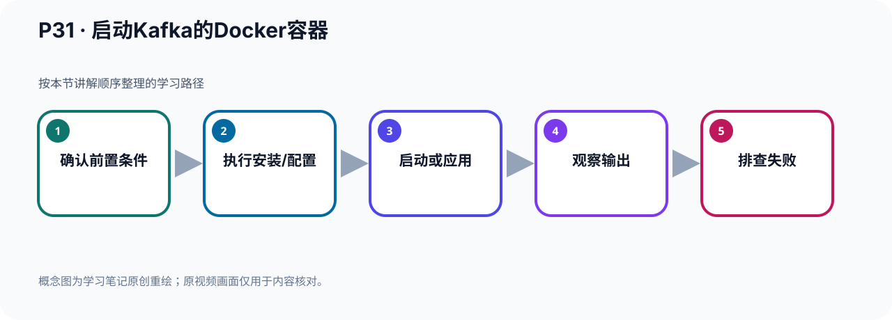

# P31：启动Kafka的Docker容器

> 笔记编号 31/156 · 时长 03:48 · [打开原视频 P31](https://www.bilibili.com/video/BV14J4m187jz?p=31)

[← P30: 拉取Kafka的Docker镜像](../02-environment-deployment/p030-拉取Kafka的Docker镜像.md) · [返回本章](./README.md) · [P32: Kafka的主题Topic和事件Event →](../03-topic-event-cli/p032-Kafka的主题Topic和事件Event.md)

## 先看结论

> 这节通过“启动Kafka的Docker容器”完成一条可验证的操作链：先核对前置条件，再执行配置或命令，最后用日志和运行结果确认环境真正可用。它服务于本章目标：完成 JDK、Kafka、ZooKeeper、KRaft 与 Docker 环境的安装、启动和验证。

## 老师怎么一步步讲

1. 第 1 步，围绕“启动Kafka的Docker容器”完成确认前置条件。
2. 第 2 步，围绕“启动Kafka的Docker容器”完成执行安装/配置。
3. 第 3 步，围绕“启动Kafka的Docker容器”完成启动或应用。
4. 第 4 步，围绕“启动Kafka的Docker容器”完成观察输出。
5. 第 5 步，围绕“启动Kafka的Docker容器”完成排查失败。

## 老师的补充说明

下面按原声顺序整理老师的完整讲解脉络。保留原因、案例、对比、操作过程、边界条件和口头提醒；删除重复语气词，并把长口语拆成适合阅读的短段落。

> 技术术语已经过统一校正；仍无法确认的人名或口头英文会保留原意，并通过右侧时间范围返回视频核对。

### 先明确：启动Kafka的Docker容器要解决什么 · 00:00–01:28

我们刚才把Kafka这个镜像已经拿取下来了。接下来我们就通过镜像启动容器。那么启动容器就通过执行这个命令。那么这个在它官方文档里面也有你看。通过它Round，当然这一块你需要学习过这个Docker就知道了。Round，执行Round这个指类，然后钢P，钢P是硬射端口，把我们这个虚拟机里面这个端口和容器端口做个硬射。那么Kafka它运行之后它里面会有一个端口叫9992，把这个端口做个硬射。硬射完之后后面是跟上我们这个镜像的名字，后面的帽号是版本号。

这样的话我们就把我们的这个Kafka就给它启动下来了。对吧，好，那这个是我们通过这样去执行一下。执行一下之前我们看看我们当前这个电脑上网这个风气上有没有Kafka，我们把之前这个Kafka给它这个停一下，如果不停会有什么问题的，那么应该是端口会冲突的，因为我们之前这个Kafka它也占了992嘛，我们现在要把这个9092和它做一个硬射，和这个9092是我们虚拟机的9092，这个9092是我们容器里面那个Kafka容器的9092，是吧，好，你现在我们如果这个直接执行一下，。

### 跟着老师操作，并观察运行结果 · 01:28–02:25

我们把这个执行一下，看一下它会报错，这个其实它会报错的，它提出什么，这个地址已经在使用，地址在使用其实就是9092在使用，9092在使用是因为我们当前这个圣诚O2室里面有一个人嘛，有一个Kafka，它启动好了，它启动之后它已经占了这个9092了，然后你又想用这个9092和容器的9092做硬射，那么这个9092已经被人占用了，所以你现在用不了了，所以我们通过这样执行它就爆了个错，爆了错，地址冲突的，那现在我们把我们当前这个电脑里面，我们这个虚拟机里面这个Kafka先给关一下，关一下之后我们再去启动容器，好，那我们进到U的Nok，这个Kafka这个部下，并部下，并部下，那么关闭的话，通过这个Stub，关闭，好，那就是Kafka，Stub和Stub，好，跟上配置本件，。

### 最后验证结果，并收束本节结论 · 02:25–03:43

那config，然后我们是通过corruptor启动的，所以我们跟上它里面那个配置本件，因为我们之前这个Kafka是通过corruptor的方式启动的，好，所以我们跟这个配置本件回车，这样我们就把这个Kafka给关掉，好，回车，那么此时帖子查一下，看看Kafka还在不在，好，现在没有了，没有了以后我们这个时候，就可以执行这个命令来运行这个多可容器了，好，这个时候我们执行一下，回车，好，点它执行，好，那现在我们就给它执行，Kafka它提示Kafka已经启动了，好，其实我们之后我们经常可以在这边查看一下，比如说这个ps，是吧，Grip，你看Kafka它有这个进程，对吧，或者说你通过多可这个查一下，多个ps查一下，你看可以看到我们这个容器，是吧，运行这个容器，好，那么这时我们就通过这个多可的方式，

启动一个容器版本的这个Kafka，这样就把容器版本的Kafka就原来启动好了，好，这是通过容器方式运行启动Kafka，。

## 放进整套课

本节属于 **环境准备与三种部署方式**。这一章要解决的是：完成 JDK、Kafka、ZooKeeper、KRaft 与 Docker 环境的安装、启动和验证。

这是一节动手课。不要只记命令，要把前置条件、操作步骤、关键参数和成功信号连成一条验证链。

### 记忆路线

```mermaid
flowchart LR
    N0["确认前置条件"]
    N1["执行安装/配置"]
    N0 --> N1
    N2["启动或应用"]
    N1 --> N2
    N3["观察输出"]
    N2 --> N3
    N4["排查失败"]
    N3 --> N4
```

## 用在工作里

| 项目 | 内容 |
|---|---|
| 先回答 | 先确认版本、目录、端口和依赖服务是否满足本节前置条件。 |
| 立刻做 | 按老师的顺序复现安装或配置，并记录每条命令的输入与输出。 |
| 留下证据 | 留下一份包含成功信号和失败排查过程的实验记录。 |

## 关键术语

- **Kafka：** Apache 开源的分布式事件流平台，常用于高吞吐消息传递、数据管道和流处理。

## 最容易踩的坑

只照抄命令而不核对当前目录、版本、端口和配置文件路径，最容易造成“命令没报错但服务不可用”。

## 自测

1. 不看笔记，用自己的话解释“启动Kafka的Docker容器”解决了什么问题。
2. 按顺序复述：确认前置条件、执行安装/配置、启动或应用、观察输出、排查失败。
3. 如果运行结果和老师不同，你会先检查哪三个输入或环境条件？

## 学完检查

- [ ] 我能不看视频复述本节完整思路
- [ ] 我能指出关键命令、配置、类或接口的作用
- [ ] 我能解释画面中的输入与输出为什么对应
- [ ] 我读完了老师的详细讲解正文，没有只看路线图和要点
- [ ] 我完成了本节自测或复现实验

## 需要核对原话时

[查看本节带时间戳的完整 ASR](./transcripts/p031-启动Kafka的Docker容器-ASR.md)。主笔记负责理解与实践；ASR 页面负责逐句完整性复核。
