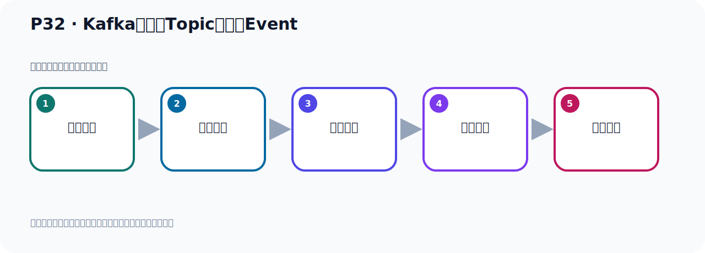
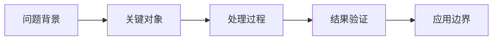

# P32：Kafka的主题Topic和事件Event

> 笔记编号 32/156 · 时长 02:42 · [打开原视频 P32](https://www.bilibili.com/video/BV14J4m187jz?p=32)

[← P31: 启动Kafka的Docker容器](../02-environment-deployment/p031-启动Kafka的Docker容器.md) · [返回本章](./README.md) · [P33: 通过脚本工具创建主题Topic →](../03-topic-event-cli/p033-通过脚本工具创建主题Topic.md)

## 这节到底讲什么

**核心主题：Kafka的主题Topic和事件Event。**

这节继续完善 Kafka 的完整知识链。请按老师的讲解顺序理解动机、做法和结果。
本节属于“Topic、Event 与命令行实操”这一章；放在全章里看，它的作用是：用脚本创建 Topic，写入与读取 Event，并解决内外网连接与容器配置问题。

## 本节路线

## 老师的完整讲解（按视频顺序校正）

> 下面保留老师的完整讲解顺序，并修正 Kafka、Java、ZooKeeper、
> Topic、Partition、Offset 等常见识别错误。它不是压缩摘要；原始 ASR 在后面单独保留。

### 1. 00:00–00:48

好，那我们通过Docker的方式，把Kafka就启动好了。启动好了之后，接下来我们开始去操作Kafka。我们看看Kafka怎么操作呢？好，那下面我们开始Kafka的操作。操作，它第一步就是你需要创建一个主题。这个主题叫Topic。它有这么一个单词叫Topic，叫做主题。那么在使用Kafka之前，第一件事情就是必须创建一个Topic，创一个主题。那么主题什么意思呢？Topic主题就类似于我们文件系统的文件夹，就相当于要先创建个文件夹，然后在这个主题，也就是在这个文件夹下存储事件，存储我们的事件也叫Event这个事件。

### 2. 00:48–01:51

那么事件是什么呢？这个事件就是我们的记录的数据或者消息，你的一切数据消息就成为事件。比如说我们支付交易的消息，手机地理位置更新的数据，运输订单的数据，物联网设备，或者是医疗设备的传感器，测量数据等等，那么一切的消息数据都是事件，所以这个事件就是你的数据，就是你的消息。那么这个事件，就是数据消息，被组织和存组在这个主题中，存组在这个托笔的中。所以我们简单来说，这个主题就是文件系统中的文件夹，类似于这个文件夹，这是主题。那事件Event就是这个文件夹中的文件，所以你先创建一个文件夹，也就是托笔的，然后在这个文件夹下，倒是放文件，。

### 3. 01:51–02:39

文件就是我们的数据，也就是我们的Event，它的这么关系。所以第一步，创建文件夹，第二步，创建文件。也就是说，那么这个文件里面写的就是数据，这个文件夹就是一个主题，你可以把不同数据放在不同文件夹下，那就是你可以建立多个主题，在这个主题下放数据，另外一个主题下放另外一些数据，可以把数据分开存放，分类存放。所以第一步，创建个主题，然后把我们的各种事件，也就是各种数据，放在这个主题下，放在主题下就像在文件夹下，创建个文件，文件里面存放我们的具体的数据，这是这么一个逻辑关系。那下面我们就来具体操作一下。

## 关键术语

- **Kafka：** Apache 开源的分布式事件流平台，常用于高吞吐消息传递、数据管道和流处理。
- **Topic：** 事件的逻辑分类。生产者向 Topic 写数据，消费者从 Topic 读取数据。
- **Event：** Kafka 中的一条业务记录，通常由 key、value、时间戳和 headers 等组成。

## 完整原声逐段记录

[查看本节带时间戳的本地 ASR](./transcripts/p032-Kafka的主题Topic和事件Event-ASR.md)。主笔记负责可读性和术语校正；ASR 页面负责完整性复核。

## 读完记住

- 本节主题是 **Kafka的主题Topic和事件Event**，它服务于本章目标：用脚本创建 Topic，写入与读取 Event，并解决内外网连接与容器配置问题。
- 理解顺序是：问题背景 → 关键对象 → 处理过程 → 结果验证 → 应用边界。
- 学习时要同时核对老师的解释、画面中的配置/代码，以及最终运行结果。

## 最容易踩的坑

不要把孤立 API 或配置项当成完整能力；始终把它放回生产、存储、消费或集群链路中理解。

## 自测

1. 不看笔记，用自己的话解释“Kafka的主题Topic和事件Event”解决了什么问题。
2. 按顺序复述：问题背景、关键对象、处理过程、结果验证、应用边界。
3. 如果运行结果和老师不同，你会先检查哪三个输入或环境条件？

## 学完检查

- [ ] 我能不看视频复述本节完整思路
- [ ] 我能指出关键命令、配置、类或接口的作用
- [ ] 我能解释画面中的输入与输出为什么对应
- [ ] 我核对过完整 ASR，没有跳过老师的补充说明
- [ ] 我完成了本节自测或复现实验
