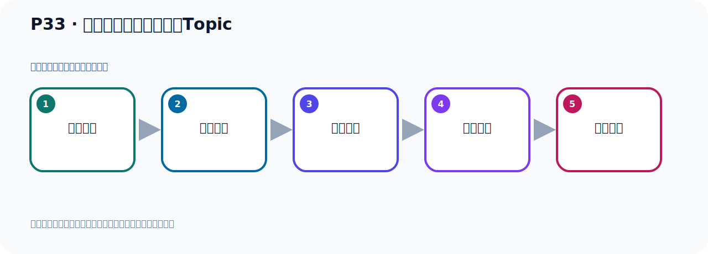
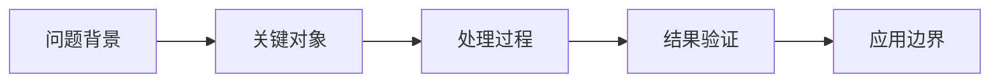

# P33：通过脚本工具创建主题Topic

> 笔记编号 33/156 · 时长 06:53 · [打开原视频 P33](https://www.bilibili.com/video/BV14J4m187jz?p=33)

[← P32: Kafka的主题Topic和事件Event](../03-topic-event-cli/p032-Kafka的主题Topic和事件Event.md) · [返回本章](./README.md) · [P34: kafka-topics.sh脚本工具的使用 →](../03-topic-event-cli/p034-kafka-topics.sh脚本工具的使用.md)

## 这节到底讲什么

**核心主题：通过脚本工具创建主题Topic。**

这节继续完善 Kafka 的完整知识链。请按老师的讲解顺序理解动机、做法和结果。
本节属于“Topic、Event 与命令行实操”这一章；放在全章里看，它的作用是：用脚本创建 Topic，写入与读取 Event，并解决内外网连接与容器配置问题。



## 本节路线



## 先用准确命令完成本节

创建、查看、描述和删除 Topic：

```bash
bin/kafka-topics.sh \
  --bootstrap-server localhost:9092 \
  --create \
  --topic helloTopic \
  --partitions 3 \
  --replication-factor 1

bin/kafka-topics.sh --bootstrap-server localhost:9092 --list
bin/kafka-topics.sh --bootstrap-server localhost:9092 --describe --topic helloTopic
bin/kafka-topics.sh --bootstrap-server localhost:9092 --delete --topic helloTopic
```

`--bootstrap-server` 指定要连接的 Broker；`--topic` 指定操作对象。课程音频中被识别成
“Crit”“历史的”“Nokohost”的词，分别对应 `--create`、`--list`、`localhost`。

## 老师的完整讲解顺序（ASR 辅助复核）

> 下面按时间顺序保留经过基础术语替换的 ASR，方便核对老师是否提到某个细节。
> 人名、命令、代码和英文参数仍可能识别错误；准确结论以本节白话说明、代码块和实操速查表为准。

### 1. 00:00–01:03

接下来我们就来看一下怎样去创建这个主题。进入下一个PPT。创建主题我们要使用它的Kamukawa、Topic、SH这个脚本。它也是个销脚本。在它的并目录下，这个是我们去看一下。我们在这个地方打开一下。在它的User、Locker、Kafka并目录下。它里面有很多脚本。我们现在使用Kafka、Topic这个脚本。用这个脚本来去创建主题。这个脚本怎么用呢？首先如果你不带任何参数，它就会告诉你这个脚本怎么使用。所以我们直接执行一下这个脚本，不带任何参数去执行一下。它就会告诉我们怎么使用。这个是我们执行一下这个脚本。当前部下执行Topic、Topic，然后直接回车执行。

### 2. 01:03–02:02

执行之后，它就会打印很多信息。这就是我们这个脚本该怎么使用。我们看看它怎么使用，我们回到上面。这个脚本它就是用来创建、删除、描述或者是改变一个Topic。就是对一个主题的真相改参。它里面可以带这些参数，杠杠的这个参数。杠杠后面是带参数，带这些参数。那么它这边你看，往下走还有这么多，这些都是参数。好，这参数。现在我们利用它这些参数来达到我们的目标。那我们第一个目标目的就是干嘛呢？就是要去创建一个主题。下面几个人带参数了很多，很多。创建主题是用Crit 创建。那我们看一下，创建主题是哪个呢？就是这个杠杠、Crit 这个参数。

### 3. 02:02–02:56

它就是创建一个新的Topic、NewTopic。好，加上它。那我们这个是呢，我们就去整理一下我们这个命令，应该怎么操作，就当前部下。执行Kafka。Kafka、Topic 是吧？Topic是点SH，好，然后杠杠、Crit。好，这两个是创建主题。那第一个参数。好，第一个参数就是你需要来去指定一下这个主题的名字。那这个是加高整个参数呢？来加一个看一下，让它走一下。加一个杠杠、Topic。后面指定一个名字，字无算名字。就是这个Topic去创建的时候，或者是改变的时候，或者是描述的时候，或者是去删除的时候，那么你是创建哪个，或者删除哪个Topic，。

### 4. 02:56–03:46

指定个名字。好，那这个指定个名字，我们可以随便指定个名字，就是杠杠、Topic 是吧？名字，名字我们叫Handau，这就是名字，主题的名字，就是Handau。好，这是创建主题，名字这个名字。好，那接下来还需要个什么呢？还需要一个B田项，它有个B田项，是哪一个呢？就是它，不得是Job，更是Sevon。好，后面是你要连的那个Kafka的服务器，也是个字无算，对吧？你看，它要求这个材料数是必须的，Required 是必须的。这个就是指定我们Kafka服务器，你要连的这个Kafka服务器，通过它指定一下，通过这个，不得是Job、Sevon 去指定。

### 5. 03:46–04:27

好，指定，这是必须要写，它要求的。那么其他材料数它不是要求的，那么这个材料数是必须要求的。好，那这个是我们通过这个材料数，指定一下我们Kafka服务器。好，那现在我们后面就要加一个这个材料数，对吧？好，服务器加空格，空格那我们服务器在哪里在本地，那就是Nokohost，或者是127.0.0.1都可以。那端口如何呢？端口是9092，我们Kafka端口是9092，我们连的时候就连Nokohost 9092。好，那么这样的话，我们就出了一个主题，主题名字叫Hull，这就是主题的创建。好，那么马上密利执行一下，这个是我们看一下，执行这个密利，。

### 6. 04:27–05:13

好，我们回车一下，好，带上执行，你看，他给我们做过提示，然后创建了一个Topic，名字叫Hull，名字叫Hull，好，这就是我们创建这个主题，通过它里面的这个参数来去创建，那么用其中的参数就可以了。好，这个主题就创造完了。创造完了之后，我们想查一下主题，你想查一下有哪些主题，他给我们提供一个历史的这个参数，这个就列出了你所有的可用的主题，把你列出来，用这个历史的参数。好，那么怎么抽出来，那就这样啊，那就说，把这个密利我们复制一下，列出所有主题，那么直接把起来，刚刚历史的，是吧，刚刚历史的，好像你后面你就不用指定了，这个名字不用指定了，好，历史的，。

### 7. 05:13–06:00

我们要因为这个后面这个布料手加布，这个是必须要写的，我要连到哪个Kafka服务器，我要连到这个服务器上，然后开开它上面有哪些主题，好，就这样，执行一下，那么它把你的Topic都把你列出来，列一下，好，这个时候它列出来，这里面目前有两个主题，好，另外一个主题是我之前创建的，直接创建的，好，我们刚才创建的这个Handau这个主题，那目前我们这个Kafka里面，目前创建有两个主题，这两个主题，对吧，好，这是查看，好，那查看，然后我们比如说这个主题我不想要的，我想删除，那怎么办呢，好，删除那么它就给你，上面看一下它有个delete吗，delete就删除，对吧，。

### 8. 06:00–06:41

好，删除这个主题我们删一下，那就相当于删除的话，应该就是你指定删除哪个主题，应该这样的，首先这里面肯定是delete，delete，好，比如说我想把这个Handau这个主题删掉，那你指定一下，这个主题名字叫Handau的主题，我要删掉，好，后面这个连Kafka服务器，不能少，那这个必须要有的，要求的，好，这样的话，我们把Handau删掉了，这个时候我们执行一下，Handau的执行，好，那这样的话，就把那个Handau这个Topic给删掉了，此时我们用list去查一下，查一下，好，那这个时候你发现我们这个Handau这个主题之前有，。

### 9. 06:41–07:18

那么现在就没有了，这就是我们创建主题，删除主题，查看主题，这个一个操作，好，那我们就开始删除主题，。

## 关键术语

- **Kafka：** Apache 开源的分布式事件流平台，常用于高吞吐消息传递、数据管道和流处理。
- **Topic：** 事件的逻辑分类。生产者向 Topic 写数据，消费者从 Topic 读取数据。

## 完整原声逐段记录

[查看本节带时间戳的本地 ASR](./transcripts/p033-通过脚本工具创建主题Topic-ASR.md)。主笔记负责可读性和术语校正；ASR 页面负责完整性复核。

## 读完记住

- 本节主题是 **通过脚本工具创建主题Topic**，它服务于本章目标：用脚本创建 Topic，写入与读取 Event，并解决内外网连接与容器配置问题。
- 理解顺序是：问题背景 → 关键对象 → 处理过程 → 结果验证 → 应用边界。
- 学习时要同时核对老师的解释、画面中的配置/代码，以及最终运行结果。

## 最容易踩的坑

不要把孤立 API 或配置项当成完整能力；始终把它放回生产、存储、消费或集群链路中理解。

## 自测

1. 不看笔记，用自己的话解释“通过脚本工具创建主题Topic”解决了什么问题。
2. 按顺序复述：问题背景、关键对象、处理过程、结果验证、应用边界。
3. 如果运行结果和老师不同，你会先检查哪三个输入或环境条件？

## 学完检查

- [ ] 我能不看视频复述本节完整思路
- [ ] 我能指出关键命令、配置、类或接口的作用
- [ ] 我能解释画面中的输入与输出为什么对应
- [ ] 我核对过完整 ASR，没有跳过老师的补充说明
- [ ] 我完成了本节自测或复现实验
