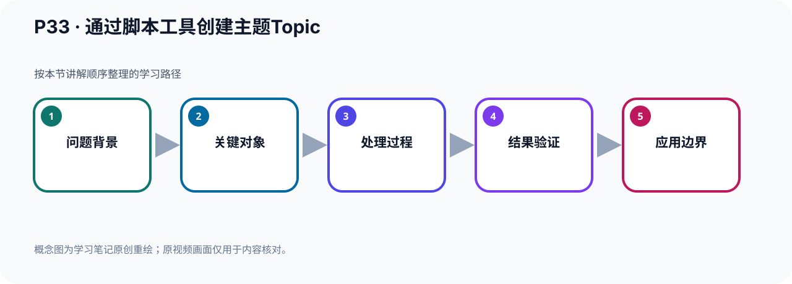
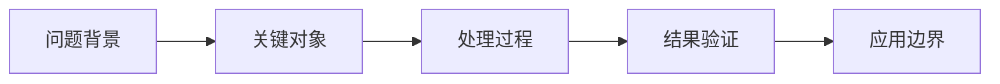

# P33：通过脚本工具创建主题Topic

> 笔记编号 33/156 · 时长 06:53 · [打开原视频 P33](https://www.bilibili.com/video/BV14J4m187jz?p=33)

[← P32: Kafka的主题Topic和事件Event](../03-topic-event-cli/p032-Kafka的主题Topic和事件Event.md) · [返回本章](./README.md) · [P34: kafka-topics.sh脚本工具的使用 →](../03-topic-event-cli/p034-kafka-topics.sh脚本工具的使用.md)

## 先看结论

> 这节围绕“通过脚本工具创建主题Topic”串起问题背景、关键对象、操作过程和验证结果，并把结论放回 Kafka 完整链路中理解。它服务于本章目标：用脚本创建 Topic，写入与读取 Event，并解决内外网连接与容器配置问题。

## 老师怎么一步步讲

1. 第 1 步，围绕“通过脚本工具创建主题Topic”完成问题背景。
2. 第 2 步，围绕“通过脚本工具创建主题Topic”完成关键对象。
3. 第 3 步，围绕“通过脚本工具创建主题Topic”完成处理过程。
4. 第 4 步，围绕“通过脚本工具创建主题Topic”完成结果验证。
5. 第 5 步，围绕“通过脚本工具创建主题Topic”完成应用边界。

## 先用白话读懂

本节使用 `bin/kafka-topics.sh` 管理 Topic。创建时至少写 `--bootstrap-server`、`--create` 和 `--topic`；`--list` 查看主题，`--describe` 查看分区、副本与 ISR，`--delete` 删除主题。准确命令见 `notes/00-practical-command-reference.md`。

## 老师的补充说明

下面按原声顺序整理老师的完整讲解脉络。保留原因、案例、对比、操作过程、边界条件和口头提醒；删除重复语气词，并把长口语拆成适合阅读的短段落。

> 技术术语已经过统一校正；仍无法确认的人名或口头英文会保留原意，并通过右侧时间范围返回视频核对。

### 先明确：通过脚本工具创建主题Topic要解决什么 · 00:00–01:39

接下来我们就来看一下怎样去创建这个主题。进入下一个PPT。创建主题我们要使用它的kafka-Topics.sh这个脚本。它也是个Shell 脚本。在它的bin 目录下，这个是我们去看一下。我们在这个地方打开一下。在它的/usr/local/kafkabin 目录下。它里面有很多脚本。我们现在使用Kafka、Topic这个脚本。用这个脚本来去创建主题。这个脚本怎么用呢？首先如果你不带任何参数，它就会告诉你这个脚本怎么使用。所以我们直接执行一下这个脚本，不带任何参数去执行一下。

它就会告诉我们怎么使用。这个是我们执行一下这个脚本。当前目录下执行kafka-Topics.sh，然后直接回车执行。执行之后，它就会打印很多信息。这就是我们这个脚本该怎么使用。我们看看它怎么使用，我们回到上面。这个脚本它就是用来创建、删除、描述或者是改变一个Topic。就是对一个主题的增删改查。它里面可以带这些参数，杠杠的这个参数，这个参数，这个参数。杠杠后面是带参数，带这些参数。那么它这边你看，往下走还有这么多，这些都是参数。

### 跟着老师操作，并观察运行结果 · 01:39–02:51

这参数。现在我们利用它这些参数来达到我们的目标。那我们第一个目标目的就是干嘛呢？就是要去创建一个主题。下面几个人带参数了很多，很多。创建主题是用--create 创建。那我们看一下，创建主题是哪个呢？就是这个----create 这个参数。它就是创建一个新的Topic、NewTopic。加上它。那我们这个是呢，我们就去整理一下我们这个命令，应该怎么操作，就当前目录下。执行Kafka。Kafka、Topic 是吧？Topic是点SH，好，然后----create。

这两个是创建主题。那第一个参数。第一个参数就是你需要来去指定一下这个主题的名字。那这个是加高整个参数呢？来加一个看一下，让它走一下。加一个--Topic。后面指定一个名字，字符串名字。就是这个Topic去创建的时候，或者是改变的时候，或者是描述的时候，。

### 继续拆解处理过程 · 02:51–03:57

或者是去删除的时候，那么你是创建哪个，或者删除哪个Topic，指定个名字。那这个指定个名字，我们可以随便指定个名字，就是--Topic 是吧？名字，名字我们叫hello，这就是名字，主题的名字，就是hello。这是创建主题，名字这个名字。那接下来还需要个什么呢？还需要一个必填项，它有个必填项，是哪一个呢？就是它，不得是Job，更是Sevon。后面是你要连的那个Kafka的服务器，也是个字符串，对吧？你看，它要求这个参数是必须的，Required 是必须的。

这个就是指定我们Kafka服务器，你要连的这个Kafka服务器，通过它指定一下，通过这个，bootstrap-servers 去指定。指定，这是必须要写，它要求的。那么其他参数它不是要求的，那么这个参数是必须要求的。那这个是我们通过这个参数，指定一下我们Kafka服务器。

### 跟着老师操作，并观察运行结果 · 03:57–05:03

那现在我们后面就要加一个这个参数，对吧？服务器加空格，空格那我们服务器在哪里在本地，那就是localhost，或者是127.0.0.1都可以。那端口如何呢？端口是9092，我们Kafka端口是9092，我们连的时候就连localhost 9092。那么这样的话，我们就出了一个主题，主题名字叫Hull，这就是主题的创建。

那么马上密利执行一下，这个是我们看一下，执行这个密利，好，我们回车一下，好，带上执行，你看，他给我们做过提示，然后创建了一个Topic，名字叫Hull，名字叫Hull，好，这就是我们创建这个主题，通过它里面的这个参数来去创建，那么用其中的参数就可以了。这个主题就创造完了。创造完了之后，我们想查一下主题，你想查一下有哪些主题，他给我们提供一个--list这个参数，这个就列出了你所有的可用的主题，把你列出来，用这个--list参数。

那么怎么抽出来，那就这样啊，那就说，把这个密利我们复制一下，。

### 老师用例子进一步解释 · 05:03–06:11

列出所有主题，那么直接把起来，刚刚--list，是吧，刚刚--list，好像你后面你就不用指定了，这个名字不用指定了，好，--list，我们要因为这个后面这个bootstrap-servers，这个是必须要写的，我要连到哪个Kafka服务器，我要连到这个服务器上，然后开开它上面有哪些主题，好，就这样，执行一下，那么它把你的Topic都把你列出来，列一下，好，这个时候它列出来，这里面目前有两个主题，好，另外一个主题是我之前创建的，直接创建的，好，我们刚才创建的这个hello这个主题，那目前我们这个Kafka里面，目前创建有两个主题，这两个主题，对吧，好，这是查看，好，那查看，然后我们比如说这个主题我不想要的，我想删除，那怎么办呢，好，删除那么它就给你，上面看一下它有个delete吗，delete就删除，对吧，好，

删除这个主题我们删一下，那就相当于删除的话，应该就是你指定删除哪个主题，应该这样的，首先这里面肯定是delete，delete，好，。

### 最后验证结果，并收束本节结论 · 06:11–07:18

比如说我想把这个hello这个主题删掉，那你指定一下，这个主题名字叫hello的主题，我要删掉，好，后面这个连Kafka服务器，不能少，那这个必须要有的，要求的，好，这样的话，我们把hello删掉了，这个时候我们执行一下，hello的执行，好，那这样的话，就把那个hello这个Topic给删掉了，此时我们用list去查一下，查一下，好，那这个时候你发现我们这个hello这个主题之前有，那么现在就没有了，这就是我们创建主题，删除主题，查看主题，这个一个操作，好，那我们就开始删除主题，。

## 放进整套课

本节属于 **Topic、Event 与命令行实操**。这一章要解决的是：用脚本创建 Topic，写入与读取 Event，并解决内外网连接与容器配置问题。

这节继续完善 Kafka 的完整知识链。请按老师的讲解顺序理解动机、做法和结果。

### 记忆路线

```mermaid
flowchart LR
    N0["问题背景"]
    N1["关键对象"]
    N0 --> N1
    N2["处理过程"]
    N1 --> N2
    N3["结果验证"]
    N2 --> N3
    N4["应用边界"]
    N3 --> N4
```

## 用在工作里

| 项目 | 内容 |
|---|---|
| 先回答 | 先指出本节在 Kafka 完整数据链路中的位置。 |
| 立刻做 | 跟着老师复现关键步骤，并记录输入、处理与输出。 |
| 留下证据 | 留下可以独立复述的结论和一次验证结果。 |

## 关键术语

- **Kafka：** Apache 开源的分布式事件流平台，常用于高吞吐消息传递、数据管道和流处理。
- **Topic：** 事件的逻辑分类。生产者向 Topic 写数据，消费者从 Topic 读取数据。

## 最容易踩的坑

不要把孤立 API 或配置项当成完整能力；始终把它放回生产、存储、消费或集群链路中理解。

## 自测

1. 不看笔记，用自己的话解释“通过脚本工具创建主题Topic”解决了什么问题。
2. 按顺序复述：问题背景、关键对象、处理过程、结果验证、应用边界。
3. 如果运行结果和老师不同，你会先检查哪三个输入或环境条件？

## 学完检查

- [ ] 我能不看视频复述本节完整思路
- [ ] 我能指出关键命令、配置、类或接口的作用
- [ ] 我能解释画面中的输入与输出为什么对应
- [ ] 我读完了老师的详细讲解正文，没有只看路线图和要点
- [ ] 我完成了本节自测或复现实验

## 需要核对原话时

[查看本节带时间戳的完整 ASR](./transcripts/p033-通过脚本工具创建主题Topic-ASR.md)。主笔记负责理解与实践；ASR 页面负责逐句完整性复核。
