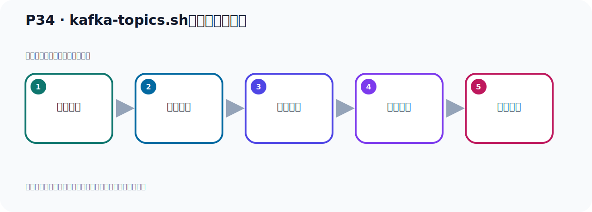
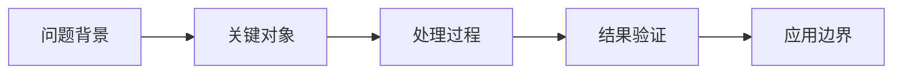

# P34：kafka-topics.sh脚本工具的使用

> 笔记编号 34/156 · 时长 06:42 · [打开原视频 P34](https://www.bilibili.com/video/BV14J4m187jz?p=34)

[← P33: 通过脚本工具创建主题Topic](../03-topic-event-cli/p033-通过脚本工具创建主题Topic.md) · [返回本章](./README.md) · [P35: 在主题Topic中写入一些事件Events →](../03-topic-event-cli/p035-在主题Topic中写入一些事件Events.md)

## 这节到底讲什么

**核心主题：kafka-topics.sh脚本工具的使用。**

这节继续完善 Kafka 的完整知识链。请按老师的讲解顺序理解动机、做法和结果。
本节属于“Topic、Event 与命令行实操”这一章；放在全章里看，它的作用是：用脚本创建 Topic，写入与读取 Event，并解决内外网连接与容器配置问题。

## 本节路线

## 老师的完整讲解（按视频顺序校正）

> 下面保留老师的完整讲解顺序，并修正 Kafka、Java、ZooKeeper、
> Topic、Partition、Offset 等常见识别错误。它不是压缩摘要；原始 ASR 在后面单独保留。

### 1. 00:00–01:18

刚才我们通过Kamakar、Topic使脚本去创建了主题。这个脚本以不带这个参数值行的手，它就会提示你这个脚本怎么使用，它会有一些参数。刚才我们创建了主题，就通过这样一种命令去创造主题，根据它的参数去创造主题。那么这个List成立出所有的主题，然后我们刚才也演示了一个三数主题，通过Delete三数主题。那么我们把这个地方交换一下顺序，下面我们还有一个就是这个第四个，然后这有一个第五个。这个地方换行一下第五个，那么第五个是显示主题详细信息，我们看一下把这个弄小一点，这样它就可以展示在一行。好，这样啊，第五个是显示主题的详细信息，那么这个它是用Discrabable，去描述一下我们这个主题的信息。

### 2. 01:18–02:14

好，那我们看一下在我们这边，我们之前执行这个脚步的时候，它会列出很多这个参数，那我们在这里开个新窗口，我们把我们创建的主题，把它详细信息展示一下。那首先第一步呢，我们就是把我们这个，我们看一下就是这个List，对吧，我们刚刚用了这个List嘛，我们看一下目前它有哪些这个主题，哎，我们需要进入这个Kafka的这个并步下，用着罗可Kafka并步下，并步下去执行命令啊，你看这里面才有它的命令嘛，好，执行这个命令。在列出目前还有哪些主题，那目前只剩这个主题上，我们那个主题已经删掉了啊，只有这个主题，那我们就描述一下这个主题，它的详细信息，好，那这个时候呢，怎么办呢，用它的描述嘛，你看创建我们已经创建过了，三组也删除过了，那么下面就是描述。

### 3. 02:15–03:01

怎么描述呢，那么它里面有一个参数叫刚刚describe，就这个参数，那么这个参数就是列出这个detail，这个详细的，给定了这个托比格的详细信息，那就是describe，是吧，通过这个参数啊，describe，这个参数。好，那你相遇你执行手来就是什么，就是，是吧，托比格，然后后面就是刚刚describe，我们把这个地方，好，刚刚describe，是吧，然后后面是刚刚describe，描述哪个主题来，描述我们这个主题，这个主题，好，沾一下，是吧，好，然后后面指令，我们连接了哪个服务器，指令好，好，这样我们回车一下，那就是对我们这个主题的一个描述嘛，。

### 4. 03:02–03:54

好，那么这是目前这个主题的一个信息，一个信息，是展示这个效果，对吧，在它的一个信息，是这样子，好，那然后我们再看一下，它这个命令呢，还有一个就是什么，就是你可以改变一个主题，对这个主题做改变，那怎么改变呢，改变它可以个orata，用这个参数orata，好，那么改变的时候，我能不能把主题的名字改一下，好，主题的名字改一下，目前没有找到这个方法，没有找到这个参数，以前它里面没有这个云内木相关的，改名字目前没看到，那么这个呢我提前就看过了，它没有改名字的，目前没找到这个一个参数可以改名的，但是你可以改什么呢，改它的这个这个主题里面的一些信息，啊，比如说主题里面的分区数，好，这个我们后面会展开讲这个分区，。

### 5. 03:55–04:53

比如说我们要改分区数，你可以改，比如说这个partix，partici，这个就是它的分区数，不要我们改一下，啊，那目前我们查出来之后发现它这个partici，它其实是三，分区数，三，都想改一下，好，那怎么改来，好，那这样啊，首先呢就是把这个迷你先考过来啊，那就是这个地方呢，首先加个orata，orata参数，好，我们要改这个主题，是吧，把这个主题改一下嘛，好，后面指定这个主题名字，好，改哪个呢，改它的这个分区数，那分区数有哪一个呢，分区数就用这个partici，哎，这个，加上这个参数，好，那这里就加上这个参数，对吧，改多少，它原是三吧，比如说我改成五，那这样就改成五了，哎，这就是改它的这个，这个主题的一些信息，主题里面的一些属性值，属性信息，。

### 6. 04:54–05:52

但是这个名字目前没有找到方法可以改，主题名字目前没有这个内幕相关的一个参数，所以主题名字呢，我们现在改不了，我们可以改一下它的这个，这个一些信息啊，好，那么改成五，好，再给我们执行一下，执行，哎，等一下，对吧，我们回车，好，回车之后呢，那么它这个地方，我们看一下啊，改变一只notrebo的选项，我们看看啊，这里是notre，我们看写错没有啊，alt12，哎，哎呦，啊，我这个单词写错了啊，这个单词写错了，那不是，notre，这个notre变成这个gst里面的那个谈出嘛，是吧，它是alt12，t12是这样的，t12，好，回车，哎，这就对了，啊，刚刚这个单词写出了，。

### 7. 05:52–06:37

这个是谈出alt，是吧，这个gst里面谈出啊，这个才是alt，才是修改，是改变啊，好，那现在改成五了是吧，改成五以后我们现在之前是三现在五，我们现在再查一下，通过这个停止快步行，描述查一下它的详细信息，好，beast， terrible，通过它，是吧，查一下，回车，好，那么此时你看它这五个嘛，是吧，哎，这就是修改啊，好，那么更多的这个参数呢，哎，它后面都有说明啊，我说明，如果我们要学用的话呢，我们要给你这个说明，然后呢，你去执行一下，啊，那我这里来把它这个基本的这个，常用的这个，啊，创建啊，三足啊，描述啊，还有改变呢，我们做了一个演示，好，这就是我们的这个Topic啊，这个脚本啊，它的一个使用。

## 关键术语

- **Kafka：** Apache 开源的分布式事件流平台，常用于高吞吐消息传递、数据管道和流处理。
- **Topic：** 事件的逻辑分类。生产者向 Topic 写数据，消费者从 Topic 读取数据。

## 完整原声逐段记录

[查看本节带时间戳的本地 ASR](./transcripts/p034-kafka-topics.sh脚本工具的使用-ASR.md)。主笔记负责可读性和术语校正；ASR 页面负责完整性复核。

## 读完记住

- 本节主题是 **kafka-topics.sh脚本工具的使用**，它服务于本章目标：用脚本创建 Topic，写入与读取 Event，并解决内外网连接与容器配置问题。
- 理解顺序是：问题背景 → 关键对象 → 处理过程 → 结果验证 → 应用边界。
- 学习时要同时核对老师的解释、画面中的配置/代码，以及最终运行结果。

## 最容易踩的坑

不要把孤立 API 或配置项当成完整能力；始终把它放回生产、存储、消费或集群链路中理解。

## 自测

1. 不看笔记，用自己的话解释“kafka-topics.sh脚本工具的使用”解决了什么问题。
2. 按顺序复述：问题背景、关键对象、处理过程、结果验证、应用边界。
3. 如果运行结果和老师不同，你会先检查哪三个输入或环境条件？

## 学完检查

- [ ] 我能不看视频复述本节完整思路
- [ ] 我能指出关键命令、配置、类或接口的作用
- [ ] 我能解释画面中的输入与输出为什么对应
- [ ] 我核对过完整 ASR，没有跳过老师的补充说明
- [ ] 我完成了本节自测或复现实验
