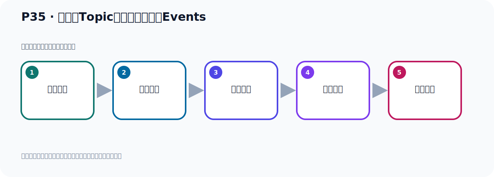
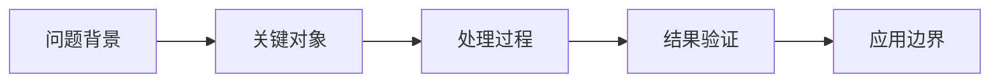

# P35：在主题Topic中写入一些事件Events

> 笔记编号 35/156 · 时长 09:05 · [打开原视频 P35](https://www.bilibili.com/video/BV14J4m187jz?p=35)

[← P34: kafka-topics.sh脚本工具的使用](../03-topic-event-cli/p034-kafka-topics.sh脚本工具的使用.md) · [返回本章](./README.md) · [P36: 从主题Topic中读取事件Events →](../03-topic-event-cli/p036-从主题Topic中读取事件Events.md)

## 这节到底讲什么

**核心主题：在主题Topic中写入一些事件Events。**

这节继续完善 Kafka 的完整知识链。请按老师的讲解顺序理解动机、做法和结果。
本节属于“Topic、Event 与命令行实操”这一章；放在全章里看，它的作用是：用脚本创建 Topic，写入与读取 Event，并解决内外网连接与容器配置问题。

## 本节路线

## 老师的完整讲解顺序（ASR 辅助复核）

> 下面按时间顺序保留经过基础术语替换的 ASR，方便核对老师是否提到某个细节。
> 人名、命令、代码和英文参数仍可能识别错误；准确结论以本节白话说明、代码块和实操速查表为准。

### 1. 00:00–01:06

刚才我们通过Kamak、Popeker，然后对主题做了一些操作。当然这里还有一个第六点，我们应该补充一下，就是修改它的一些信息。这个就是我们刚才执行的这个命令，我们看一下，就是Alt修改它的分区数，这是修改。那么这个就是修改主题信息，对吧，通过这个命令，把这个也粘过来一下。好，再说我们这样一个操作。那现在我们这个操作这个命令，它里面这个顺序是没有什么关系的。就是你这个命令，比如说我们用这个命令我们随便给你执行一下，它这个参数的顺序是无所谓的。执行，比如说我把后面这个连接地址，我放在这个前面，放在这个位置，放在最前面，是吧，可不可以呢？

### 2. 01:06–01:57

它也是可以的，就是它的这个位置是无所谓的。这就是我们研到这个本地的这一段，负责一下。好，再来这，对吧，好，我顺序打乱的它也是可以的，在描述了，实际上把这个信息给你描述，打一出来，对吧。所以就说这些参数的顺序是无所谓的，你可以前也可以后，比如说我们现在把这个Topic的这一段再给它放在前面去也是可以的。好，负责一下，那么把后面这个删掉，是吧，比如说我放在这个位置，在这个位置，所以不让它找。那么它也是可以的，也可以，也可以出结果，所以这些参数的顺序无所谓。好，那么这是我们这个脚本工具，那接下来我们继续往下看，好，我们看一下Kafka操作。

### 3. 01:58–02:49

好，那么刚才我们是创作这个一个主题了，那接下来我们第二步就是在主题中写一些事件，写入一些事件，写入一些事件。那么这个事件，就是invent，那么这个事件其实就是你的数据，你的这个消息，因为Kafka我们也称为叫消息红系嘛，那这个世界就是你写一个消息进去，写一个消息其实就是写一个数据，这个数据可以是个字物串，也可以是个数字，是吧，你写个消息进去，好，那我们这个Kafka扣端，那就是我们这边啊，这个就是Kafka生产者，因为生产者他是用来发生这个数据的，叫Producer，然后就发生一个数据，发生到我们这个消息服务器，中间这个消息服务器，消息服务器我们是叫Broker，叫Broker。

### 4. 02:50–03:30

右边是我们这个Consumer，就是我们消费者，叫Consumer。Consumer呢，从这个Broker，从这个消息服务器去接收啊，去接收这个消息。这是我们这个基本的一个，这个消息服务器的一个组件，三不分，是吧，一个消息服务器，然后一个生产者，一个消费者。所以现在来我们通过一个扣端，就是生产者，然后通过网络，那么中间这一方是网络，通过网络来，与这个Broker，就与这个KafkaBroker，就进行这个网络通信。相当于连接，连接到Kafka上，然后来我们可以写或者读这个Kafka那个主题中的那个事件，那个事件就是拿到个消息，读那个消息。

### 5. 03:31–04:24

当然我们这边这个生产者是往里面去写入这个数据，写入事件，然后这个Consumer呢，就从这边去接收去读取这个事件，一个是往里面写数据，一个是从里面读数据。生产者写数据，消费者读数据，写数据叫写入事件，读数据叫读取这个事件。那我们这个Broker里面一个Topic，手机上有一个Topic，然后我们把这个数据这个事件写在这个Topic里面的。好，这是这个情况啊，那么Kafka这个Broker，他一旦接收到你这个事件，也就是你这个数据，接到以后呢，他就把这个事件，以持久化的容错的方式存储起来。这个我们后面会设到的一个集群，他的容错的方式存起来，可以永久存住，不丢消息，永久帮你存起来。存在这个Broker里面。

### 6. 04:25–05:13

好，那下面我们通过一个工具，我们去往这个Broker里面去发送一个数据，或者写入一个事件。好，那么工具就是我们Kafka这个Consumer，然后丢出这个ssh这个脚本，通过这个脚本，我们就可以发送消息，或者说叫写入事件。好，那么这个脚本他的使用啊，我们前面那个差不多，就是第一步，你不执行任何这个参数，你不加任何参数，你执行一下，他就是告诉你这个脚本怎么使用。你不带参数，他就告诉你怎么使用。好，那这里我们操作一下啊，那在bin 目录下，对吧，他是哪个脚本呢？是没Kafkaconsole这个脚本，console呢？不，留着这个脚本，好，那么直接这个脚本啊，不带这个参数，不带这个参数直接完之后你看我们这个脚本是在这，我们执行了，执行之后，那么他就告诉你他怎么用。

### 7. 05:14–06:06

他可以带上这些参数，带上这些参数，对吧，那么也是一大堆啊，这个参数，参数后面他有人解释这个参数什么意思啊，什么意思他有后面有人解释这里吗？那么他这里面有几个参数是必须的，然后有个required是必须的，那就是我们的这个服务器，Kafka的连接服务器是哪个AP端口，你通过这个参数就指定好，这个是必须的，这个必须的。然后这个呢，这个是过时的，不建议使用的，不站起来使用的，过时的就是这个，因为他加了一个这个单词，这单词是过时的，哎，还说不定，哎，等一下，好，这个是过时的，他不建议使用，这个是必须要有啊，上面这个必须要有，然后我们再看一下呢，哎，我的手边怎么有点问题啊，。

### 8. 06:10–07:04

全选，好，刷新一下，刷新一下，手边有点卡住了，然后再往下走一下，他有一个，还有一个参数啊，是必须要有的，我们再走一下。哎，我记得他有两个参数，是必须要有的。哎，对这个，对，这个，这个参数啊，你看，就是Topic名字，必须要指定，就是你发送数据，也就是你发送消息写入事件，那你必须要指一个服务器地址，然后指一个Topic名字，你把这个数据这个事件要写入哪个Topic，这个是必须要指定的。所以他有两个参数必须要有，一个是服务器地址，一个是Topic名字，必须要指定。好，那么通过他呢，我们就可以发送一个数据或者写入一个消息，那这个是你看我们就通过，这个console Producer是吧，好，指定一个Topic，好，我们通过名字，那目前的话我们这里面只有一个quake start这个Topic，没有别的名字。

### 9. 07:05–08:05

我们前面已经查过了，对吧，我们前面可以看一下我们之前一个查询的历史，哎，这个查询看一下，他目前只有这个Topic，那我们就用这个Topic发送一个事件或者写入一个消息，对吧，好，后面是跟着你服务器地址。那么这两个参数他顺序可以交换，顺序无所谓，哪个在前，哪个在后都是可以的，好，我们把这个执行一下，那这样我们就连到了Kafka这个服务器上，然后就去发送这个事件，执行，回车。好，回车之后呢，他这里面就出一个箭头，对吧，箭头就是等待你去输入，你每次输入，好，他就相与发生一个消息，那我们写个，哎，hello，是吧，Kafka，好，我按个回车，回车，好，回车之后，相与就是写入了一个事件，那么这一行就是一个消息，已经写进去了，如果你再来一个，那么他就第二个消息，每次换行是一个消息，hello，。

### 10. 08:06–08:36

是吧，hello，这个，哎，ccte，啊哈吉，Kafka，回车，好，那目前我就往这个Topic里面就写入了两个消息，也就是写入了两个事件了，他每一次换行就是一个事件，好，然后你要停下来，你不再发送这个事件，停止发送事件，也就是停止发送消息，那就是按Ctrl+C，Ctrl+C退出，好，那这个就按一个Ctrl+C，好，他退出来了，Ctrl+C退出来了，好，那这个就按一个Ctrl+C，好。

### 11. 08:36–09:00

退出来了，好，这个是我们这个生产者发的消息，通过这个脚本来去往这个Topic发消息，他必须用两个参数，一个是Topic，一个是Broker 地址，那么其他参数呢，比如说还有什么超时时间啊等等啊，那么这个他后面都有这个对应的说明，好，那我们这个参数就在此啊，不再一个一个掩饰了啊，因为参数比较多，好，这是我们发那个消息啊，消息就发出去了。

## 关键术语

- **Kafka：** Apache 开源的分布式事件流平台，常用于高吞吐消息传递、数据管道和流处理。
- **Topic：** 事件的逻辑分类。生产者向 Topic 写数据，消费者从 Topic 读取数据。
- **Event：** Kafka 中的一条业务记录，通常由 key、value、时间戳和 headers 等组成。
- **Broker：** 运行 Kafka 服务的节点；多个 Broker 组成 Kafka 集群。
- **Producer：** 向 Kafka Topic 发送事件的客户端。
- **Consumer：** 从 Kafka Topic 拉取并处理事件的客户端。

## 完整原声逐段记录

[查看本节带时间戳的本地 ASR](./transcripts/p035-在主题Topic中写入一些事件Events-ASR.md)。主笔记负责可读性和术语校正；ASR 页面负责完整性复核。

## 读完记住

- 本节主题是 **在主题Topic中写入一些事件Events**，它服务于本章目标：用脚本创建 Topic，写入与读取 Event，并解决内外网连接与容器配置问题。
- 理解顺序是：问题背景 → 关键对象 → 处理过程 → 结果验证 → 应用边界。
- 学习时要同时核对老师的解释、画面中的配置/代码，以及最终运行结果。

## 最容易踩的坑

不要把孤立 API 或配置项当成完整能力；始终把它放回生产、存储、消费或集群链路中理解。

## 自测

1. 不看笔记，用自己的话解释“在主题Topic中写入一些事件Events”解决了什么问题。
2. 按顺序复述：问题背景、关键对象、处理过程、结果验证、应用边界。
3. 如果运行结果和老师不同，你会先检查哪三个输入或环境条件？

## 学完检查

- [ ] 我能不看视频复述本节完整思路
- [ ] 我能指出关键命令、配置、类或接口的作用
- [ ] 我能解释画面中的输入与输出为什么对应
- [ ] 我核对过完整 ASR，没有跳过老师的补充说明
- [ ] 我完成了本节自测或复现实验
