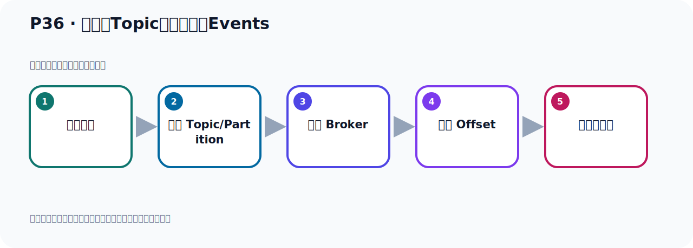
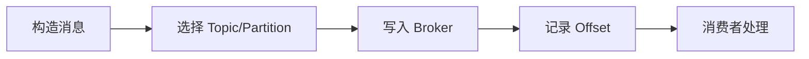

# P36：从主题Topic中读取事件Events

> 笔记编号 36/156 · 时长 05:21 · [打开原视频 P36](https://www.bilibili.com/video/BV14J4m187jz?p=36)

[← P35: 在主题Topic中写入一些事件Events](../03-topic-event-cli/p035-在主题Topic中写入一些事件Events.md) · [返回本章](./README.md) · [P37: 从主题Topic中读取事件Events →](../03-topic-event-cli/p037-从主题Topic中读取事件Events.md)

## 这节到底讲什么

**核心主题：从主题Topic中读取事件Events。**

这节位于消息链路上。要顺着“发送端—Broker—分区日志—消费端”看数据和元数据怎样流动。
本节属于“Topic、Event 与命令行实操”这一章；放在全章里看，它的作用是：用脚本创建 Topic，写入与读取 Event，并解决内外网连接与容器配置问题。

## 本节路线

## 老师的完整讲解顺序（ASR 辅助复核）

> 下面按时间顺序保留经过基础术语替换的 ASR，方便核对老师是否提到某个细节。
> 人名、命令、代码和英文参数仍可能识别错误；准确结论以本节白话说明、代码块和实操速查表为准。

### 1. 00:00–00:47

好，那我们刚才把这个消息，把消息也就是事件我们写入的这个Topic和ZooKeeper。那接下来我们开始从这个Topic和ZooKeeper去读取这些事件。好，那我们看下来，第三步就是从这个主题Topic和ZooKeeper读取这些事件。好，它整个结构图就是我们一个生产者，我们刚才把这个事件把这个消息已经发生到这个Broker服系上去了。Broker服系上有一个Topic发生到这个Topic里面去了。好，接下来我们接下来就用这个消费者来读取这个Topic里面的这个事件，也就是这个消息，读取这个消息。那么读取这个消息，我们可以用这个工具，Kafka，Consumer，Consumer点SH这个脚本，这是一个消费者扣端。

### 2. 00:47–01:50

通过这个扣端，我们可以读取之前所写入的那些事件，也就是那些消息。好，那么这个脚本，你不带任何参数，你执行一下，它就会告诉你这个怎么使用。它里面也可以加一些参数，那我们接下来去执行一下，看一下。好，那么在这里，这个并布一下，对吧，我们用Kafka，Consumer，之前我们这个是生产者扣端，这个扣者生产者，那么Consumer这个SH，这个就是我们的消费者。那么这里就是Kafka，Consumer，直接回车，不带参数直接回车，那么它又会显示这个脚本该如何使用。里面钢钢什么什么这些参数，可以带很多参数，那我们看下来，我们怎么去消费这个消息呢，就是读取消息呢，它有一个是必须要有的，就是这个如意语。

### 3. 01:51–02:45

这个表示，你这个服务器的IP端球，一定要指定一下，也就是我从哪个Kafka去读取消息，有这个意思，要指定它。然后其他的我看了下来，其他参数都没有要求我们是必须的，下面这个没有必须的，目前是没有看到，这有个是过时的，这个参数不建议使用。那么除了这个离的地址，其他的不是必须的，那我们先去试一下，我们去读取消息，这个脚本，然后呢，首先这个地方是必须的，那我现在这个地址，你看它是什么呢，有点长啊，我现在这样，我什么都不加，我看能不能堵到啊，我们试一下，把这个弄到长时间，这是我的命令吧，那就中间这个我都不要了，是吧，它必须要求一个这个地址，这个不能说叫我蛇，我这个地址，。

### 4. 02:46–03:35

Kafka地址需要有，好，我们直接这样执行，看能不能消费消息，我们试一下，对吧，好，试一下啊，好，这是我们有回执行，好，回车。那么回到之后，它不行的，是吧，不行的，你看一下啊，我们执行这个，它让不能叫我粘就地址粘上去，粘下去之后，我执行之后，它提示我，它其实告诉我这个命令怎么使用。然后呢，它这个你看它需要什么呢，需要指的一个Topic格，它说是必须要求的，就是要么是GunGun Include，要么是GunGunTopic格是必须要求的。那么其实就是说，它这个参数里面，其实有个Topic格也是必须要求的，只不过它没有，这里这个文档之后没有标出来，你看，这边一个Topic格啊，就是这个，这个是你必须要求的。

### 5. 03:36–04:43

但是它没有给我们加上一个required，它没有加，所以你在消费的时候，这个Topic格是必须要求的，你说你要加个Topic格，你连这个例子，然后去哪个Topic格去消费，对吧，那就是我们这个课言中，那就是你这个Topic格，那就是我们这个quickster这个Topic格，这个名字这个必须要有。好，那我们这个命令人再改一下，再改一下，那就是在这个基础上加Topic的名字，那么这个呢我先去掉，对吧，好，那现在我们这样去消费，看看能不能消费到，去读取数据，好，执行一下，加了一个Topic格，回车。好，那么回车以后呢，它也没有读到，你看，什么都没读到，一直是空着一个状态，一直空着一个状态，没读到，好，那这个时候就说，我们需要怎么办，我们需要加一个参数，要什么参数呢，就是加一个这个参数啊，课言中有，就是你从这个，从开始开始读取，beginning开始嘛，。

### 6. 04:43–04:44

从消息的开始啊，从第一个消息，从第一个消息开始读取，说明再加个这个参数，这样才可以读到，那就是整个完整的命令是这样一个命令，好，那我们把这个，按这个扣除了C退出，退出一下，退出了对吧，好，这个我们再执行这个完整的命令是这样的，好，执行一下，看着它能不能读到消息，这个时候你发现它读到了，就我们之前发了一个消息嘛，一个是Handel Kafka，一个是H。

### 7. 05:13–05:18

Handel Apagic Kafka，它读到了，好，这个比方说从头开始读啊，从头开始读。

## 关键术语

- **Kafka：** Apache 开源的分布式事件流平台，常用于高吞吐消息传递、数据管道和流处理。
- **Topic：** 事件的逻辑分类。生产者向 Topic 写数据，消费者从 Topic 读取数据。
- **Event：** Kafka 中的一条业务记录，通常由 key、value、时间戳和 headers 等组成。
- **Broker：** 运行 Kafka 服务的节点；多个 Broker 组成 Kafka 集群。
- **Consumer：** 从 Kafka Topic 拉取并处理事件的客户端。
- **ZooKeeper：** 旧版 Kafka 用于集群元数据和控制器协调的外部服务。

## 完整原声逐段记录

[查看本节带时间戳的本地 ASR](./transcripts/p036-从主题Topic中读取事件Events-ASR.md)。主笔记负责可读性和术语校正；ASR 页面负责完整性复核。

## 读完记住

- 本节主题是 **从主题Topic中读取事件Events**，它服务于本章目标：用脚本创建 Topic，写入与读取 Event，并解决内外网连接与容器配置问题。
- 理解顺序是：构造消息 → 选择 Topic/Partition → 写入 Broker → 记录 Offset → 消费者处理。
- 学习时要同时核对老师的解释、画面中的配置/代码，以及最终运行结果。

## 最容易踩的坑

能发送成功不代表业务处理成功；序列化、分区、确认机制和消费进度需要分别观察。

## 自测

1. 不看笔记，用自己的话解释“从主题Topic中读取事件Events”解决了什么问题。
2. 按顺序复述：构造消息、选择 Topic/Partition、写入 Broker、记录 Offset、消费者处理。
3. 如果运行结果和老师不同，你会先检查哪三个输入或环境条件？

## 学完检查

- [ ] 我能不看视频复述本节完整思路
- [ ] 我能指出关键命令、配置、类或接口的作用
- [ ] 我能解释画面中的输入与输出为什么对应
- [ ] 我核对过完整 ASR，没有跳过老师的补充说明
- [ ] 我完成了本节自测或复现实验
